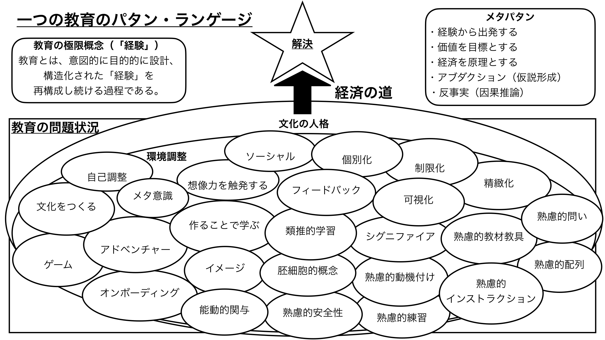

# 教育パタン・ランゲージ Wiki

教育設計・授業実践・学習理論に関するパタン・ランゲージのアーカイブ。

## まず読むなら

初めてきた人は、目的に近い道筋を上から順にたどる。

**理論から深める**  
[パタン・ランゲージ概論](./概念/パタン・ランゲージ概論) → [メタパタン](./メタパタン/) → [概念](./概念/)

**教育を設計する**  
[図解にある親パタン](#図解にある親パタン) → [熟慮的配列](./パタン/熟慮的配列) → [類推的学習](./パタン/類推的学習①) → [オンボーディングなど](./パタン/オンボーディング)

**今日の教育に使う**  
[実践から探す](./実践/) → [教材から探す](./教材/) → [困りごとから探す](./困りごとから探す) → [目標から探す](./目標から探す)

## Wikiの地図

| 入口 | こんな時に使う |
| --- | --- |
| [パタン](./パタン/) | 授業設計・指導・学級づくりの具体的な型を探す |
| [概念](./概念/) | パタンの背景にある理論・哲学・教育思想を確認する |
| [実践](./実践/) | 具体的な授業・指導の記録から考える |
| [特別支援](./特別支援/) | 特別支援教育の実践と理論をつなげて見る |
| [教科](./教科/) | 算数・国語など教科別のアイデアを見る |
| [算数](./教科/算数) | ナンバートーク、数学ワークショップ、算数教材から探す |
| [教材](./教材/) | 授業で使う道具・ワークシート・ゲーム教材を探す |
| [文献](./文献) | 参考文献・動画記録・研究メモをたどる |
| [メタパタン](./メタパタン/) | パタンを発見・検証・使い続ける原理を確認する |

## 実践・教材から探す

授業準備中にすぐ使うなら、実践と教材の棚から入る。

| 入口 | 何を探せるか |
| --- | --- |
| [実践](./実践/) | 国語・算数・特別支援など、具体的な授業実践を教科・領域別に探す |
| [教材](./教材/) | 授業で使う道具・ワークシート・ゲーム教材を用途別に探す |
| [読書の道具棚](./教材/読書の道具棚) | 付箋、読書目標、読書記録、振り返りなどを探す |
| [読書会の道具棚](./教材/読書会の道具棚) | ブッククラブや読書会で使う質問・付箋・書き出しの道具を探す |
| [書くことの道具棚](./教材/書くことの道具棚) | 詩・俳句・物語などを書く活動の足場を探す |
| [算数の道具棚](./教材/算数の道具棚) | 算数ゲーム、良問・課題、語彙辞典、数学ジャーナル、学習チームの道具を探す |
| [算数シンキング・タスク集索引](./教材/算数シンキング・タスク集索引) | 136問の算数タスクを、学年・領域・目的から先に選ぶ |

## メタパタン

パタンを発見・検証・使い続けるための根本原理。

| メタパタン | 核心 |
| --- | --- |
| [[メタパタン/経験から出発する]] | 私たちのあらゆる認識は経験とともに始まる |
| [[メタパタン/価値を目標とする]] | パタンの目的は価値の実現にある |
| [[メタパタン/経済を原理とする]] | よいパタンは、最小の手段で最大の価値を生む |
| [[メタパタン/アブダクション（仮説形成）]] | 驚くべき事実から、最もよい説明仮説を立てる |
| [[メタパタン/反事実（因果推論）]] | 「もしなかったら」と問うことで、パタンの因果を確かめる |

## 図解にある親パタン

図解の楕円に置かれている主要パタンを、使う場面ごとに並べた全体像。名前から探すときは [[パタン名インデックス|主要パタン名インデックス]] を使う。

### 文化・環境をつくる

| パタン | 核心 |
| --- | --- |
| [[パタン/文化の人格]] | 自然の個性を文化的な人格へ育てる、教育の目的と軌道 |
| [[パタン/環境調整]] | 物的・社会的環境を意図的に設計する |
| [[パタン/ソーシャル]] | 社会的相互作用を学びの資源にする |
| [[パタン/個別化]] | 一人ひとりの状態に合わせて学習経験を調整する |
| [[パタン/文化をつくる]] | コミュニティと文化を意図的に育てる |
| [[パタン/心理的安全性（コンフォートゾーン）]] | 安心して試し、間違えられる場をつくる |

### 学習者の内側を育てる

| パタン | 核心 |
| --- | --- |
| [[パタン/自己調整]] | 学習者が自分の学びを見取り、調整する |
| [[パタン/メタ意識]] | 自分の学びや思考を一段高い視点から見る |
| [[パタン/想像力（感情）を触発する]] | 感情と想像力に働きかけ、深い動機と理解を生む |
| [[パタン/イメージ]] | 具体的な像が学びの方向を支える |
| [[パタン/能動的関与]] | 学習者が自分から関わる状態をつくる |
| [[パタン/熟慮的動機付け]] | 学習者のやる気を意図的に設計する |

### 教材・活動を設計する

| パタン | 核心 |
| --- | --- |
| [[パタン/制限化限定化]] | 制約を設けて、集中と創造性を生む |
| [[パタン/精緻化]] | 知識をつなぎ、使える理解へ深める |
| [[パタン/作ることで学ぶ]] | 制作・表現を通じて理解を深める |
| [[パタン/類推的学習①]] | 既知の構造を使って未知の概念を理解する |
| [[パタン/シグニファイア]] | 行動や理解を導く知覚可能な手がかりを置く |
| [[パタン/熟慮的教材教具]] | 教材・教具を吟味して設計する |
| [[パタン/アドベンチャー]] | 冒険・挑戦・遊びを学習に組み込む |
| [[パタン/キーコンセプト（胚細胞的概念）]] | 背後の原理を小さな核として捉える |
| [[パタン/ゲーム]] | ルール・挑戦・フィードバックを学習に生かす |
| [[パタン/オンボーディング]] | 学習者を活動の土台に乗せる |

### 問い・指示・練習・フィードバックを設計する

| パタン | 核心 |
| --- | --- |
| [[パタン/熟慮的問い]] | 問いを目的・相手・方法・文脈から設計する |
| [[パタン/フィードバック]] | 学習の進み具合を伝え合う |
| [[パタン/可視化]] | 見えないものを見える形にする |
| [[パタン/熟慮的配列]] | 学習経験をどの順序で並べるかを設計する |
| [[パタン/熟慮的練習]] | 目標設定と内省を伴う練習を設計する |
| [[パタン/熟慮的インストラクション]] | 指示・説明をシステムとして設計する |

### 国語・読書指導（リーディングワークショップより統合）

| パタン / 実践 | 核心 |
| --- | --- |
| [[パタン/リーディング・ワークショップ]] | ミニレッスン・独立読書・カンファリングの3部構造で読書力を育てる |
| [[パタン/リテラシー・ワークステーション]] | 小グループ指導中に全員が「目的のある本物の練習」をする——I Can リスト・パートナー・教えた内容だけの原則（Diller, 2005） |
| [[実践/リテラシー・ワークステーションの起動]] | 独立読書から始めて3〜4週間でワークステーション体制を段階的に育てる起動ガイド |
| [[パタン/デイリー5]] | 5択（自分で読む・誰かに読む・聴く・書く・言葉の仕事）を毎回自由選択——独立性とスタミナを育て、教師が小グループ指導に集中できる時間を作る（Boushey & Moser, 2014） |
| [[パタン/スタミナを育てる]] | 「1分から始めて毎日少しずつ延ばす」——I-チャート・スタミナチャート・10ステップで独立学習の持続力を育てる |
| [[パタン/よい本の選び方（IPICK）]] | 目的・興味・理解・語彙の4軸で「今の自分に合う本」を自分で選ぶ力を教える——IPICK と5本指ルール |
| [[実践/デイリー5の起動]] | 独立性を教える10ステップと4〜6週間の段階的起動プラン——Read to Self から始めて5択へ |
| [[パタン/リーダーズ・ノート]] | 読者の思考を可視化する道具——読書ログでも感想日記でもない、思考の記録と読書アイデンティティの場 |
| [[パタン/作家のように読む]] | 著者の技法を観察・記録してライターズ・ノートで試す——読書と作文をつなぐ橋 |
| [[実践/リーダーズ・ノートの起動]] | 年度初め2週間で読者の自分史から始める起動実践 |
| [[パタン/ライティング・ワークショップ]] | 書く時間・選択・作家の椅子・カンファリングで書き手を育てる |
| [[パタン/ライターズ・ノート]] | アイデアを集める貯蔵庫——低リスク・高頻度の書き実践でワークショップの素材を育てる |
| [[実践/ライターズ・ノートの起動]] | 年度初め2週間で8種類のエントリーを体験しノート文化をつくる |
| [[パタン/作家のクラフト]] | 書き出し・見せる描写・視点・声・語選択で「正確な文」を「読みたい文」に変える技芸 |
| [[パタン/話す・描く・書く]] | 話すことをリハーサルに、描くことを作曲として、書く前の足場をつくる |
| [[パタン/ストーリーテリング（語りの時間）]] | 一人の語り手が椅子に座りクラス全体に自分の経験を語る——文字も絵の技術も不要で全員が参加できる入口 |
| [[パタン/ミニレッスン・サイクル]] | 3〜6時間を傘テーマで束ねるサイクル計画で読者を育てる |
| [[パタン/BDAフレームワーク]] | 読む前・読む間・読んだ後の3段階で読解授業を設計するメタフレームワーク——あらゆる読解方略の「いつ使うか」が決まる（Buehl, 2017） |
| [[パタン/読解の7プロセス]] | 熟達した読者が使う7つの思考プロセス（既有知識とのつながり・問いの生成・視覚化・推論・重要性の判断・統合・モニタリング）——7プロセスを授業の共通言語として読解指導を設計する（Keene & Zimmermann, 2007 / Buehl, 2014） |
| [[パタン/規律的リテラシー]] | 教科固有の読み方を教える——リテラシーの塔（Towers of Literacy）・3つの失敗パターン（Sink or Swim/Hedging Your Bets/Throwing in the Towel）・10の教科別質問分類表で教科横断的な読解指導を設計する（Buehl, 2014） |
| [[パタン/テキスト・フレーム]] | 6つの文章構造（原因と結果・問題と解決・比較対比等）を読みの枠組みとして使う——国語・理科・社会・算数に横断して機能する |
| [[パタン/アンティシペーション・ガイド]] | 先入観を記述文で明示化し認知的葛藤を作る——読む前の「問いと予測」が理解を深くする |
| [[実践/BDA読解授業の設計]] | Before・During・After の方略メニューと教科別授業例——読解授業をゼロから設計する実践ガイド |
| [[パタン/リテラチャー・サークル]] | 役割シートで足場かけし、段階的に消して生徒主導の読書対話へ——補助輪は外すためにある（Daniels, 2002） |
| [[パタン/表現して学ぶ]] | 書く・描く・演じる・動くを「評価のため」でなく「考えるツール」として使う——クイックライト・クイックドローが思考を外在化する |
| [[実践/リテラチャー・サークルの起動]] | 役割シートから始めて役割を消す6週間の起動プラン——Week別の具体的ステップと観察ノート |
| [[パタン/深い理解（3水準の読解）]] | 文字通り→推論的→応用的の3水準で読解を捉え、比較・判断・評価まで引き上げる——Dorn & Soffos の3つの問いが既存の指導を批評的に問い直す |
| [[パタン/共有読書（Shared Reading）]] | 易しいテキストの再読→新テキストへのオリエンテーション→共に読む5ステップで「疲れ知らず」の読書リズムを作る——スケール・オブ・ヘルプで足場を動的に調整する（Dorn & Soffos, 2005） |
| [[パタン/文学討論グループ]] | 7コンポーネント（導入→黙読→個別カンファリング→グループ討論→ピア討論→テキストマップ→拡張）で徒弟制的な文学討論を設計——リテラル言語・ジャンル研究・著者研究への展開（Dorn & Soffos, 2005） |
| [[パタン/テキスト・セット]] | 同じテーマ・著者・問いで3〜5冊を束ねて順に読む——読み進めるほど背景知識が積み上がり、第3水準の比較・評価が自然に起動する |
| [[実践/文学討論グループの設計]] | 第3水準（応用的理解）を目指す問いを教師が設計し、小グループの討論→個人の書くで深める |
| [[パタン/シンクアラウド]] | 教師が思考を声に出すモデリングで読解ストラテジーを可視化する |
| [[パタン/アンカーチャート]] | 子どもの言葉で作る年間通しの思考の地図 |
| [[パタン/背景知識]] | 読解力の最も強力な変数——ストラテジーより知識の蓄積が長期的な読解力を決める（Willingham, 2015） |
| [[パタン/読み聞かせ]] | 自分の読書レベルを超えた語彙・概念・背景知識に触れられる全年齢向けの経路——パフォーマンスとしての声・表情・クリフハンガー技法（Layne, 2009追補） |
| [[パタン/対話的読み聞かせ（PEER法）]] | 読み聞かせの中に「問いかけ→受け止め→広げる→繰り返し」の対話を設計する——子どもを受動的な聴衆から能動的な語り手に変える就学前〜K-2向け語彙強化技法（Arnold & Whitehurst, 1994） |
| [[パタン/読書アイデンティティ]] | 「自分は読む人間だ」という自己像——SKILL（技術）× WILL（意志）の両立が完全な読み手を育てる（Willingham/Atwell/Buckner/Layne統合） |
| [[パタン/アリテラシー（読む意志）]] | 読む技術はあるが読もうとしない「アリテラシー」を名付け、SKILL vs. WILL の区別で読書指導の目標を再設計する（Layne, 2009） |
| [[パタン/ブック・チャット]] | 「この本あなたに合いそう」——評価なし・義務なしの個別の熱烈な本の推薦が読む意志（WILL）に火をつける（Layne, 2009） |
| [[実践/読書への情熱を育てる実践集]] | 興味調査・読書ラウンジ・Book Celebration・著者研究・四半期計画で読む情熱を年間を通じて設計する |
| [[パタン/チェックイン（Checking In）]] | 「カンファランス」でなく「チェックイン」——毎日2〜3分・全員に・7カテゴリの問いで、ゾーンから取り残される子を一人も出さない（Atwell, 2016） |
| [[パタン/レターエッセイ（Letter-Essay）]] | 読んでいる本について3週ごとに1通・先生か友人宛の手紙を書く——感想文ではなく対話の往復が読むことと書くことをつなぐ（Atwell, 2016） |
| [[パタン/Books-We-Love（本の展示コーナー）]] | クラスで愛された本（評価9以上）を表紙が見える形で展示——生徒の選書の3回に1回はここから始まる（Atwell, 2016） |
| [[パタン/Someday List（読みたい本リスト）]] | 読みたい本リストを常に育てる——「次が決まっている読者」を作り、ブック・トークや Books-We-Love の出会いを「いつか読む」意図に変換する（Atwell, 2016） |
| [[パタン/不思議を育てる]] | 問いを持つことを読書の目的として位置づける |
| [[パタン/RIPモデル]] | 読書会議をReview・Instruction・Planの3段階構造で設計する |
| [[パタン/推論する（インファリング）]] | テキストに書かれていないことを既知の知識と手がかりから考える |
| [[パタン/読みとつながる]] | 自分の経験・他の本・世界とつなぐことで読解を深める |
| [[パタン/会話から問いを引き上げる（Lifting a Prompt）]] | クラスの対話から有機的に生まれた問いをノートエントリーへ移す——事前設計でなく子どもの声が問いになる（Buckner, 2009） |
| [[パタン/問いをもつ（クエスチョニング）]] | Thin/Thick Questions・Wonder Wall・I Wonder→I Think で問いを能動的関与の核にする（Harvey & Goudvis, 2007） |
| [[パタン/重要性の見極め]] | 「面白い」vs「重要」の区別・ノンフィクション特徴の活用・教室の80%問題（Harvey & Goudvis, 2007） |
| [[パタン/統合する（シンセサイジング）]] | Summary≠Synthesis・Reading changes thinking・CPC フォームで思考の進化を記録する（Harvey & Goudvis, 2007） |
| [[実践/カンファリング（読書会議）]] | 1対1の読書会議で読者としての成長を支援する |
| [[実践/思考の記録サイクル]] | 年度初めの「読みながら考えを記録する」4時間サイクルの具体的実践 |
| [[実践/ライティング・ワークショップ年度初め]] | 白紙の冊子・作家の椅子・話す→描く→書くで書く文化を作る最初の2週間 |
| [[実践/書き出しのクラフト]] | 書き出しの5パターンを3〜4時間サイクルで指導する技芸ミニレッスン |

### 学習科学・認知心理学（Weinstein & Sumeracki より統合）

| パタン / 実践 | 核心 |
| --- | --- |
| [[パタン/間隔学習]] | 詰め込みより分散した学習が長期記憶を作る——忘れかけた頃に想起する |
| [[パタン/インターリービング]] | 種類を混ぜた練習が「どれを使うか」の判断力を育てる |
| [[パタン/テストを繰り返す]] | 思い出す行為そのものが記憶を強化する（検索練習効果） |
| [[パタン/精緻化]] | 「なぜ？」を問うことで新旧知識がつながり使える理解になる |
| [[パタン/マルチモダール]] | 言語＋視覚の二重符号化で記憶の経路が増える |
| [[実践/学習科学の6方略]] | 6方略を授業の各場面に組み込む実装ガイド |

### 特別支援・インクルーシブ教育

| パタン / 実践 | 核心 |
| --- | --- |
| [[パタン/環境調整]] | 物的・社会的環境を意図的に設計する超特大パタン |
| [[パタン/発達特性と環境調整]] | 人的・物的・空間的の3次元から発達障害の困難を環境側で解消する（いるかどり, 2023） |
| [[実践/発達特性別の環境調整]] | 言語理解・感覚過敏・読み書き・整理整頓・集団参加別の調整ガイド |
| [[特別支援/TEACCHとシグニファイア]] | TEACCHの環境構造化とシグニファイアの接続 |
| [[パタン/授業のユニバーサルデザイン]] | 表現・表出・参加の3原則ではじめから全員のために設計する——配慮→適応→修正の3段階（Hammeken, 2007 / CAST） |
| [[実践/インクルーシブ授業の設計]] | 教科別配慮カタログ・行動支援の予防的設計・評価の調整・ウェイトタイム・Pass or Play（Hammeken, 2007） |
| [[パタン/合図システム]] | 指1本＝助けが必要、指2本＝動きたい——双方向の目立たない合図が子どもの自己主張と教師のリマインドを守る |
| [[パタン/行動契約]] | 目標と報酬を子どもが選ぶ——「自分で決めた」契約が動機を生む行動支援の設計 |
| [[パタン/段階的クールダウン]] | 教室内コーナー→別室→管理職→保護者の4段階——危機になる前に「落ち着く場所」が設計されているクラス |
| [[パタン/コーティーチング]] | チーム・サポート・補完・並行の4形態——一般担任×特別支援教員の役割を授業ごとに設計する |

### 算数・数学の指導（数学ワークショップより統合）

| パタン / 教材 | 核心 |
| --- | --- |
| [[パタン/数学ワークショップ]] | ウォームアップ・ミニレッスン・問題解決・ジャーナルで「数学者として考える」場をつくる |
| [[パタン/ナンバートーク]] | 1問の計算を暗算で解き、複数の解法を共有する5分のウォームアップ |
| [[パタン/算数シンキング・タスク]] | 低い床・高い天井・新しさの3条件を満たすタスクをLaunch→探究→Consolidationで使う |
| [[教材/算数シンキング・タスク集]] | 日本語版シンキング・タスク136問（K-6対応、Liljedahl & Giroux, 2024をもとに再構成） |

### 学習する組織・システム思考（Schools That Learn より統合）

| パタン / 実践 | 核心 |
| --- | --- |
| [[パタン/学習する学校]] | 5つのディシプリンで学校を学習組織として設計する（Senge et al., 2000/2012） |
| [[パタン/推論のはしご]] | 無意識の前提・仮定を7段階で可視化し、固定した見方を解くツール |
| [[パタン/ダイアログ]] | 議論と区別された「仮定を宙吊りにして集合的に考える」対話の形式 |
| [[実践/学習する学校をつくる]] | 個人・チーム・学校の三層で5つのディシプリンを実装する実践ガイド |

### 能動的学習・教授戦術（Pedagogical Patterns より統合）

Bergin et al.（2012）*Pedagogical Patterns: Advice For Educators* より。\*\* = Alexander基準の真の不変項。

| パタン | 核心 |
|---|---|
| [[パタン/グループ学習]] | 大小・短期・長期のグループを授業の基本構造にする—— \*\* |
| [[パタン/非可視の教師]] | 問題が起きたらピアへ向かわせる——教師が唯一の情報源でなくなることで全員が学ぶ \*\* |
| [[パタン/問いを大切にする]] | 愚かな質問はない——問いを正解より高く評価する文化が深い学びを生む \*\* |
| [[パタン/省察]] | 学習者自身の経験と知性を信頼する環境——教師が「答えを与える者」でなくなる \*\* |
| [[パタン/ゴールドスター]] | 良い仕事を公開で称える——何を価値あるとするかをクラス全体に示す \*\* |
| [[パタン/早期警告]] | 落ちこぼれる前に声をかける——指摘より「成功への道筋」を示す個別の介入 \*\* |
| [[パタン/修正を受け入れる]] | 成果物を改善できる機会を与える——一度の提出で終わらない「実社会の標準」を教室に \*\* |
| [[パタン/チャレンジ理解]] | 理解を問う活動で隠れた誤解を表面化させる——「分かっている」と「使える」の距離を埋める \*\* |
| [[パタン/一貫したメタファー]] | 複雑な概念に首尾一貫したアナロジーを与える——メタファーから正しい推論ができるものが良いメタファー \*\* |
| [[パタン/自分で探求する]] | 自分で調べて発表させる——探索の不確実性を乗り越えるほど自律学習者に育つ \*\* |
| [[パタン/自分の言葉で]] | キーアイデアを自分の言葉で説明させる——定義の暗唱ではなく本物の理解を診断する \*\* |
| [[パタン/主要概念で評価する]] | 最重要概念を最高配点にする——難しいことと重要なことは別である \*\* |
| [[パタン/誰も完璧ではない]] | 知らないことを率直に認め、一緒に探求する姿勢が問いを歓迎する文化をつくる \*\* |
| [[パタン/まずやってみる]] | 説明の途中で止まり、その場で短い演習を——即時フィードバックが理解の誤りを今この瞬間に発見する \*\* |
| [[パタン/リスクを減らす]] | 評価構造を「試験対策」でなく「能動的な学習者」を支える設計に変える——失敗が学びになる土台 \*\* |
| [[パタン/自己テスト]] | 成績に影響しない、学習者が自分で採点する確認テスト——スパイラルの節目に自分の理解の地図をつくる \*\* |
| [[パタン/ラウンドロビン]] | 順番に発言させ全員の声を書き留める——声の大きい人が場を占拠する問題を構造で解く \*\* |
| [[パタン/場を設定する]] | 新トピック導入前の5点チェックリスト——名前・前提・目標・文脈・見通しで認知的準備を整える \*\* |

### 統合文献

文献の一覧と、文献から生まれたパタン・実践・教材への導線は [[文献/index]] にまとめる。トップページでは、まず実践・教材・親パタンへの入口を優先する。

## 困りごとから探す

パタン名を知らなくても、今日の教室で起きていることから探せる入口。

[現場の「困りごと」から探す](./困りごとから探す)

## 目標から探す

「どんな子に育てたいか」と「何ができるようになってほしいか」から探せる入口。

[目指す学習者の姿とパフォーマンスから探す](./目標から探す)

## パタンを名前から探す

探すための入口。よく使うパタンから探すなら主要パタン名インデックス、全体を確認するなら全パタン一覧。

[主要パタン名インデックスを見る](./パタン名インデックス)  
[全パタン一覧を見る](./全パタン一覧)

## フィードバック

感想・コメントをお気軽にどうぞ。

<iframe src="https://docs.google.com/forms/d/e/1FAIpQLSc9yJU3O2oWrO4yhRzJuqs0r-T42FYQf71Rv1sxj6vGVj7nYQ/viewform?embedded=true" width="100%" height="600" frameborder="0" marginheight="0" marginwidth="0">読み込んでいます…</iframe>
