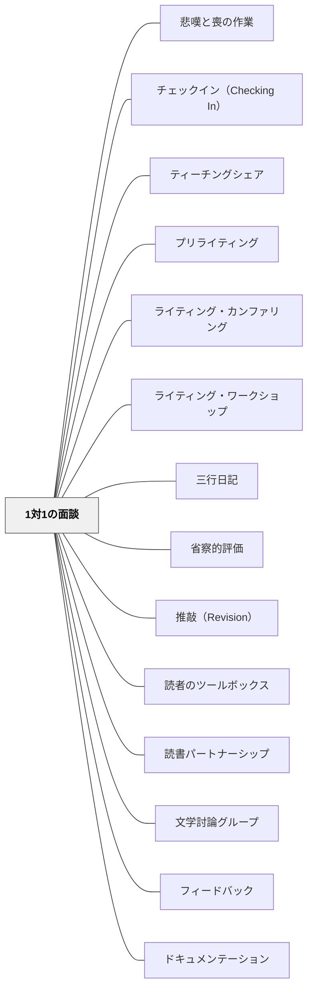

# 1対1の面談

> 一人ひとりへの言葉だけが、その人の核心に届く。

## [Pattern Connection]

Allen, P. A.（2009）*Conferring: The Keystone of Reader's Workshop* の統合（2026-05-19）：

Allen はリーディング・ワークショップにおける1対1のカンファリングを、単なる読書確認から「厳密さ・探究・親密さ」を備えた知的対話へ昇格させる方法論を詳述した。

- **補強された点**：「1つだけフィードバック」という原則に加えて、よい会議が持つ3つの質が明確になった——*厳密さ（Rigor）*「深く考えさせるか」、*探究（Inquiry）*「子どもが自分を読者として発見しているか」、*親密さ（Intimacy）*「誰が話し、誰がテキストを所有しているか」
- **修正・拡張された点**：「どこに座るか」という問いが加わった。コーナーの机に呼ぶ（教師の場所）ではなく、読んでいる場所に行く（子どもの場所）が、親密さの物理的条件
- **他のパタンへの波及**：[[パタン/RIPモデル]] が1対1の面談に構造を与える。[[パタン/リーディング・ワークショップ]] の Composing 時間に面談が埋め込まれる

**Dorn & Soffos（2005）統合（2026-05-19）——文学討論グループにおける個別カンファリング：**

Dorn & Soffos は [[パタン/文学討論グループ]] の7コンポーネントの1つとして、**黙読期間中の個別カンファリング**（コンポーネント3）を位置づける。このカンファリングは Allen の「厳密さ・探究・親密さ」という質の枠組みに、**文学討論グループ固有の3方向の問い**という内容的な構造を与える。

- **時間設計**：黙読中に1人あたり3〜4分。1日7〜8名に実施可能
- **開始の定型文**：「読みながら話したいところはありますか？」——子どもが主導する形でカンファリングが始まる（Allen の「親密さ」原則の具体化）
- **3方向の問いの構造**：

| 方向 | 問いの例 | Allen の質との対応 |
|---|---|---|
| **物語への反応** | 「この物語はどんな気持ちにさせてくれましたか？」 | 親密さ（子どもが感じたことから始める） |
| **著者への問いかけ** | 「著者はここで何を言いたいと思う？」 | 厳密さ（テキストへの深い問い） |
| **理解のアセスメント** | 「このテーマは何だと思いますか？」 | 探究（理解の状態を診断する） |

- **補強された点**：Allen の RIP モデル（Review → Instruction → Plan）のうち「Review（今何を読んでいるか）」フェーズを、Dorn & Soffos の3方向で具体化できる。物語への反応がReview、著者への問いかけがInstruction、理解のアセスメントがPlan（次の討論の準備確認）と対応する
- **文学討論グループとの接続**：個別カンファリングで得た子どもの発言・気づきは、その後のグループ討論（コンポーネント4）で子どもが発言する足場になる——カンファリングが討論の「リハーサル」として機能する

**Collins（2004）統合（2026-05-24）：**

*Growing Readers* はカンファランスを「ミニレッスンの計画を改善するための観察ツール」として描く。子どもの読書を直接見る場であり、次の全体指導の設計に戻ってくる循環が明示される。

- **補強された点（カンファランスから全体指導へ）**：Collins はHillary先生のクラスでのデモで、個別カンファランスで観察したこと（Jean-Pierreが「disappointed」でつまずいた）を「全体ミニレッスン」へ変換しようとする際の落とし穴を示す——「/oi/音のミニレッスン」は特定すぎてクラスに届かない。「Readers need to use multiple strategies」という広い問いに変換すると、クラス全体への指導になる
- **具体例（Fiona とのカンファランス）**：Fionaは語彙・流暢さは優秀だが思考が表面的だった（Nate the Greatを読んでいる）。Collins は「本の声に語りかけながら読む声（the voice in her head that talks back to the story）」を育てることを指導目標として設定し、続きを読みながらFionaが「止めるタイミング」を決める練習をさせた
- **具体例（Frances とのカンファランス）**：FrancesがHenry and Mudgeを読み「Like Ne Ne（自分の従姉）」とsticky noteに書いていた。Collinsは「そのつながりで物語の理解はどう変わった？」と問い、表面的なつながり（TS）から「Henryの気持ちの推察」（深い理解）へと接続を深めさせた
- **拡張された点（カンファランスの目的は「読み手を教える」）**：本の技術的な修正（特定の音を教える）ではなく、「この読み手が次に何を学べばもっと良い読み手になれるか」を問う設計——AllenのRIPモデル・Atwell の「Teach the writer, not the writing」と同じ哲学
- **他のパタンへの波及**：[[パタン/読書パートナーシップ]] — カンファランスで観察した力のレベルがパートナー設計に使われる

---

## 背景（Context）

学習者へのフィードバックには、全体に向けたものとは異なる深さをもつ形式がある。それが教師と学習者の1対1の面談（カンファランス）だ。読書・作文・プロジェクト学習などの場面で行われる個別カンファランスは、学習者の個別の状態・困り感・強み・次のステップを丁寧に扱うことができる、最も個人に最適化されたフィードバックの形式だ。

ナンシー・アトウェル（Nancy Atwell）が読書・作文ワークショップで発展させた「書くカンファランス」は、この実践の最も洗練された形として知られており、学習者の声を丁寧に聞きながら、その学習者にとって「今必要な一つのこと」を届けるという原則で行われる。

## 問題（Problem）

全体向けのフィードバックや書面による評価だけでは、学習者の個別の文脈（その学習者が今どこで詰まっているか・どこに強みがあるか・どんな疑問をもっているか）に応じたフィードバックは届きにくい。特に内向きな学習者は、全体の場では質問や困り感を表明しにくく、個別の空間でこそ本音が語られる。

また、学習者の数が多い場合、一人ひとりに時間をかけることが難しいという制約がある。

## 力のかたち（Forces）

- 1対1の面談は質が高い分、時間とエネルギーが必要で、全員に同等の時間を確保することが難しい
- 面談の内容・記録を蓄積することで、一人ひとりの学習の軌跡が可視化される
- 面談の雰囲気（安心・信頼・正直さ）が、フィードバックの深さを左右する

## 解決（Solution）

授業中に他の学習者が個別作業をしている時間を使って、一人ひとりと短時間（5〜10分）の個別面談を行う。面談の頻度は週1回・隔週・月1回など、学習の段階と必要性に応じて調整する。面談は学習者の声を聞くことから始め（「今どんな状態ですか？」「何に取り組んでいますか？」）、教師は診断的に聞いた後、「一つだけフィードバックするとすれば」という原則で最も重要な一点を伝える。

面談の記録（メモ・シート）をつけることで、前回からの成長を確認し、継続的な対話が生まれる。学習者にとっては「自分のことを個別に見てもらっている」という経験が、学習動機と教師への信頼に深くつながる。

---

### 厳密さ・探究・親密さ（Rigor, Inquiry, Intimacy）——Allen（2009）による3つの質

Allen と Lori Conrad は、よいカンファリングを「3つの質の共存」として定義した。この3つは、読書カンファリングに限らず1対1の面談全般に適用できる。

**厳密さ（Rigor）——認知的文脈**
- 面談が知的に深いかどうか。「何を教えるか」「どんな言葉を使うか」が問われる
- 子どもの思考を「より賢くする」経験になっているか——「ハレーが言ったこと：『Mr. Allen は私が賢くなる道具を与えてくれた』」
- 「1つのことを深く」という原則が厳密さを生む。多くのことを一度に言おうとすると厳密さが失われる

**探究（Inquiry）——分析的文脈**
- 面談が「教師が知識を与える場」でなく「子どもが自分を読者として発見する場」になっているか
- パターンを探す：「この子の成長の軌跡の中で、今何が起きているか？」
- 具体的な実践：開放的な問いかけ・パラフレーズ（子どもの話を繰り返し確認する）・Think time（沈黙を埋めない）・断言を控える（「〜だと思う？」でなく「〜に気づいていた。それを続けて」）

**親密さ（Intimacy）——社会的文脈**
- 「誰が話すか？」——子どもが話す量を最大化する。教師が答えを用意して聴くのでなく、子どもが語ることに従う
- 「誰がテキストを所有するか？」——読んでいる本は子どものもの。教師がテキストをコントロールする瞬間に親密さは壊れる
- 「どこに座るか？」——コーナーの机に呼ぶのでなく、読んでいる場所に行く。隣り合わせで座る（shoulder-to-shoulder）。面談は子どもの場所で行う

Jaryd との会議から：「知っているか」ではなく「どのように知ったか」を問う。「Farmer Boy は難しすぎる」と教師が判断するのでなく、Jaryd 自身が「自分を信頼することを学んだ」——面談は子どもが自分の判断力を発見する場になる

## 結果（Consequences）

- 学習者の個別の状態に最適化されたフィードバックが届き、学習改善が加速する
- 教師と学習者の信頼関係が深まり、困り感を表明しやすい関係が育まれる
- 学習者が「自分の学習を見てもらっている」という帰属感・安心感をもつ

## 関連パタン
- [[パタン/悲嘆と喪の作業]]
- [[パタン/チェックイン（Checking In）]]
- [[パタン/ティーチングシェア]]
- [[パタン/プリライティング]]
- [[パタン/ライティング・カンファリング]]
- [[パタン/ライティング・ワークショップ]]
- [[パタン/三行日記]]
- [[パタン/省察的評価]]
- [[パタン/推敲（Revision）]]
- [[パタン/読者のツールボックス]]
- [[パタン/読書パートナーシップ]]
- [[パタン/文学討論グループ]]

- [[パタン/フィードバック]] — 親パタン
- [[パタン/ドキュメンテーション]] — 面談の記録が学習の軌跡として機能する
- [[パタン/到達レベルの自己評価]] — 面談の中で自己評価を共有し深める
- [[パタン/フィードフォワード（次に何をするべきか）]] — 面談で明らかになったギャップを次の行動につなげる
## このパタンが働く実践
- [[実践/カンファリング（読書会議）]]

| 実践パタン | どのように1対1の面談が働くか |
|------------|------------------------------|
| [[パタン/リーディング・ワークショップ]] | 読書カンファランスで、今読んでいる本・困り感・次の一歩を個別に聞く |
| [[パタン/ライティング・ワークショップ]] | 書くカンファランスで、書き手として一点だけ渡す（詳細は [[パタン/ライティング・カンファリング]]）|
| [[パタン/ピアコーチング]] | 一対一の対話を通して、相手の目標と改善行動を支える |

## クラスター図

## Actionable Insight

- 他の学習者が個別作業をしている間に、一人ずつ5〜10分の個別面談を設ける——全員に週1回は難しくても2週間に1回でも定期的な面談が信頼と改善を積み重ねる
- 面談は「今どんな状態ですか？」から始め、教師は診断的に聞いた後「一つだけフィードバックする」原則を守る——一点集中のフィードバックが最も届きやすい
- 面談の記録（何を話したか・何を次の目標にしたか）を簡単にメモし、次回の面談で参照する——記録があることで成長が可視化され継続的な対話が生まれる
- **「親密さ」のチェック**：次の面談で「誰が話しているか」を意識する——教師が80%話していたら、開幕の問いを変えて「今日はあなたが教えてくれる番」にしてみる
- **「厳密さ」のチェック**：面談を終えたあとに「今日、子どもが賢くなった瞬間はあったか？」を問う——なければ次回は問いの深さを変える
- **「探究」のチェック**：面談中に「沈黙が居心地悪くなって先に口を開いた」なら、次は10秒待ってみる——Think time はカンファリングの最も重要なツールの一つ

## 出典
- [[文献/社会科教師の授業・学級づくり「仕掛け学」（小倉勝登）]]
- [[文献/Teaching for Deep Comprehension（Dorn & Soffos）]]

Atwell, N. (1998). *In the Middle: New Understandings about Writing, Reading, and Learning*. Heinemann.
Anderson, C. (2000). *How's It Going? A Practical Guide to Conferring with Student Writers*. Heinemann.
Allen, P. A. (2009). *Conferring: The Keystone of Reader's Workshop*. Stenhouse Publishers.

[[文献/Conferring（Allen）]]
