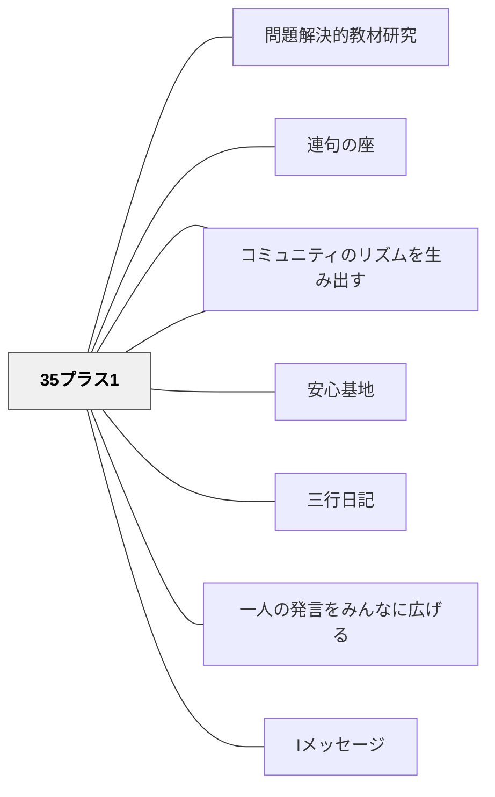

# 35プラス1

> 学級は35人の子どもと1人の担任——36人全員のチームである。

## [Pattern Connection]

**小倉勝登（2020）全文再統合（2026-05-21）——6つの約束の具体的内容：**

初期統合では「6つの約束」の名称だけが記録されていたが、全文 OCR により各約束の具体的な語りかけ・エピソード・意図が明らかになった。

**① 「35+1でつくる」の語りかけ**：黒板に「35+1」と書き、意味を子どもに問いかける。「35はみんな、1は先生のこと。全員で協力してつくっていこう」——「あなたの居場所はここ」という明示的な宣言。

**② 「チャレンジしよう」の語りかけ**（キャロル・ドウエック研究を根拠として子どもに語る）：
> 「失敗を恐れずに、やりたいこと、達成したい目標のために、どんどんチャレンジしよう。人は失敗の経験をしないで生きていくなんて無理。でもね、大切なことは、失敗した後です。次どうすれば同じ失敗をしないかを自分で考えよう。大切なのは次だよ。」

授業場面への直接効果：「間違ったらどうしよう」という委縮を学期はじめに解く布石になる。

**⑤ 「あたたかい言葉かけ」の語りかけ**（詩の紹介とセット）：「人の心を傷つける言葉は絶対に許さない。特に身体的なことは冗談でも言ってはいけない」——「そのたった一言が人の心を傷つける、そのたった一言が人の心をあたためる」という詩を子どもに紹介する。

**⑥ 「遠慮せず」のエピソード**：「私が間違えたら言ってください。間違えたら謝ります」という宣言は、実際に走り高跳びの授業で子どもの学習を保証できなかったとき、翌朝全体の前で頭を下げることで体現された。子どもたちは許し、フォローしてくれた——**教師の姿勢が子どもの行動規範になる**原理の実例。

- **補強された点**：6つの約束は単なる言語化ではなく、「教師が最初に行動で示す」こととセットになっている。特に「遠慮せず」は教師が先に体現してはじめて成立する。
- **他のパタンへの波及**：[[パタン/提案する文化]] — 「提案しよう」約束が浸透すると、授業中に「グループで話し合う時間をください」という子どもの提案が生まれる実例あり。[[パタン/授業の縦糸と横糸]] — 学期はじめの6つの約束は、その後のすべての授業仕掛けが機能するための「布石」として位置づけられている。

---

## 背景（Context）

「先生が学級を管理する」という構図では、教師は35人に対して外部から指示を出す存在になる。しかし優れた学級づくりにおいて、教師は学級の「外」にいるのではなく「中」にいる。教師もまた、学級という共同体の一員として参加しているという認識が、関係性の質を根本的に変える。

小倉勝登は、文科省の教科調査官として多くの学級を観察する中で、子どもとの関係が深い担任ほど「私もこのクラスの一員として学んでいる」という姿勢を自然に示していることを見出した。

## 問題（Problem）

教師が学級を管理・統制する対象として見ていると、子どもは「見られている・評価されている」という緊張の中に置かれる。提案・失敗・本音の発言がしにくくなり、教師と子どもの間に透明な壁ができる。また、子どもは「学級は先生のものだ」と感じると、主体的に関わろうとしない。

## 力のかたち（Forces）

- 教師が「みんなのリーダー」として立つことは権威を示すが、コミュニティへの参加意識を子どもから奪う
- 「36人のチーム」という言語化は比喩であり、実際に運用するには教師が自己開示・参加・相互承認を示し続ける必要がある
- 学校制度の非対称性（評価する者とされる者）は解消できないため、完全な対等関係は幻想でもある——その制約の中で「できる限り共に」を目指す姿勢が問われる

## 解決（Solution）

**学期はじめに「このクラスは35+1の36人でつくる」と宣言し、教師も含めて全員が欠かせない存在であることを明示する。**

この宣言は単なる言葉ではなく、以下の行動によって実体化される：

- **教師が自己開示する**：「私も間違えることがある。間違えたら言ってください」と先に範を示す。教師が完璧な権威者ではなく、ともに成長するメンバーであることを示す。
- **提案を歓迎する**：子ども同士の提案だけでなく、教師への提案も「ありがとう、考えます」と受け取る姿勢を示す。
- **教師不在でも動く文化**：教師が休んだときに学級が自分たちで判断できるなら、35+1が本物になっている。
- **チャレンジを讃える**：失敗した子どもを責めず、「次はどうする？」と共に考える。教師自身も挑戦し、失敗を語る。

小倉は学期はじめの学級開きで次の6つの約束を提示している：
1. **35+1でつくる**（全員の参加）
2. **チャレンジ**（失敗を恐れず）
3. **提案**（互いに改善案を出し合う）
4. **助け合い・認め合い・高め合い**（個性のデコボコを力に変える）
5. **あたたかい言葉かけ**（傷つける言葉を絶対に許さない）
6. **遠慮せず**（本音で、教師にも）

これらを「学級の憲法」として共有することで、その後の教師の行動が価値と一致した「モデル」として届く。

## 結果（Consequences）

- 子どもが「この学級は自分たちのものだ」という主体感をもつ
- 教師への提案・質問・本音の発言が増え、対話的な関係が育つ
- 「誰か一人が欠けても困る」という相互依存の感覚が助け合いの文化を育てる
- 教師が「管理する人」から「共に歩む人」になると、子どもは教師の言葉を別の形で受け取るようになる

## クラスター図

## Actionable Insight

- 学期はじめに「このクラスは○人の子どもと1人の担任、全部で○○人のチームです」と声に出して言う——「全員参加」の認識を最初の日に言語化するだけで学級の前提が変わる
- 「私も間違えることがあります。間違えたら遠慮なく言ってください」と学期はじめに言う——教師が先に「不完全な参加者」として自己開示することで子どもの防衛が緩む
- 子どもから提案があったとき、即座に「ありがとう」と言い、次の日に「あの提案、考えました」と結果を伝える——提案を「受け取る」行動の繰り返しが「提案の文化」をつくる

## 関連パタン
- [[パタン/問題解決的教材研究]]
- [[パタン/連句の座]]

- [[パタン/コミュニティをつくる]] — 上位パタン。学級を実践コミュニティとして設計する
- [[パタン/安心基地]] — 「あたたかい言葉かけ」が育てる心理的安全性
- [[パタン/三行日記]] — 35+1の関係を毎日の書き言葉でつくる
- [[パタン/一人の発言をみんなに広げる]] — 35+1の実践としての1×35の技術
- [[パタン/Iメッセージ]] — 教師が自己開示するときの言語的モデル
- [[パタン/コミュニティのリズムを生み出す]] — 学期はじめの宣言をリズムとして継続させる

## 出典
- [[文献/社会科教師の授業・学級づくり「仕掛け学」（小倉勝登）]]

小倉勝登（2020）『社会科教師の授業・学級づくり「仕掛け学」』東洋館出版社
