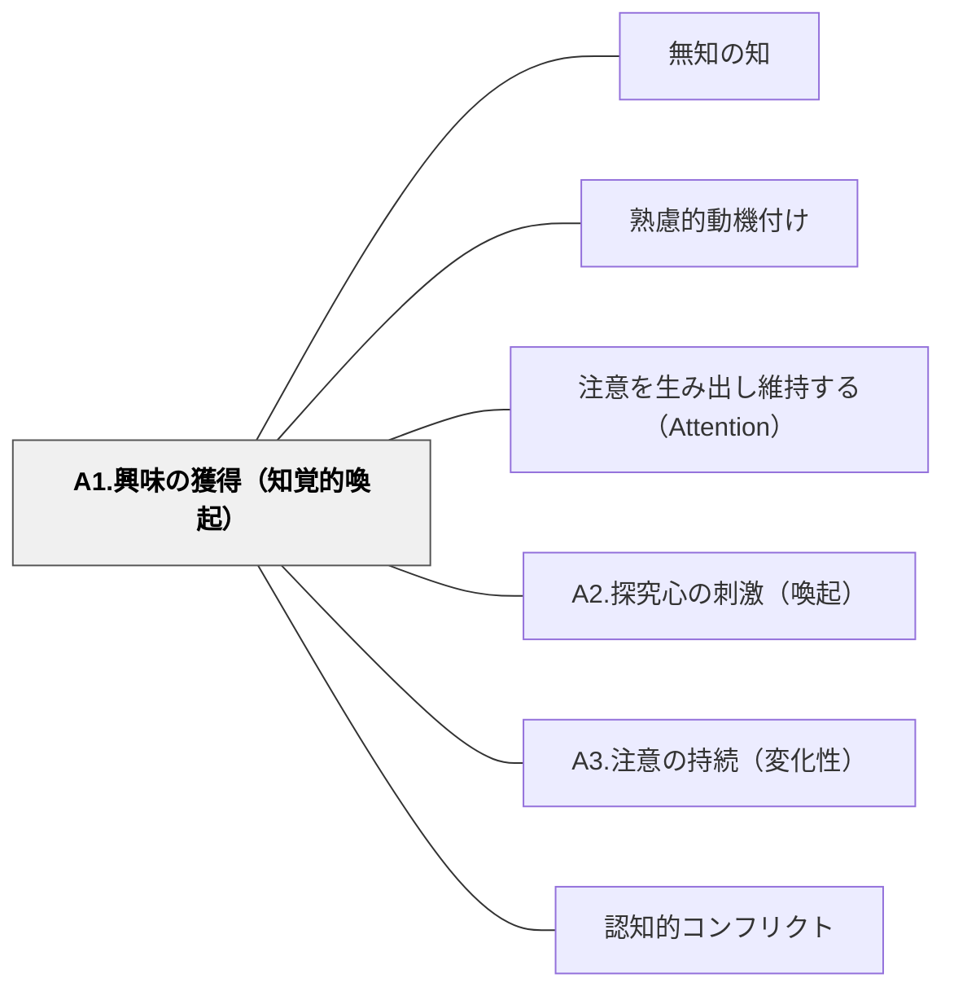

# A1.興味の獲得（知覚的喚起）

> 驚き・新奇性・視覚的刺激が、学習者の「なんだろう？」を呼び起こす。最初の一瞬が、その後の学習への入口になる。

## 背景（Context）
学習活動の冒頭において、学習者の注意を引くことが最初の課題になる。人は新奇なものや予期せぬ刺激に強く反応する性質があり、これを意図的に活用することで学習への入口を開くことができる。

## 問題（Problem）
学習者は授業や活動の開始時点では、まだ「学ぶモード」になっていないことが多い。ありきたりな導入では注意が引かれず、内容に入る前に興味を失ってしまう。

## 力のかたち（Forces）
- 驚きや新奇性は強力な注意喚起になるが、本筋と無関係な刺激は逆効果になる
- 視覚的・聴覚的な刺激は言葉だけの説明より注意を引きやすい
- 一度引いた注意は、後続の活動で維持する工夫が別途必要
- 過剰な「つかみ」は期待値を上げすぎ、失望を招くことがある

## 解決（Solution）
**授業や活動の冒頭に、驚き・不思議・逆説的な事実・印象的なデモなどを置くことで、学習者の「知覚的な注意」を喚起する。**

例えば、授業の始まりに反直観的な現象を見せる、学習内容に関連した驚きのデータを提示する、謎めいた写真や動画から始めるといった方法が有効である。重要なのは、この刺激が後続の学習内容と必ず結びついていることである。

## 結果（Consequences）
- 学習者が「これは何だろう？」という好奇心を持って活動に入れる
- 授業の冒頭の雰囲気が変わり、クラス全体のエネルギーが高まる
- 後続のA2（探究心の刺激）やA3（注意の持続）と組み合わせることで効果が持続する

## クラスター図

## Actionable Insight

- 授業の冒頭に「こんな現象、見たことある？」と反直観的なデータや現象を1分見せる——「なんだろう？」という気持ちが後続の学習への入口を開く
- 学習内容に関連した謎めいた写真や動画を導入に置き「これが何か分かる？」と問う——視覚的な刺激が言葉だけの説明より注意を引きやすい
- 授業の最初の一文を「実は〇〇ではなかった」という逆説的な事実から始める——驚きは注意喚起の最も強力なトリガーだが、後の学習内容と必ず結びつけることが条件

## 出典

- 一つの教育のパタン・ランゲージ（岩井輝久）

## 関連パタン
- [[パタン/無知の知]]
- [[パタン/熟慮的動機付け]] — 親パタン
- [[パタン/注意を生み出し維持する（Attention）]] — 親パタン
- [[パタン/A2.探究心の刺激（喚起）]] — 関連サブパターン
- [[パタン/A3.注意の持続（変化性）]] — 関連サブパターン
- [[パタン/認知的コンフリクト]] — 関連パタン（驚きの活用）
