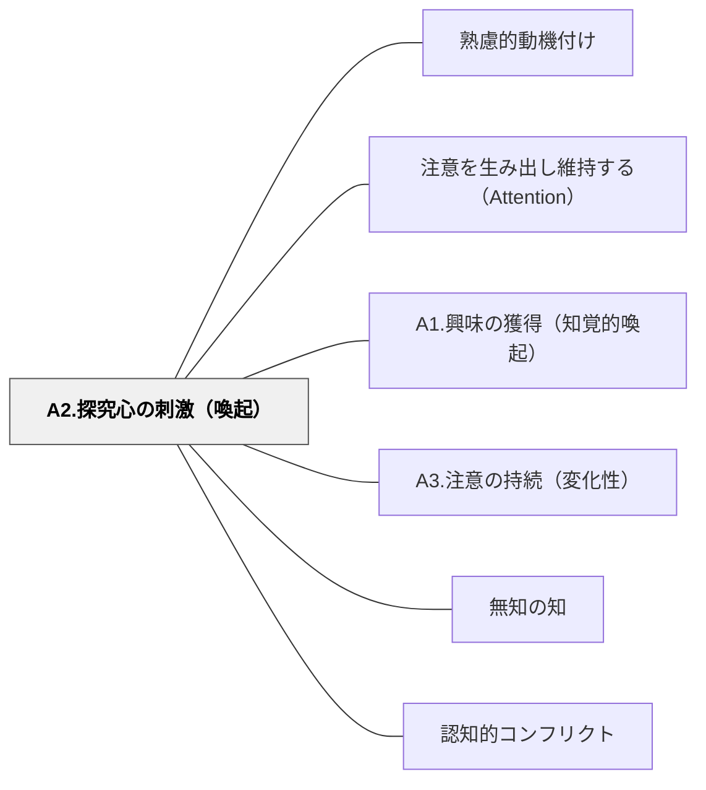

# A2.探究心の刺激（喚起）

> 「なぜ？」「どうして？」が解きたくなる状況を作ることで、探求欲を内側から燃やす。問いは答えより強い動機になる。

## 背景（Context）
注意を引いた後、学習者が自分から深めていこうとする探究心を喚起することがこのパターンの焦点である。知的好奇心は外から与えるのではなく、「謎」「問い」「未解決の緊張」によって内側から引き出される。

## 問題（Problem）
教師が「答え」を先に提示してしまうと、学習者が自ら探究する余地がなくなる。問いがない学習は受動的になりやすく、深い理解や記憶の定着につながりにくい。

## 力のかたち（Forces）
- 謎や問いは、答えが提示される前の「緊張状態」を生み出す
- 問いが難しすぎると無力感につながり、簡単すぎると探究心が生まれない
- 学習者自身が問いを生成できると、より強い探究心が育つ
- 問いに対する答えを自分で発見する体験が、学習の喜びにつながる

## 解決（Solution）
**問いかけ・謎・課題・仮説の投げかけによって、学習者が「解きたい」「知りたい」という状態になるよう設計する。**

授業の中に「なぜこうなるのだろう？」という問いを埋め込む、仮説を立てさせてから検証させる、答えを言わずに問いだけを提示して次回に持ち越すなどの方法が有効である。問いは教師が与えるだけでなく、学習者自身が問いを立てる場を設けることも重要である。

## 結果（Consequences）
- 学習者が受動的な受け手でなく、能動的な探究者として活動に参加できる
- 学習への関与が深まり、内容の理解と記憶が促進される
- 探究心の習慣が育ち、自己主導的な学びへとつながっていく

## クラスター図

## Actionable Insight

- 授業の中に「なぜこうなるのだろう？」という問いを一つ埋め込み、答えを言わずに活動に入る——答えを先に与えないことが「解きたい」という探究の動機をつくる
- 仮説を立てさせてから実験・調査に入る——「自分の予想が合っているか」という緊張感が探究への能動的な関与を生む
- 授業の終わりに「今日の内容から、あなたが一番気になった問いを1つ書こう」と問う——学習者自身が問いを生成する経験が自己主導的な探究心を育てる

## 出典

- 一つの教育のパタン・ランゲージ（岩井輝久）

## 関連パタン
- [[パタン/熟慮的動機付け]] — 親パタン
- [[パタン/注意を生み出し維持する（Attention）]] — 親パタン
- [[パタン/A1.興味の獲得（知覚的喚起）]] — 関連サブパターン
- [[パタン/A3.注意の持続（変化性）]] — 関連サブパターン
- [[パタン/無知の知]] — 関連パタン（知らないことを知る）
- [[パタン/認知的コンフリクト]] — 関連パタン
