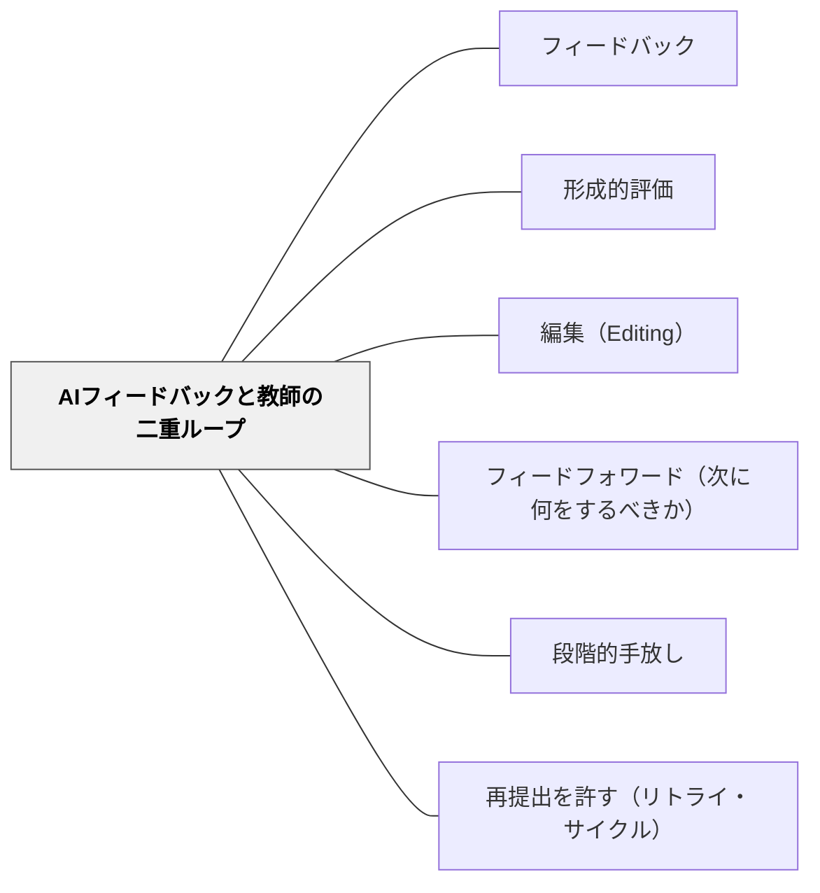

# AIフィードバックと教師の二重ループ

> 30人分の作文に一人で朱を入れていると、フィードバックは遅く・薄くなる。AIは速く・疲れず・大量に返せる——だが感情を読めず、平然と的外れなことを言う。だからAIに全部任せるのでも、全部抱え込むのでもない。**低次の表記はAIに、高次の意味と人格的応答は教師に**。AIと教師がそれぞれの得意で二重にループを回す。

## 背景（Context）

書くことの指導で、フィードバックは学習の心臓部である（[[パタン/フィードバック]]・[[パタン/形成的評価]]）。だが一人の教師が学級全員に、頻繁に・具体的に・速く返すのは時間的に困難で、人数が増えるほどフィードバックの質か量が削られる（Gao et al., 2024）。

AWE（自動作文評価；Automated Writing Evaluation）ツールやChatGPTのような生成AIは、この制約を変えうる。AIは即時・詳細・一貫したフィードバックを、何人にでも疲れず返せる（Luo, 2016）。Grammarly が自律的学習を支えつつ作文力を伸ばした研究もある（Barrot, 2023）。

しかしAIフィードバックには弱点がある。微妙なニュアンスや感情を読めず（Otaki & Lindwall, 2024）、ハルシネーションで的外れな指摘をすることがある。Koltovskaia（2023）は「AWEは教師を補完すべきで、頼り切ってはならない」と述べ、Son & Philpott（2026）も「AIが低次の関心（lower-order concerns）を扱い、教師が高次の関心（higher-order concerns）に集中する」分担を提案する。これはAIリテラシーの「効果的・効率的」観点（[[概念/AIリテラシー（創造的・批判的・効果的・効率的・倫理的）]]）の中核的実装である。

## 問題（Problem）

AIフィードバックの導入は、両極端のどちらかに振れて失敗しやすい。

**失敗形①：AIに丸投げする。** 作文をAIに渡し、返ってきた指摘をそのまま子どもに返す。教師は楽になるが、AIは内容の核心（言いたいことが伝わるか・構成は効いているか）や、その子の挑戦・成長といった**人格的な文脈**を読めない。フィードバックは表記の訂正に偏り、しかも時に的外れになる。子どもは「先生は読んでくれていない」と感じ、フィードバックの意味（自分に向けられた応答）が失われる。

**失敗形②：AIを警戒して全部抱え込む。** 「AIは不正確だから使わない」と、教師が従来どおり全員分に朱を入れる。結果、フィードバックは遅く・少なく・表記の訂正で手一杯になり、高次の指導まで届かない。AIの省力効果を、リスクを恐れて捨てている。

どちらも「AIか教師か」の二択で考えている。問題は、AIと教師の**得意が違う**のに、それを役割分担として設計していないことにある。

## 力のかたち（Forces）

- フィードバックは速く・頻繁・具体的なほど効くが、一人の教師では人数の壁に当たる——量と質はトレードオフになりやすい
- AIは速く・疲れず・大量に・一貫して返せる——だが感情・文脈・その子の物語を読めない
- AIは表記や文法など低次の誤りの検出が得意——だが内容・構成・声など高次の判断は人間が強い
- AIはハルシネーションで的外れな指摘をしうる——出力をそのまま返すと害になる
- AIに頼り切ると教師の役割が痩せ、フィードバックの人格的意味が失われる——「読んでもらえた」感覚は人間からしか来ない
- 教師が全部抱えると高次の指導まで手が回らない——省力できるところは省力すべき

## 解決（Solution）

**AIと教師を「二重ループ」として設計する。AIは低次の関心（表記・文法・語彙・文レベル）を即時に・全員に返す内側のループを担い、教師は高次の関心（内容・構成・声・その子への人格的応答）に集中する外側のループを担う。教師は子どもに返す前に必ずAIフィードバックを自分の評価と突き合わせ、人間が最終責任を持つ。**

実装は次の5点で進める。

1. **低次と高次を分ける**：AIには「文レベルの誤り（誤字・文法・語彙）を指摘して」と役割を限定して頼む。教師は「言いたいことが伝わるか・構成は効いているか・この子の挑戦は何か」という高次の関心に時間を使う（Koltovskaia, 2023）
2. **教師が突き合わせてから返す**：AIフィードバックをそのまま子どもに渡さない。教師が自分の評価（ルーブリック）と照合し、一致点・不一致点を確認してから返す（Son & Philpott の活動4.4）。AIの的外れな指摘はここで止める
3. **AIで「繰り返す誤り」を見つける**：個々の訂正でなく、AIの出力からその子・学級に**繰り返し現れる誤り**のパターンを抽出し、次のミニレッスンの題材にする。省力を指導の質に変換する
4. **使う機会を保証する**：フィードバックは「使う機会」があって初めて学習になる。AIの即時フィードバックを受けて直し、再提出する循環を組む（[[パタン/再提出を許す（リトライ・サイクル）]]）
5. **依存させない**：AIフィードバックは足場であり、最終的には子ども自身が自分の文章を吟味できることを目指す。慣れたら「まず自分で→次にAI→最後に教師」の順で、足場を段階的に外す（[[パタン/段階的手放し]]）

---

### 具体例1：作文の二重ループ（活動4.4の翻案）

国語の作文単元で、子どもが段落を書く。提出後の流れ：

1. **内側ループ（AI）**：子ども自身がAIに「この段落の誤字・文法・文のねじれを指摘して」と頼み、表記レベルを直す。教師の手を借りずに低次の修正が回る
2. **外側ループ（教師）**：教師は表記でなく「中心となる文があるか・支える文が効いているか・読者に伝わるか」を見る。返す前に、AIの指摘と自分のルーブリックを突き合わせ、的外れな指摘は除く
3. **返却と再提出**：高次のコメントを返し、子どもは直して再提出する

教師は「全員の誤字を朱で直す」労力から解放され、その時間を「一人ひとりの内容への応答」に振り向ける。AIが下支えし、人間が核心を担う。

---

### 具体例2：AI出力から「繰り返す誤り」を抽出してミニレッスンにする

教師が学級全員の作文をAIに通し、「この30人の文章に共通して多い誤りを3つ挙げて」と頼む。たとえば「主語と述語のねじれ」「『ら抜き』」「一文が長すぎる」が浮かぶ。

教師はこれを次の[[パタン/編集（Editing）]]ミニレッスンの題材にする。個別の朱入れ（労力大・効果薄）でなく、共通の誤りを学級全体で1回扱う（労力小・効果大）。AIの省力効果を、フィードバックの「質」と「焦点化」に変換している。

---

### 具体例3：依存を防ぐ「自分→AI→教師」の順

慣れてきた学級では、フィードバックの順序を設計し直す。

- **まず自分で**：自分のチェックリストで表記を見直す（[[パタン/編集（Editing）]] の編集パス）
- **次にAI**：見落としをAIに拾わせる。「自分で見つけられなかった誤りはどれか」を確認する
- **最後に教師**：高次の応答だけを教師が返す

AIを「最初から頼る相手」でなく「自分の後に確かめる相手」に置くことで、過度依存（[[概念/AIリテラシー（創造的・批判的・効果的・効率的・倫理的）]] が警告する risk）を防ぎ、自己編集力を育てる。

---

### 特別支援の視点：低次の負荷をAIで下げ、人間の応答を厚くする

書字・正書法の負荷が高い子にとって、表記の誤りを全部自力で直すのは「書くこと」そのものを嫌いにしかねない。

- **低次をAIに肩代わりさせる**：表記の修正をAI（読み上げ・文法チェック）に任せ、その子は「言いたいこと」に集中できる。書く意欲を守る
- **教師の時間を人格的応答に回す**：省力できた分、その子の挑戦・成長への個別の言葉（[[パタン/1対1の面談]]）を厚くする。「読んでもらえた」感覚は人間からしか来ない
- **AIの指摘を一度に全部出させない**：誤りを一気に提示すると圧倒される。「今日は1種類だけ」とAIへの依頼を限定する

## 結果（Consequences）

**利点：**
- フィードバックが速く・頻繁・具体的になる——人数の壁をAIが下支えする
- 教師の時間が低次の訂正から高次の応答・人格的支えへ移る——人間にしかできない指導が厚くなる
- AIの的外れ・ハルシネーションを教師が止める——人間が最終責任を持つ安全弁が働く
- 省力効果を「繰り返す誤りの抽出→ミニレッスン」に変換でき、指導が焦点化する

**注意点：**
- AIフィードバックをそのまま返すと、的外れな指摘や人格的意味の喪失を招く——必ず教師が突き合わせてから返す
- AIに頼り切ると子どもの自己編集力が育たず、過度依存に陥る——「自分→AI→教師」の順で足場を外す
- データプライバシーに注意——子どもの作文をどのAIに渡すか、何が保存されるかを確認する（[[概念/AIリテラシー（創造的・批判的・効果的・効率的・倫理的）]] の倫理的観点）
- AIフィードバックの精度はツール・言語で差がある——日本語の処理が弱いツールもある。導入前に教師が試す

## 関連パタン

- [[概念/AIリテラシー（創造的・批判的・効果的・効率的・倫理的）]] — 「効果的・効率的」観点の中核的実装。倫理的観点（データプライバシー）とも接続
- [[パタン/フィードバック]] — フィードバックの一般原則。AIはその担い手の一つであり、人間の応答を置き換えない
- [[パタン/形成的評価]] — 評価を学習に役立てる営み。AIで頻度と即時性を上げつつ、判断は人間が持つ
- [[パタン/編集（Editing）]] — 低次の表記整えをAIが補助し、教師は最終編集者として高次に集中する。役割分担が直結
- [[パタン/フィードフォワード（次に何をするべきか）]] — AIの即時フィードバックを「次の一歩」につなぐ。返すだけで終わらせない
- [[パタン/段階的手放し]] — AIへの依存を防ぎ、自己編集力が育ったら足場を外す（I Do→We Do→You DoのAI版）
- [[パタン/再提出を許す（リトライ・サイクル）]] — AIフィードバックを「使う機会」があって初めて学習になる。評価を循環にする
- [[文献/AI-Powered Language Teaching（Son & Philpott）]] — 出典。第2.2節（AWE）・第4.4節（writing feedback）から抽出

## クラスター図

## Actionable Insight

- **AIへの依頼を「低次だけ」に限定する一文を用意する**——「この文章の誤字・文法・文のねじれだけを指摘して。内容や構成にはふれないで」という定型プロンプトを決め、低次／高次の分担を毎回はっきりさせる
- **返す前にAIフィードバックを自分のルーブリックと突き合わせる**——子どもに渡す前に、AIの指摘と自分の評価の一致・不一致を確認し、的外れな指摘を除く一手間を習慣にする
- **学級全員の作文から「繰り返す誤り3つ」をAIに抽出させ、次のミニレッスンにする**——個別の朱入れでなく、共通の誤りを1回の授業で扱う。省力を指導の焦点化に変える

## 出典

Son, J.-B., & Philpott, A. (2026). *AI-Powered Language Teaching*. Cambridge University Press. (Cambridge Elements: Technology in Second Language Education). DOI: 10.1017/9781009650809

Koltovskaia, S. (2023). Student engagement with automated written corrective feedback (AWCF).

Barrot, J. S. (2023). Using ChatGPT for second language writing: Pitfalls and potentials. *Assessing Writing, 57*.

> "if AWE tools focus on lower-order concerns (e.g., sentence level), teachers can focus on higher-order concerns (e.g., overall organisation)."（本書 p.17）

> "Teachers should use AWE to complement their feedback processes but should not rely on the tools completely."（本書 p.17）
