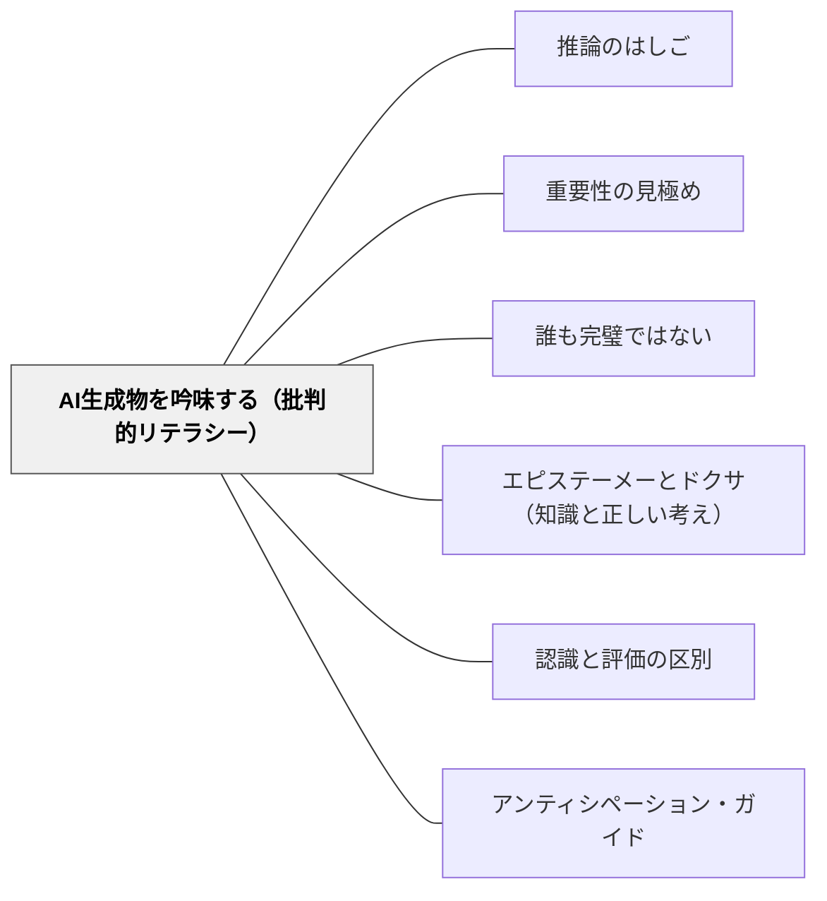

# AI生成物を吟味する（批判的リテラシー）

> AIの答えは、流暢で自信ありげなほど信じたくなる。だが流暢さは正しさではない。AIは平然と存在しない出典を作り（ハルシネーション）、特定の話し方や立場に偏る（バイアス）。AIを「答えをくれる神託」でなく「吟味される一次情報」として扱う構えを、活動として教室に組み込む。

## 背景（Context）

生成AI（ChatGPT・Copilot・Gemini など）は、子どもにとっても教師にとっても「すぐ答えが返ってくる便利な相手」になった。だが生成AIの出力は、もっともらしい言い回しで誤りを含むことがある——Pack & Maloney（2023）はこれをハルシネーション（hallucination）と呼び、ChatGPT が実在しない出典を捏造する例を挙げる。

加えてAIには構造的なバイアスがある。Fleisig et al.（2024）は、話者の少ない方言や言語変種が「非標準」と扱われる**方言バイアス**を指摘し、社会経済的に恵まれた利用者ほど高性能なAIにアクセスできる**社会経済バイアス**も知られる。AIの出力は中立で客観的に見えて、実は学習データと設計の偏りを映している。

この観点はAIリテラシーの5観点（[[概念/AIリテラシー（創造的・批判的・効果的・効率的・倫理的）]]）のうち「批判的（critical）」の中核的実装である。Son & Philpott（2026）は批判的リテラシーを育てる活動として「AIファクトチェッカー」を提案する。

## 問題（Problem）

AIの出力を**鵜呑みにする**ことから二つの失敗が生まれる。

**失敗形①：流暢さを正しさと取り違える。** AIの文章は文法的に整い、断定的で、いかにも正しそうに見える。子どもは（そして大人も）「ここまで自信を持って書くなら正しいのだろう」と判断してしまう。だが整った文体は、内容の真偽とは無関係である。捏造された出典・事実誤認・古い情報が、整った日本語のまま教室に持ち込まれる。

**失敗形②：偏りに気づかないまま規範化する。** AIが返す「標準的な答え」「自然な言い方」を、唯一の正解として受け取る。すると、少数派の話し方・多様な立場・別の見方が「間違い」として切り捨てられる。AIのバイアスが、批判されないまま子どもの規範になっていく。

放置すると、子どもは「調べる」を「AIに聞く」に置き換え、検証の習慣を失う。これは情報活用能力の核心——情報の信頼性を自分で評価する力——の空洞化である。

## 力のかたち（Forces）

- AIの出力は流暢で断定的なほど信じたくなる——だが流暢さは正しさの証拠ではない
- 「すぐ答えが出る」便利さは、自分で確かめる手間を省く方向に強く働く——便利さと検証は逆を向く
- AIは存在しない出典を平然と作る（ハルシネーション）——「出典がある」ことすら検証が要る
- AIは方言・社会経済・立場のバイアスを中立的な見た目で運ぶ——偏りは見えにくいからこそ規範化しやすい
- 全否定すると道具として使えず、全肯定すると検証が消える——「使いながら疑う」という両立が要る
- 検証には「比べる相手（別ソース）」が要る——AI一つでは正しさは確かめられない

## 解決（Solution）

**AIの出力を「正解」でなく「検証すべき主張（claim）」として扱う活動を設計する。AIに答えを出させ、その答えを別の情報源で確かめ、誤りと偏りを子ども自身が見つける——この「生成→検証→修正」のサイクルを授業の型にする。**

実装は次の5点で進める。

1. **AIを「一次情報」でなく「吟味対象」と位置づける**：「AIが言った」を結論にしない。「AIはこう言った。では本当か？」を出発点にする。AIの発話を引用として扱い、検証の対象に格下げする
2. **別ソースで突き合わせる**：AIの主張を、検索エンジン・教科書・辞書・実物など**別の情報源**と照合する。「AccordingTo（〜によれば）」で出典を言える形に直す。一つの情報源だけで真偽を決めない
3. **わざと誤りを混ぜて見破らせる**：AIに「半分は間違いの文を10個作って。どれが間違いかは言わないで」と頼み、子どもがペアで真偽を予測→検証する（Son & Philpott の AIファクトチェッカー活動）。誤りを能動的に探す経験が「疑う目」を育てる
4. **バイアスを名指しで問う**：「この答えは誰の立場から書かれている？」「別の言い方・別の見方は切り捨てられていない？」と問う。方言・性別・文化の偏りを具体例で検出する
5. **ハルシネーションの実例に出会わせる**：AIが捏造した出典を実際に検索して「存在しない」ことを確かめる。一度この経験をすると、「出典がある」ことすら検証対象になる

---

### 具体例1：AIファクトチェッカー（半分うそクイズ）

社会科の「日本の地理」の単元で、教師が事前にAIに「日本の都道府県について、半分は間違いの文を10個作って。どれが正しい/間違いかは書かないで」と頼む。

授業では、子どもがペアでこの10文を読み、調べずにまず「これは本当・これはうそ」と予測する。次に、各文をAIや検索で検証し、間違っている文は「○○によれば、正しくは△△」と出典つきで直す。最後に「なぜAIの言うことを確かめる必要があるのか」をクラスで話し合う。

予測（自分の知識）→検証（別ソース）→修正（出典明示）の流れは、[[パタン/アンティシペーション・ガイド]] の「読む前の予測→読みながら検証」と同じ構造を、AI出力に対して使っている。

---

### 具体例2：捏造された出典を「実際に探す」

国語の調べ学習で、子どもがAIに「このテーマの参考になる本を教えて」と聞く。AIは著者名・書名・出版年つきのリストを返す。

ここで教師は「この本、本当にあるかな？図書館の検索で探してみよう」と促す。いくつかは実在するが、いくつかは**検索しても出てこない**。「もっともらしい書名なのに、存在しない」——この体験が、ハルシネーションを概念でなく実感として刻む。以後、子どもは「AIが出典を挙げた」こと自体を検証するようになる。

---

### 具体例3：「誰の立場か」を問う——バイアスの検出

外国語活動や国際理解の授業で、AIに「ていねいなあいさつの仕方」を聞く。返ってきた答えを見て、「これは誰の文化・誰の立場のあいさつ？」「日本の方言や、別の国ではどう違う？」と問い直す。

AIの「標準的な答え」が、実は特定の文化・立場に偏っていることを、別の事例と比べて可視化する（[[パタン/誰も完璧ではない]] の精神——AIも教師も完璧でなく、一緒に偏りを見つける）。「正解は一つ」という思い込みを、AIを題材にして崩す。

---

### 特別支援の視点：検証の手順を外在化する

「自分で確かめる」は抽象的で、何をどうすればよいか分かりにくい子がいる。検証を**目に見える手順カード**にして渡す。

- **検証3ステップカード**：「①AIは何と言った？ ②別のところ（教科書・検索・先生）でも同じ？ ③ちがったら、正しいのはどっち？」の3問を絵つきカードにする
- **「ほんと？」スタンプ**：AIの答えをノートに書いたら、隣に「ほんと？」欄を作り、確かめた結果を書く。検証を習慣の形にする
- **一度に1観点**：真偽・出典・偏りを同時に見ると混乱する。今日は「ほんとかな（真偽）」だけ、と限定して全体を通す（[[パタン/編集（Editing）]] の「1観点ずつ」と同じ思想）

## 結果（Consequences）

**利点：**
- 子どもが「調べる＝AIに聞く」から「AIの答えを確かめる」へ進む——情報活用能力の核心（信頼性評価）が育つ
- 「流暢さ＝正しさ」という思い込みが、実例を通して崩れる——メディアリテラシー全般に転移する
- AIを禁止せず、使いながら批判的に付き合う構えが育つ——全否定でも全肯定でもない現実的な態度
- バイアスを名指しで問う経験が、多様な立場・少数派の見方を尊重する目を育てる

**注意点：**
- 検証には「比べる相手（別ソース）」が要る——AI一つでは閉じる。検索・教科書・実物とセットで設計する
- 「疑え」だけを強調するとAI不信・学習意欲の低下を招く——「便利だが確かめる」のバランスを保つ
- 教師自身がAIの出力を検証していないと説得力がない——教師がモデルとして検証して見せる（[[パタン/シンクアラウド]] のAI版）
- 低学年では真偽の判断材料が乏しい——身近で検証可能な題材（学校・地域の事実など）に限定する

## 関連パタン

- [[概念/AIリテラシー（創造的・批判的・効果的・効率的・倫理的）]] — 「批判的（critical）」観点の中核的実装。本パタンはこの概念の下位にある
- [[パタン/推論のはしご]] — AI出力の前提・推論過程を段階的に可視化して問う道具
- [[パタン/重要性の見極め]] — 「もっともらしい」と「正しい・重要」を区別する読みの目。AI出力の吟味に直結
- [[パタン/誰も完璧ではない]] — AIも教師も完璧でない。間違いを一緒に検証する文化が批判的吟味を支える
- [[パタン/エピステーメーとドクサ（知識と正しい考え）]] — AI出力は根拠で縛られていない「正しそうな考え（ドクサ）」。原因推論で吟味して知識に高める
- [[パタン/認識と評価の区別]] — まず事実として検証（認識）し、価値判断（評価）は保留する科学的態度をAI出力に適用する
- [[パタン/アンティシペーション・ガイド]] — 「予測→検証」の構造を共有。AIの主張の真偽を予測してから確かめる
- [[文献/AI-Powered Language Teaching（Son & Philpott）]] — 出典。第4.2節「AIファクトチェッカー」（批判的観点）から抽出

## クラスター図

## Actionable Insight

- **次に子どもがAIを使う場面で「AIはこう言った。では本当か？」を合言葉にする**——AIの答えを結論でなく出発点にする一言を、教室の共通ルールとして掲示する
- **「半分うそクイズ」を1回やってみる**——身近な題材（学校・地域・教科の事実）でAIに半分誤りの10文を作らせ、ペアで予測→検証→出典つき修正を通す。ハルシネーションを実感として体験させる
- **捏造された出典を実際に図書館・検索で探させる**——AIが挙げた参考文献を1つ選び、本当に存在するか確かめる活動を入れる。「出典があること」自体が検証対象だと体験で刻む

## 出典

Son, J.-B., & Philpott, A. (2026). *AI-Powered Language Teaching*. Cambridge University Press. (Cambridge Elements: Technology in Second Language Education). DOI: 10.1017/9781009650809

Pack, A., & Maloney, J. (2023). Using generative artificial intelligence for language education research: Insights from using OpenAI's ChatGPT. *TESOL Quarterly, 57*(4).

Fleisig, E., et al. (2024). Linguistic bias in ChatGPT: Language models reinforce dialect discrimination.

> "Most importantly, not all data produced will be accurate or contextually appropriate. This necessitates a critical approach from users in which they learn how to distinguish between accurate data and inaccurate data through understanding the limitations and biases of AI tools."（本書 p.38）
