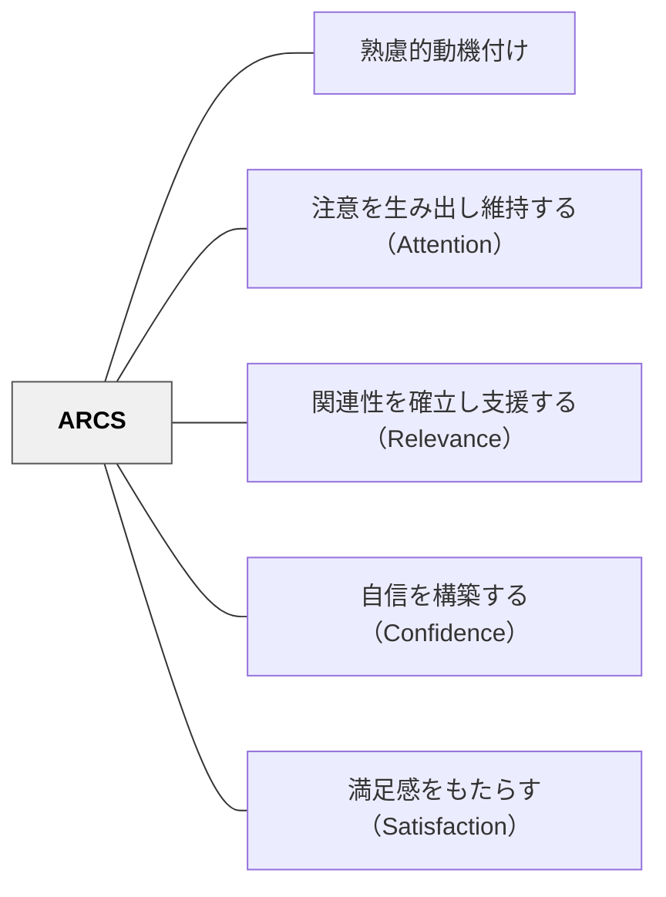

# ARCS

**一文でいうと**：注意・関連性・自信・満足の4観点から、学習意欲を総合的に設計する。

## 使いどころ・使いすぎ注意

| 観点         | 内容                                               |
| ------------ | -------------------------------------------------- |
| 使いどころ   | 意欲を複数観点から点検したいとき。                 |
| 使いすぎ注意 | 枠組みに当てはめすぎると、子どもの固有性が薄れる。 |

> 動機付けの4つの柱——注意・関連性・自信・満足——を体系的に設計することで、学習者の「やる気」を意図的に育てる。

## 背景（Context）

教育設計において、内容の質だけでは学習者の動機は保証されない。どれほど優れた教材でも、学習者が「なぜ学ぶのか」「自分にできるか」を感じなければ、深い学習は起こりにくい。ケラー（J.M. Keller）は、動機付けを構成する要因を整理し、実践可能なフレームワークとして提案した。

## 問題（Problem）

学習者の動機付けは複合的な要因からなり、教師が直感だけで対処しようとすると抜け漏れが生じる。「意欲がない」という問題を前にしても、その原因が「興味の欠如」なのか「自信のなさ」なのか「報酬の不在」なのかが見えなければ、有効な対応ができない。

## 力のかたち（Forces）

- 動機付けは単一の要因ではなく、複数の層からなる複合的な構造を持つ
- 学習者によって動機のボトルネックとなる要因は異なる
- 教師は動機付けを設計しようとしても、何から手をつけるべきか迷いやすい
- 過剰な介入は逆効果になる場合もある

## 解決（Solution）

**ARCSの4要素（Attention・Relevance・Confidence・Satisfaction）を枠組みとして、動機付けを体系的に診断・設計する。**

「注意を引く → 関連性を示す → 自信を育てる → 満足をもたらす」という流れで学習体験を設計する。各要素はそれぞれ3つのサブパターンを持ち、具体的な実践方法へと展開できる。どの要素が欠けているかを診断することで、的を絞った介入が可能になる。

## 結果（Consequences）

- 動機付けを構造的に捉えることができ、場当たり的な対応から脱却できる
- 学習設計の段階で動機付けを意図的に組み込めるようになる
- 各要素の強弱を診断することで、改善の優先順位が明確になる

## 関連パタン

- [[パタン/熟慮的動機付け]] — 親パタン
- [[パタン/注意を生み出し維持する（Attention）]] — ARCSのA
- [[パタン/関連性を確立し支援する（Relevance）]] — ARCSのR
- [[パタン/自信を構築する（Confidence）]] — ARCSのC
- [[パタン/満足感をもたらす（Satisfaction）]] — ARCSのS

## クラスター図

## Actionable Insight

- 授業準備のとき「この授業はARCSのどの要素が弱いか？」と自問し、最も弱い1要素に絞って改善策を考える——全要素を均等に設計しようとするより、ボトルネックに集中する方が効果的
- 学習者が意欲を失っている場面では「注意・関連性・自信・満足のどれが欠けているか」を観察して診断する——原因を特定することで有効な介入が選べる
- 単元の最初に「なぜこれを学ぶのか（R）」を示し、最後に「何ができるようになったか（S）」を確認する——ARCSのRとSの両端を意識するだけで学習体験の構造が整う

## 出典

- Keller, J. M. (2010). _Motivational Design for Learning and Performance: The ARCS Model Approach_. Springer.
- Keller, J. M. (1987). Development and use of the ARCS model of instructional design. _Journal of Instructional Development_, 10(3), 2–10.
