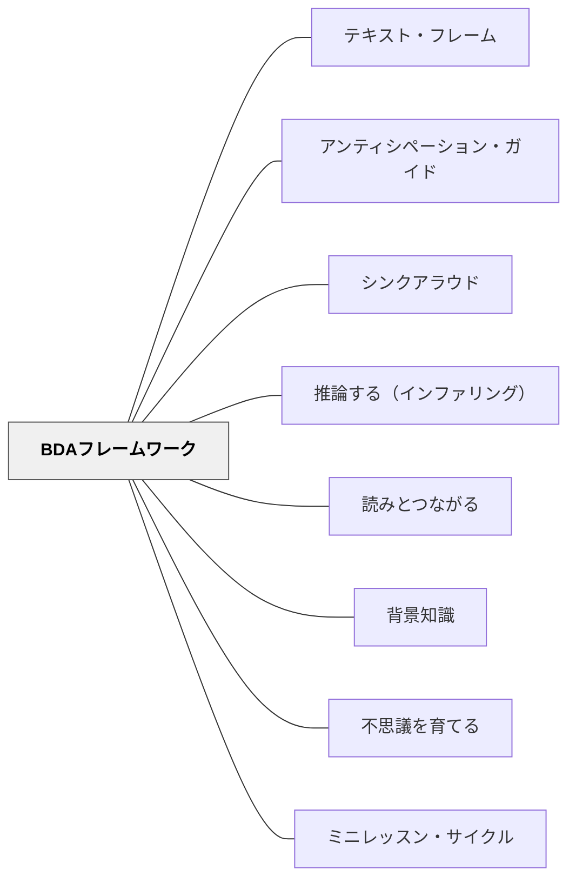

# BDAフレームワーク

> 読む前（Before）・読む間（During）・読んだ後（After）——この3段階でテキストとの関わりを設計することで、どんな読解方略も「いつ使うか」が決まり、授業全体が一本の線でつながる。

---

## Pattern Connection

**Allen（1999）統合（2026-05-20）**：

*Words, Words, Words* はBDAの各フェーズに対応する語彙方略のセットを提供する。語彙指導はBDAの枠組みに収まるとき、単発の「覚える時間」でなく授業の流れと一体化した継続的な学びになる。

- **既存パタンとの関連**：BDAフレームワークはBefore（背景知識の活性化・語彙の事前準備）→During（文脈からの語彙習得）→After（語彙の統合・深化）という語彙学習のサイクルと完全に対応する
- **補強された点**：「語彙プレビュー」（Before）の方法として、Allenの「リスト・グループ・ラベル」「どれだけ知っているか」「ワードストーミング」が具体的な実装として加わった。Beforeの「語彙プレビュー」は「意味を教える」のでなく「前知識を活性化し、読む理由を作る」として設計する
- **修正・拡張された点**：After フェーズに語彙深化の方略（コンテクスト−コンテンツ−エクスペリエンス、コンセプト・ラダー、リニア・アレイ）が加わり、「読んだ後に語彙を定着させる」活動の選択肢が広がった
- **他のパタンへの波及**：[[パタン/語彙指導]] — Before/During/Afterの語彙方略を一体化したパタン

### BDA × 語彙方略対応表（Allen, 1999）

| フェーズ | 語彙方略 | 目的 |
|---|---|---|
| **Before** | リスト・グループ・ラベル | 主要概念に関連する語の前知識を活性化する |
| **Before** | どれだけ知っているか | 語の自己評価で読む目的を作る |
| **Before** | ワードストーミング | 関連語を出し合い概念の地図を描く |
| **During** | リッチ・コンテクストの活用 | 文脈から語義を推測する |
| **During** | 語攻略の12ステップ | 未知語に出会ったときの対処法を明示 |
| **After** | コンテクスト−コンテンツ−エクスペリエンス | 文脈・教科・個人経験の3コラムで語を定着 |
| **After** | コンセプト・ラダー | 問いで語の概念を深掘りする |
| **After** | リニア・アレイ | 関連語を程度で並べ微妙な違いを理解する |

**出典**: Buehl, D.（2017）*Classroom Strategies for Interactive Learning* (4th ed.). Stenhouse Publishers.

- **既存パタンとの関連**: [[パタン/シンクアラウド]]・[[パタン/推論する（インファリング）]]・[[パタン/読みとつながる]]・[[実践/テキストコーディング]] はすべて「During（読む間）」フェーズの方略として位置づけられる。[[パタン/背景知識]] は「Before（読む前）」の根拠理論として機能する。[[パタン/不思議を育てる]] は「Before」と「During」の問いの文化として接続する
- **補強された点**: 個別の読解方略（シンクアラウド・テキストコーディング・推論等）が「授業の流れのどこに置くか」という設計上の判断基準を持てるようになった。「方略を知っている」から「方略を適切なタイミングで使う」へのシフト
- **修正・拡張された点**: Buehl の **フロントローディング（Frontloading）** 概念——複雑なテキストの「知識要求」に事前に応えることで、読む前から理解の足場を作る——が Background Knowledge（背景知識）パタンに「授業の中で何をするか」という実践的な次元を加える
- **他のパタンへの波及**: [[パタン/テキスト・フレーム]] — Before フェーズで文章構造を提示することで読みの枠組みが生まれる。[[パタン/アンティシペーション・ガイド]] — Before フェーズの代表的な実践ツール。[[パタン/ミニレッスン・サイクル]] — BDA は1時間のミニレッスンにも、複数時間のサイクルにも適用できる

**Buehl（2014）Chapter 4統合（2026-05-19）——規律的リテラシーと3つの失敗パターン：**

Buehl は BDA の前提条件として、多くの教科授業が陥る3つの失敗パターンを診断する（Buehl, 2011）。BDA フレームワークはこれら3つの失敗パターンへの直接的な処方として機能する：

| 失敗パターン | 何が起きているか | BDA による処方 |
|---|---|---|
| **「泳げるはずだ」（Sink or Swim）** | Before なしで複雑なテキストを読ませる | Before（フロントローディング）で足場を整える |
| **「保険をかける」（Hedging Your Bets）** | 読ませるが After は教師が全部説明する | After で子ども自身が統合・発表する設計にする |
| **「匙を投げる」（Throwing in the Towel）** | テキストを読ませない | BDA の全フェーズが読むことを前提に設計されている |

- **補強された点**：「なぜ BDA が必要か」の診断的文脈が明確になった——Before なしの授業は Sink or Swim であり、After なしの授業は Hedging Your Bets になる
- **拡張された点**：教科固有の読み（disciplinary literacy、[[パタン/規律的リテラシー]]）の指導でも同じ BDA フレームが使える——Before で disciplinary lens を提示し、During でそのレンズで読み、After でレンズを通した解釈を統合する

---

## 背景（Context）

読解方略の研究と実践は豊富だ——「推論する」「つながりをつくる」「視覚化する」「テキストをコーディングする」「シンクアラウドする」。しかし現場の教師が直面する問いは「どの方略を使うか」だけでなく、「**いつ、どの順序で使うか**」だ。

Buehl（2017）は、あらゆる読解・学習方略を整理する枠組みとして **Before-During-After（BDA）フレームワーク** を提供する。これは認知科学の学習理論（Vacca & Vacca, 2005）をもとに、教師が授業を設計するための思考ツールとして発展した。

BDA の核心：**読むことは「前・中・後」のプロセスであり、それぞれのフェーズに固有の認知的目的がある**。フロントローディング（Before）なしに始めると、読む間（During）に詰まる。読む間の関与なしに終わると、読んだ後（After）に何も残らない。

## 問題（Problem）

読解方略の指導が「方略の種類」で分類される場合、教師は「今日はつながりをつくる方略をやる日」という形で単発的に使いがちになる。するとどの方略がいつ使えるのか、子どもには体系として届かない。

また「とりあえず読ませる」——背景知識も目的も持たせずにテキストに向かわせる——と、理解の浅い読み（fake reading）が起きる。子どもたちは文字を追っているが、意味を作っていない。

## 力のかたち（Forces）

- 読む前の知識・目的・語彙の状態が、読む間の理解の深さを決定的に左右する
- 読む間は理解の「リアルタイム」——詰まったら止まる、飛ばさない、問いを立て続けるための方略が必要
- 読んだ後に何もしないと、理解は48時間以内に急速に薄れる（記憶・転移・統合のためのAfterが必要）
- 一つの読解方略を全フェーズに無理に使うと、方略の目的が曖昧になる
- 方略が多すぎると教師は選べず、少なすぎると対応できない——BDAという分類が選択を助ける

## 解決（Solution）

**テキストを扱う授業を「読む前（Before）・読む間（During）・読んだ後（After）」の3フェーズで設計し、各フェーズに対応する方略を意図的に選んで組み合わせる。**

---

### Before（読む前）——フロントローディングのフェーズ

**目的**：背景知識の活性化、読む目的の設定、語彙・概念の事前準備、認知的準備（cognitive readiness）

フロントローディングとは「読む前に、テキストが要求する知識に応えておく」準備のことだ。

| 方略 | 概要 | 特に有効な場面 |
|---|---|---|
| **アンティシペーション・ガイド** | 内容に関する記述文への賛否を事前表明 | 子どもの先入観と衝突する内容のテキスト |
| **KWL（Plus）** | 知っている・知りたい・学んだことのチャート | 新単元の導入、探究の出発点 |
| **チャプター・ツアー** | 見出し・図版・キャプションの事前巡回 | 説明文・教科書の章 |
| **語彙プレビュー** | 重要語彙に先に出会わせ、意味を仮説立て | 専門語が多い理科・社会のテキスト |
| **マインド・マッピング（事前）** | トピックへの既有知識をウェブ状に出す | 背景知識の差が大きいクラス |
| **テキスト・フレームの提示** | 「このテキストは○○の構造」と事前に伝える | 説明文・論説文のはじめに |

**Before フェーズのポイント**：
- 「正解を出す」のが目的ではない——「自分は何を知っているか・知らないか」を意識化することが目的
- Willingham（2015）の背景知識論と直結：知識がある読者ほど理解が深い。Beforeはその差を補う時間

---

### During（読む間）——エンゲージメントとモニタリングのフェーズ

**目的**：理解のリアルタイム追跡、つながりの構築、問いの生成、詰まったときの立て直し

| 方略 | 概要 | 特に有効な場面 |
|---|---|---|
| **テキスト・コーディング** | ✓？！などの記号で考えを追跡しながら読む | 長めの説明文・難しい内容 |
| **シンクアラウド** | 教師が思考を声に出してモデリングする | 新しい方略を教えるとき |
| **ダブルエントリー・ダイアリー** | 左：引用、右：自分の反応・疑問 | 意見・問い・つながりを残したいとき |
| **ペア読み・ターン＆トーク** | 読みを止めてペアで対話する | 複雑な内容を処理するとき |
| **問いを持ち続ける** | 「分からない」「なぜ？」を追いながら読む | 探究的な読みを育てたいとき |

**During フェーズのポイント**：
- 理解のモニタリングが核心——「分かっているか・分かっていないか」を自分で判断できる
- 詰まったときの立て直し方略（読み返す・スキップして続ける・文脈から推測する）も During に含まれる

---

### After（読んだ後）——統合・転移のフェーズ

**目的**：理解の統合、要約、批判的評価、書くことによる内面化、転移・応用

| 方略 | 概要 | 特に有効な場面 |
|---|---|---|
| **クイックライト** | 5〜10分の自由書きで理解を定着させる | 毎回の読んだ後の習慣に |
| **マグネット・サマリー** | キーワードを選び、要約を1文で書く | 要約力の育成 |
| **RAFT ライティング** | 役割・読者・形式・トピックを設定して書く | 視点・立場を変えた書き |
| **ディスカッション・ウェブ** | 賛否の根拠を整理して議論する | 複数の見方を検討する授業 |
| **スケッチ・トゥ・ストレッチ** | 読んだことを絵・図で視覚化する | 抽象的な概念の理解 |
| **KWL の L を埋める** | 「学んだこと」を記入し、新しい問いも書く | 探究サイクルの締め |

**After フェーズのポイント**：
- 書くことが最も強力な After 方略——書くことで「理解できたふり」が剥がれる
- After の方略を省略すると、学習は定着しにくい（記憶・転移・統合のコストを省略している）

---

### BDA の授業設計マトリックス

どんな読解授業も、3フェーズから1〜2つの方略を選んで組み合わせる：

```
Before           During              After
────────────────────────────────────────────
アンティシペーション  テキスト・コーディング  クイックライト
KWL（K+W）        シンクアラウド         KWL（L）
チャプター・ツアー    ダブルエントリー       ディスカッション・ウェブ
テキスト・フレーム提示  ペア読み            マグネット・サマリー
語彙プレビュー      問いを持ち続ける        RAFT ライティング
```

**選択の基準**：
- テキストの複雑さ：複雑ほど Before を手厚くする
- 目的（理解か転移か評価か）：目的に合った After を選ぶ
- 子どもの経験：初めての方略は During に入れず、事前にモデリングする

---

## 結果（Consequences）

- 教師が「今日はどの方略を使おうか」という問いから「Before・During・After で何を設計するか」という問いに変わる——授業設計の思考が整理される
- 読解方略が「一度やったら終わり」でなく、繰り返し体験できる文化になる
- 子どもたちが「読む前に準備する」習慣を身につけ、自律した読者への道が開ける
- テキストの難度が上がっても、BDA の枠組みで対応できる柔軟性が育つ
- ただし、全フェーズを毎回詰め込みすぎると授業が重くなる——1〜2つの方略を深く使う方が、多数を浅く使うより効果的

## 関連パタン

- [[パタン/テキスト・フレーム]] — Before フェーズで使う文章構造の提示ツール
- [[パタン/アンティシペーション・ガイド]] — Before フェーズの代表的フロントローディング方略
- [[パタン/シンクアラウド]] — During フェーズのモデリング方略
- [[パタン/推論する（インファリング）]] — During フェーズの中核的思考方略
- [[パタン/読みとつながる]] — During フェーズのつながり構築方略
- [[パタン/背景知識]] — Before フロントローディングの認知科学的根拠
- [[パタン/不思議を育てる]] — Before の問いの生成と During の問い持続の文化
- [[パタン/ミニレッスン・サイクル]] — BDA をサイクル設計に組み込む
- [[実践/テキストコーディング]] — During フェーズの具体的実践

---

## クラスター図



## Actionable Insight

- 次に読解授業を設計するとき、計画に「B：」「D：」「A：」と書いてから各フェーズを埋める——Before が空欄なら「まず整えること」を考える
- 「とりあえず読ませる」前に1分だけアンティシペーション・ガイドや見出しの確認を挟む——Beforeに投資するほど Duringの密度が上がる
- 授業の最後の5分に「クイックライト」（今日学んだことを自由に書く）を入れる——After を省略しない習慣がAfterの整備の最初の一歩になる

---

## 出典

Buehl, D. (2017). *Classroom Strategies for Interactive Learning* (4th ed.). Stenhouse Publishers.
Vacca, R. T., & Vacca, J. A. L. (2005). *Content Area Reading: Literacy and Learning Across the Curriculum*. Pearson.

> 「読者は意味を受動的に受け取るのでなく、能動的に作り出す。」——Buehl（2017）
