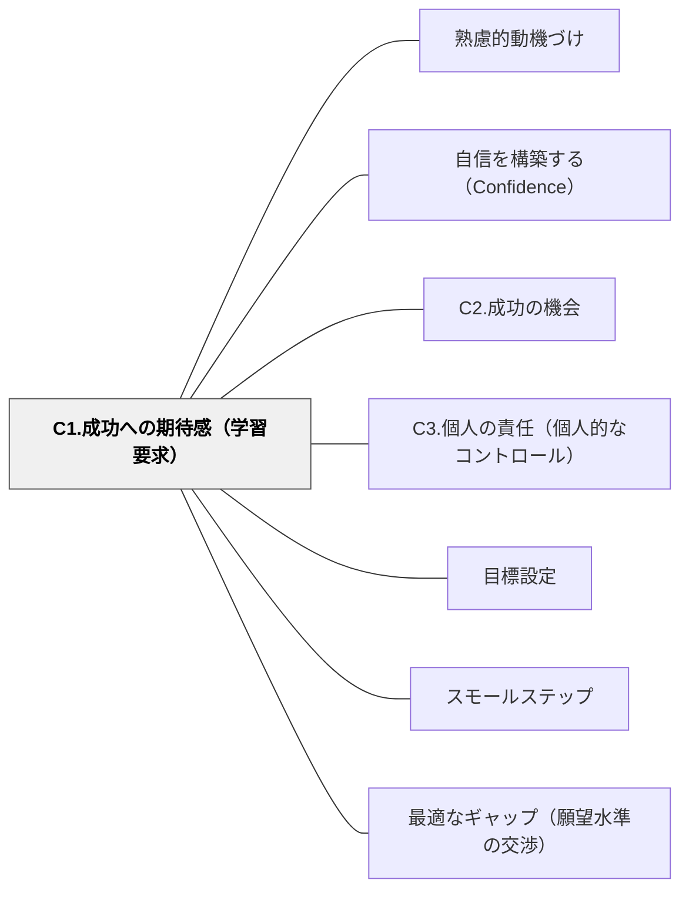

# C1.成功への期待感（学習要求）

> 「自分はこれができる」という期待感が、挑戦への最初の一歩を生む。成功への見通しがあってこそ、学習者は動き出す。

## 背景（Context）
自信の構築において、実際に成功する前の「期待感」を形成することがこのパターンの焦点である。バンデューラの自己効力感理論でいう「遂行期待」に相当し、「自分にはできる」という事前の予測が行動に大きく影響する。

## 問題（Problem）
学習者が「どうせ自分にはできない」と感じていると、挑戦自体を避けてしまう。特に過去の失敗体験が蓄積している学習者は、新しい課題に直面したときに成功への期待感が持てない状態にある。

## 力のかたち（Forces）
- 期待感は過去の成功・失敗体験によって大きく左右される
- 適切な難易度の設定が「できそう」という期待感を生む
- 明確なゴールと評価基準が「何をすれば成功か」を可視化し、期待感を高める
- 「あなたにできる」という他者からの期待も期待感に影響するが、本人の内的確信には代替できない

## 解決（Solution）
**学習の難易度を適切に調整し、ゴールと成功基準を明確にし、過去の成功体験を振り返る機会を設けることで、「自分はこれができる」という期待感を形成する。**

課題の始めに「これくらいならできそう」と感じさせるスモールステップを示す、過去に似たことができた体験を思い出させる、ゴールまでの道筋を可視化するなどの方法が有効である。

## 結果（Consequences）
- 学習者が課題に積極的に取り組もうとする姿勢が生まれる
- 期待感があることで、困難に直面しても「もう少し頑張れば」と続けやすくなる
- C2（成功の機会）と組み合わせることで、期待感から実際の達成へとつなげられる

## クラスター図

## Actionable Insight

- 課題の前に「前に似たことができたのはどんな場面だった？」と過去の成功体験を思い出させる——「あのときできた」という記憶が新しい課題への期待感をつくる
- 課題のゴールと「最初の一歩」をセットで示す——「何をすれば成功か」が見えるだけで「できそう」という期待感が生まれる
- スモールステップの最初のステップを超簡単に設定する——最初に「できた」を経験させることで次のステップへの期待感が連鎖する

## 出典

- 一つの教育のパタン・ランゲージ（岩井輝久）

## 関連パタン
- [[パタン/熟慮的動機づけ]] — 親パタン
- [[パタン/自信を構築する（Confidence）]] — 親パタン
- [[パタン/C2.成功の機会]] — 関連サブパターン
- [[パタン/C3.個人の責任（個人的なコントロール）]] — 関連サブパターン
- [[パタン/目標設定]] — 関連パタン
- [[パタン/スモールステップ]] — 関連パタン
- [[パタン/最適なギャップ（願望水準の交渉）]] — 距離が大きすぎると成功の見通しが失われ、動き出せなくなる（Sadler, 1989）
