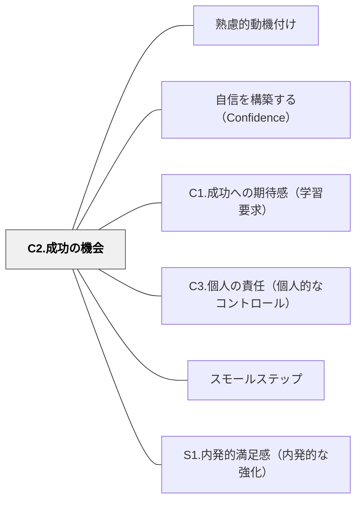

# C2.成功の機会

> 「できた」という実体験が、次の挑戦への自信になる。成功は待つものではなく、設計するものである。

## 背景（Context）
期待感を育てた後、実際に成功を経験できる機会を設計することがこのパターンの核心である。自己効力感は言葉ではなく経験によって積み上げられる。「できた」という体験の積み重ねが真の自信を形成する。

## 問題（Problem）
難しすぎる課題や達成感を感じにくい活動が続くと、学習者は「自分はできない」という確信を深めてしまう。一方で、簡単すぎる課題は達成感を生まず、成長の実感も得られない。

## 力のかたち（Forces）
- 成功体験は「難しいが達成可能」な課題から得られる（フロー理論のチャレンジとスキルのバランス）
- スモールステップの設計によって、誰もが段階的に成功を経験できる
- 足場がけ（スキャフォールディング）は、自力での成功を支援しつつも徐々に外していくことが重要
- 成功の機会は、グループ活動や協働によっても生み出せる

## 解決（Solution）
**スモールステップ・足場がけ・適切な難易度調整によって、すべての学習者が実際に「できた」と感じられる機会を意図的に設計する。**

単元の中に小さな達成ポイントを複数配置する、最初は支援を手厚くして徐々に自立を促す、グループで取り組むことで一人では難しい課題も達成できる体験を設けるといった方法が有効である。

## 結果（Consequences）
- 学習者が「自分はできる」という実感に基づいた自信を積み重ねる
- 達成感が次の課題への動機につながる正のサイクルが生まれる
- 教師が「できた経験を設計する」という視点を持てるようになる

## クラスター図

## Actionable Insight

- 単元の中に「小さな達成ポイント」を3〜5か所設計し、その都度「できた」を確認する時間を取る——段階的な達成体験が自信を積み重ねる正のサイクルをつくる
- 最初は支援を手厚くして徐々に外していく「足場がけ→自立」の設計を意識する——「最初は一緒に、次は自分で」という移行が本物の自信を育てる
- グループ活動で「一人では難しい課題」を設計し、協働で達成させる——他者と共に成し遂げた経験も「できた」の実体験として自信の土台になる

## 出典

- 一つの教育のパタン・ランゲージ（岩井輝久）

## 関連パタン
- [[パタン/熟慮的動機付け]] — 親パタン
- [[パタン/自信を構築する（Confidence）]] — 親パタン
- [[パタン/C1.成功への期待感（学習要求）]] — 関連サブパターン
- [[パタン/C3.個人の責任（個人的なコントロール）]] — 関連サブパターン
- [[パタン/スモールステップ]] — 関連パタン
- [[パタン/S1.内発的満足感（内発的な強化）]] — 関連パタン
