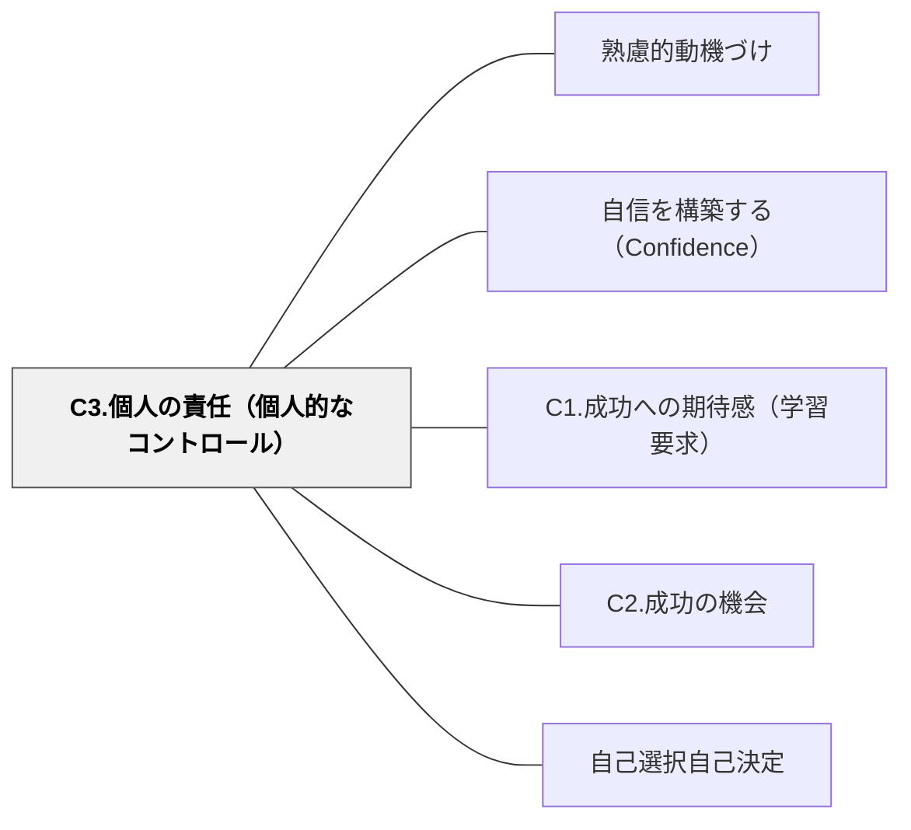

# C3.個人の責任（個人的なコントロール）

> 「自分でやった」という感覚が、自信の核心をつくる。コントロール感のある学習者は、結果を自分のものとして引き受けられる。

## 背景（Context）
自信の構築において、学習者が自分の学習を自分でコントロールしているという感覚（内的帰属）が重要な役割を果たす。成功が「自分の努力・選択の結果」と感じられるとき、自信は本当の意味で育つ。

## 問題（Problem）
すべてを教師がコントロールする学習環境では、学習者は受動的になりやすく、成功しても「先生がうまくやってくれただけ」と感じてしまう。自己効力感は自分で決め、自分で行動した経験からしか生まれない。

## 力のかたち（Forces）
- 選択の余地があること自体が、コントロール感を生む
- 過度な自由は判断に混乱をきたし、不安につながる場合もある
- 成功が「自分のコントロール下にある要因」に帰属されるとき、自信が強化される
- 失敗も「自分のコントロール下にある要因で改善できる」と感じられると、諦めにならない

## 解決（Solution）
**学習者が選択・決定・計画できる余地を設けることで、「自分がコントロールしている」という感覚を保障し、成果への主体的な関与を生み出す。**

課題の選択肢を複数用意する、取り組み方や手順を自分で決めさせる、ペースを自己調整できる時間を設けるといった方法が有効である。また、成功・失敗後に「何が良かったか／次はどうするか」を自分で振り返る機会を設けることで、内的帰属の習慣を育てる。

## 結果（Consequences）
- 学習者が成果を「自分のもの」として受け取り、自信が実感として蓄積される
- 自己調整学習・メタ認知の育成とも深く関連する
- 自律的な学習者の育成につながる長期的な効果が期待できる

## クラスター図

## Actionable Insight

- 課題への取り組み方を「A・B・Cの3つから選んで」という形で提示する——選んだという事実が学習者に「自分でやっている」という感覚を与える
- 活動後に「今日うまくいったことは？自分が何をしたからか？」と振り返りを書かせる——成功を自分の行動に帰属させる習慣が内的なコントロール感を育てる
- 「どこまで自分で決めていいか」の範囲を明示してから活動を始める——自由の範囲が明確なコントロール感は混乱なく主体性を育てる

## 出典

- 一つの教育のパタン・ランゲージ（岩井輝久）

## 関連パタン
- [[パタン/熟慮的動機づけ]] — 親パタン
- [[パタン/自信を構築する（Confidence）]] — 親パタン
- [[パタン/C1.成功への期待感（学習要求）]] — 関連サブパターン
- [[パタン/C2.成功の機会]] — 関連サブパターン
- [[パタン/自己選択自己決定]] — 関連パタン
