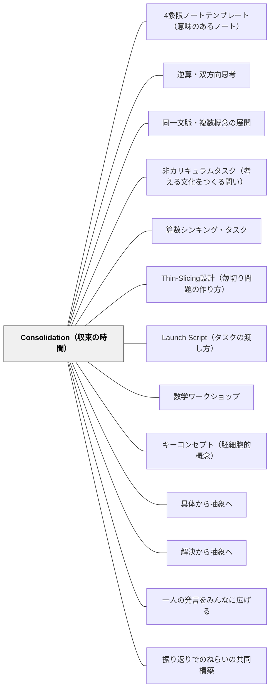

# Consolidation（収束の時間）

> 探究の後の「5〜10分の収束」が、活動を「学び」に変える。収束なき探究は経験だけを残し、概念を残さない。

---

## Pattern Connection

**出典**: Liljedahl, P. & Giroux, M.（2024）*Mathematics Tasks for the Thinking Classroom, Grades K-5.* Corwin.（統合：2026-05-17）

- **既存パタンとの関連**: 日本の授業研究における「まとめ」「振り返り」に対応するが、BTCのConsolidationは「教師が結論を言う」のではなく「子どもの発見を順番に並べて数学の構造を引き出す」点で異なる。[[パタン/キーコンセプト（胚細胞的概念）]] が収束で「数学的構造を名づける」ことに対応する。
- **補強された点**: Consolidationが「最も重要で最もよく省略される段階」（Liljedahl & Giroux）として、本書でBTCの中で最も詳細に扱われた。タスクごとに「収束の問い」が設計されており、何を概念として引き出すかが明確になった。
- **修正・拡張された点**: 日本語の「まとめ」は教師が板書する概念・公式を書く時間として機能することが多い。BTCのConsolidationは、子どもの言葉から数学の言葉へ「橋を架ける」教師の語りが核心であり、板書より対話を重視する。
- **他のパタンへの波及**: [[パタン/具体から抽象へ]] がConsolidationで「子どもの具体的発見→数学的概念」の流れに直接対応する。[[パタン/解決から抽象へ]] も同様。

---

## 背景（Context）

BTCの探究型授業では、子どもが立って書ける非永続面（ホワイトボード等）に向かいながら、グループで問いに取り組む。探究フェーズでは子どもが多様な発見をする——あるグループはシンプルな方法を見つけ、別のグループはより洗練された方法を発見し、さらに別のグループはSpicyの一般化に達する。

この多様な発見が「活動の面白い経験」で終わるか「数学の概念として定着するか」は、Consolidation（収束）の設計にかかっている。

Liljedahl & Giroux（2024）は、BTC実践の中でConsolidationを「最も重要で最もよく省略される段階」として位置づける。探究に時間を取られ、収束の時間がなくなる——あるいは「答えを確認するだけ」になる——ことが多い教室の現実に対して、本書は各タスクに「収束の問い（Consolidation Questions）」を具体的に設計して提供する。

## 問題（Problem）

探究させっぱなしで授業を終えると、子どもの中には「面白い経験をした」という記憶は残るが、その経験が数学の概念・言語・構造と結びつかない。次の授業で同じ考えを使えるかどうかが不確かになる。

また、「収束」が「教師が答えを言う時間」になると、子どもの発見は「正解かどうかの確認」に矮小化され、探究の価値が消える。

## 力のかたち（Forces）

- 探究が面白いほど、収束の時間が削られやすい
- 「答えを確認する収束」は子どもの発見を教師の言葉で上書きする
- 収束が長すぎると、子どもは「また説明を聞く時間」と感じる
- 収束が短すぎると、数学的構造が浮かび上がらない
- 「シンプルな解法からSpicyな解法へ」の順番を教師が制御することで、概念が見えやすくなる

## 解決（Solution）

**探究の後の5〜10分で、子どもの発見をシンプルから複雑な順に並べ直し、共通する数学的構造を「なぜ？」「いつも？」で引き出す。**

---

### 収束の3つの方法

Liljedahl & Giroux（2024）は、Consolidationの方法を3つ示している：

| 方法 | 適したタスクの種類 | 特徴 |
|------|--------------------|------|
| **対話（Conversation）** | 発散型・非カリキュラムタスク | Gallery walkを経て全体対話。教師が「これはどういう意味？」と問いを投げ続ける |
| **教師スクライブ（Teacher-scribe）** | 収束型・カリキュラムタスク | 教師が子どもの言葉を板書しながら数学的言語に整理する。「あなたが言ったのは〇〇ということ？」 |
| **Gallery walk（ガイド付き）** | どちらでも | グループの作業をまわって見て、「これをみんなに説明してみよう」と選択して全体共有 |

**発散型タスク（多様な解が出る）** → Gallery walk が適す  
**収束型タスク（一つの答えに向かう）** → Teacher-scribe が適す  
**Thin-slicedタスク** → 「変異に気づいて名づける（Noticing and Naming Variation）」が核心

---

### 底から積み上げる収束（Consolidation from the Bottom）

Liljedahl & Giroux（2024）が特に強調するのは「**下から上へ**」の順序：

1. **最もシンプルな解法から始める**（Most common/concrete → Less common/abstract）
2. **具体的な発見 → 抽象的な構造**（「3枚と5枚の場合でいつもそうなった」→「n枚のとき」）
3. **ありふれた方法 → 珍しい方法**（多くのグループの方法 → Spicyに到達したグループの方法）

上のグループ（Spicyに到達）の発見から始めない。下のグループの発見が「全員にとっての出発点」になることで、Spicyの一般化が「みんなで向かう目的地」として機能する。

---

### 変異に気づいて名づける（Noticing and Naming Variation）

Thin-slicedタスクでのConsolidationの中核技術。

教師が問う：「最初の問題と2番目の問題、何が変わって、何が変わらなかった？」

- 子どもが「数が変わった（でも計算の方法は同じ）」に気づく
- 教師が「変わらなかったことを数学では〇〇と言います」と名づける
- 変異と不変の対比が、数学的構造（概念・法則）を際立たせる

---

### Seeding（情報の種まき）

Gallery walk や全体共有に先立って、教師が特定のグループの解法に「種をまく」行為。

- 探究中にグループをまわりながら「それは後でみんなに説明してもらうからそのまま残しておいて」と言う
- Seedとは「全体のConsolidationで使いたい解法・発見」を選んで「温存」する行為
- Gallery walkでの選択（Selecting）・配列（Sequencing）・埋める（Fill-the-Box）を事前に決める
- Hintとの違い：Seedは「クラス全体のため」、Hintは「そのグループのため」

---

### 収束の5ステップ

| ステップ | 内容 | 教師の言葉の例 |
|----------|------|----------------|
| 1. 全員を集める | 探究を止め、板書・ホワイトボードの前に集まる | 「手を止めて、ここに注目してください」 |
| 2. シンプルな解法から提示 | 最も基本的な発見を紹介する（Mild → Medium の順） | 「グループAの方法を見てください」 |
| 3. 「なぜ？」を問う | 成り立つ理由を問い返す | 「なぜこれで求まるの？」「どんな考え方？」 |
| 4. 複数の解法をつなぐ | 違う方法が同じ構造を持つことを示す | 「グループBの方法と、何が同じで何が違う？」 |
| 5. 数学的構造を名づける | 概念・用語・公式として定着させる | 「この考え方を○○と言います」 |

---

### Spicyの発見を位置づける

探究でSpicyまで進んだグループの発見は、収束でクラス全体への「問いの拡張」として使う。

> 「このグループは、3つのテーブルだけじゃなくて、n個のテーブルのとき、いつもこうなると気づきました。なぜ？　これを確かめられる？」

Spicyの発見は「できる子の特別な答え」ではなく、「全員が向かう数学の核心」として扱う。

---

### 収束の問い（Consolidation Questions）の例

Liljedahl & Giroux（2024）の各タスクには「収束の問い」が設計されている。例：

**Task 12「Tables at a Party」（パーティーのテーブル）の場合：**
- Mild：「テーブルが5つのとき何人座れる？　どう考えた？」
- Medium：「テーブルがn個のとき、式で表せる？」
- Spicy：「なぜこの式になるの？　図で説明できる？」

**収束の問いの設計原則：**
1. 「答えは何？」でなく「どうやって考えた？」から始める
2. 「いつもそうなる？」で一般化を促す
3. 「なぜ？」で理由の説明を求める
4. 「別の方法でも同じ答えになる？」で複数解法をつなぐ

---

### 日本の授業研究との対応・違い

| 日本の「まとめ」 | BTCの「Consolidation」 |
|-----------------|------------------------|
| 教師が板書する | 子どもの発言から構造を引き出す |
| 公式・まとめの文を書く | 「なぜ？」「いつも？」を問う |
| 1つの正解に収束する | 複数の解法の共通構造を見る |
| 授業の最後の5〜10分 | 探究フェーズの終わりに位置づける |
| 「分かりましたか？」で確認 | 「別の問題で試してみて」で転移を促す |

どちらも「探究後の全体化」という機能を持つが、BTCのConsolidationは「教師の言葉より子どもの言葉が先」という原則が強い。

---

### 特別支援学級でのConsolidation

支援学級では、個別の到達点が異なるため、収束の形も工夫が必要。

- **全員の発見を並べる時間を短くし、1つだけ取り上げる**——「今日一番よかった発見を一つ教えて」
- **具体物・図を使って収束する**——言葉での説明が難しい子は「これを見せてください」で参加できる
- **「全員が言える言葉」で名づける**——「分けて合わせた」「2倍した」のように、その子の言葉を数学の言葉に橋渡しする

---

## 結果（Consequences）

- 探究の発見が「今日の算数で分かったこと」として概念化される
- 翌日・翌週に同じ考えを別の文脈で使えるようになる
- 「答えが出た＝終わり」でなく「なぜ成り立つかが分かった＝学んだ」の文化が育つ
- ただし、Consolidationが「教師が説明する時間」になると、探究の意味が薄れる
- 収束に時間をかけすぎると、次の探究への意欲が削がれる

## 関連パタン
- [[パタン/4象限ノートテンプレート（意味のあるノート）]]
- [[パタン/逆算・双方向思考]]
- [[パタン/同一文脈・複数概念の展開]]
- [[パタン/非カリキュラムタスク（考える文化をつくる問い）]]

- [[パタン/算数シンキング・タスク]] — Consolidationが機能するタスク全体の設計
- [[パタン/Thin-Slicing設計（薄切り問題の作り方）]] — Thin-slicedタスクでの収束の核心技術「変異に気づいて名づける」と直接連動
- [[パタン/Launch Script（タスクの渡し方）]] — Consolidationとセットのタスクの始め方
- [[パタン/数学ワークショップ]] — Launch→探究→Consolidationが機能する授業構造
- [[パタン/キーコンセプト（胚細胞的概念）]] — 収束で「数学的構造を名づける」に対応
- [[パタン/具体から抽象へ]] — 子どもの具体的発見→概念への橋渡し
- [[パタン/解決から抽象へ]] — 解法の共通構造を取り出して名づける
- [[パタン/一人の発言をみんなに広げる]] — 収束でグループの発見をクラス全体に広げる
- [[パタン/振り返りでのねらいの共同構築]] — 収束での数学的まとめの構築
- [[教材/算数シンキング・タスク集]] — 各タスクに付いた収束の問いの実例
- [[文献/Mathematics Tasks for the Thinking Classroom（Liljedahl & Giroux）]] — 一次資料

---

## クラスター図

## Actionable Insight

- **次の探究型授業で「収束の問いを1つだけ準備する」**——授業前に「この探究で子どもが見つけてほしい数学的構造は何か？」を一文で書く。それを問う形に変えれば収束の核心ができる（例：「なぜどのグループも同じ答えになったの？」）
- **収束は「板書を書く時間」でなく「問いかける時間」として設計する**——「今日のまとめは…です」と言わずに、「グループAとグループBの方法、どこが同じ？」から始める。子どもの言葉が出たら「それを数学では○○と言います」と橋を架ける
- **「5分のConsolidation」だけ意識してみる**——最初は完璧な収束でなくてよい。「どんな方法が出た？」「一番シンプルな方法は？」「なぜ？」の3問だけで十分な収束になることが多い
- **探究中に「Seed」を1つ選んでおく**——グループをまわりながら「これは後でみんなに見せたい」と思う解法を1つ選び、そのグループに「消さないでおいて」と伝えておく。収束で「このグループが面白いものを見つけました」と紹介することで、Seedが全体への橋になる
- **Thin-slicedタスクでは「何が変わって何が変わらなかった？」を収束の問いにする**——「最初の問題と2番目の問題、変わったこと・変わらなかったことは？」これだけで変異理論（Variation Theory）の収束ができる

---

## 出典

Liljedahl, P., & Giroux, M.（2024）. *Mathematics Tasks for the Thinking Classroom, Grades K-5*. Corwin（Corwin Mathematics Series）. ISBN 978-1-0719-1329-1.

Liljedahl, P.（2021）. *Building Thinking Classrooms in Mathematics*. Corwin.

> "Consolidation is the most important moment in the thinking classroom—and the most often skipped."
> — Liljedahl & Giroux（2024）

> "If students are doing thinking tasks but not experiencing consolidation, they are experiencing activity without learning."
> — Liljedahl & Giroux（2024）
