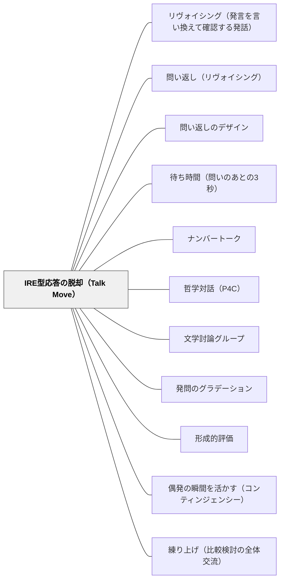

# IRE型応答の脱却（Talk Move）

> 対話を殺しているのは「悪い発問」ではなく、教師の第3ターンが「評価」であることだ。評価のかわりに思考を教室に返す手——それがTalk Move。

## 背景（Context）

教室談話を録音して書き起こすと、ほとんどの授業が同じ構造をしている。教師の発問（Initiate）→ 子どもの応答（Respond）→ 教師の評価（Evaluate）。Mehan（1979）が *Learning Lessons* で定式化し、Cazden（2001）が *Classroom Discourse* で「西洋の学校教育に普遍的に見られる支配的構造」と呼んだ **IRE構造（IRF構造ともいう）**である。

教師は良い授業をしようと発問を磨く。本Wikiにも [[パタン/発問のグラデーション]]、[[パタン/熟慮的問い]]、[[パタン/深める問い]] など発問設計のパタンが多数ある。しかし、どれだけ発問を磨いても、第3ターンが「いいですね」「正解です」「うーん、ちょっと違うかな」のままなら、対話は深まらない。子どもは「先生の正解を当てるゲーム」をプレイしはじめ、自分の考えを説明することにも、他の子の考えに反応することにも、興味を失う。

## 問題（Problem）

**教師の第3ターンが「評価」である限り、対話は成立しない。**

- 評価される側はリスクを取らない。間違いそうな考えは口にせず、安全な答えだけを言う
- 評価が終わると話題が閉じる。子ども同士の応答が生まれず、思考の連鎖が起きない
- 子どもの応答が「教師にとっての正解／不正解」のフィルターを通って消費されてしまい、考えの中身が教室の共有資源にならない
- 発話の主導権がつねに教師にあり、子どもは応答者の位置に固定される
- 第3ターンが評価で閉じるため、応答した子の思考が**本人にも教室にも**展開されない

これは「教師の発問が下手だから」ではない。**構造の問題**である。発問の工夫は第1ターンの設計だが、対話を殺しているのは第3ターンの設計なのだ。

## 力のかたち（Forces）

- 教師は子どもの応答に対して「正しい／正しくない」を伝えたい衝動を持つ（評価する役割の内面化）
- 子どもは「先生は何を求めているか」を読み、それに合わせて応答する習慣を学校生活で身につけている
- カリキュラム進度の圧力は「早く正解にたどり着き、次に進む」ことを促す
- 一方で、思考を深めるには応答後の沈黙・問い返し・他者への接続が必要で、これらは「評価」と両立しない
- 個別の技法（リヴォイシング・問い返し・待ち時間）を知っていても、**第3ターンの設計思想**として束ねないと、結局は評価に戻ってしまう

## 解決（Solution）

**教師の第3ターン（E）を「評価（Evaluate）」から「Talk Move（談話を動かす手）」へ組み替える。**

Talk Move とは、Chapin, O'Connor & Anderson（2009）*Classroom Discussions* が体系化した、教師が応答後に使える発話の型である。個別テクニックの寄せ集めではなく、「**評価を保留し、思考を教室に返す**」という一貫した第3ターンの設計思想として理解する。本パタンは、既存パタンの [[パタン/リヴォイシング（発言を言い換えて確認する発話）]]・[[パタン/問い返し（リヴォイシング）]]・[[パタン/待ち時間（問いのあとの3秒）]] などを **IRE構造の組み替えという上位の設計思想のもとに束ねる構造レベルのパタン**である。個別技法ではなく、構造そのものを名指して扱う点が固有性。

主要なTalk Moves（Chapin et al., 2009）：

1. **リヴォイシング**：「つまり〜ということ？」と子どもの発言を言い換えて確認する
2. **他の子に再話させる**：「いま〇〇さんが言ったことを、自分の言葉で言える人？」
3. **根拠を問う**：「どうしてそう考えたの？」「どこからそう思った？」
4. **賛成・反対とその理由を求める**：「〇〇さんの考えに賛成？反対？それはなぜ？」
5. **つけたしを促す**：「つけたしできる人はいる？」「もう少し詳しく言える人？」
6. **待ち時間**：応答の直後にも3〜5秒待ち、教師が即座に引き取らない

これらは別々の技法ではなく、**第3ターンを評価以外の何かにする**という一つの設計思想の現れである。

---

### 具体例1：算数の話し合い（前後対比）

**IRE型（旧）**

> T「12 × 25 は？」
> C1「300」
> T「正解！よくできました。次の問題」

→ 思考過程は表に出ず、できた子だけが残る。

**Talk Move型（新）**

> T「12 × 25 は？」（3秒待つ）
> C1「300」
> T「どうやって300を出したの？」（根拠を問う）
> C1「12を 10と2に分けて、10×25と2×25にして、250と50を足した」
> T「いま C1さんが言ったこと、自分の言葉で言える人？」（再話を促す）
> C2「12を分けて、それぞれに25をかけて、最後に足した」
> T「C2さん、つけたしできる人はいる？」（つけたしを促す）
> C3「分けるところを変えてもいい。6×25 を2回足すのでも300になる」
> T「C3さんの考えに賛成の人？ 反対の人？ どうして？」（賛成・反対を求める）

→ 一つの問いから複数の解法と理由が引き出され、教室の共有知識になる。

---

### 具体例2：国語の読み取り

**IRE型（旧）**

> T「この登場人物の気持ちは？」
> C1「悲しい」
> T「そうですね、悲しいんですね」

**Talk Move型（新）**

> T「この登場人物の気持ちは？」
> C1「悲しい」
> T「つまり、悲しいと感じたんだね？」（リヴォイシング）「どこからそう思ったの？」（根拠を問う）
> C1「ここの『うつむいて歩いた』っていうところ」
> T「C1さんが本文の『うつむいて歩いた』に注目したと言ったけど、ほかの言葉や場面から別の気持ちが読める人はいる？」（つけたしと別解を促す）

→ 「悲しい」で閉じず、テキストへの根拠づけと多様な解釈が引き出される。

---

### 特別支援の視点：発話が苦手な子への配慮

Talk Move は「発話できる子」を前提にすると、発話が苦手な子を取り残す。次の支えを組み合わせる：

- **指名前の考える時間**：問いを投げた直後に「30秒考えてから手を挙げて」と明示する。即時応答を求めない
- **ペアでの事前リハーサル**：全体共有の前に「お隣と1分話してから」を入れる。一度声に出してから全体で話すと、ハードルが大きく下がる
- **ハンドサインでの参加**：賛成・反対・つけたしを手のサインで示せるようにする。発話せずとも対話に参加できる
- **書いてから話す**：付箋・ホワイトボード・ノートに書いてから読み上げる。発話のワーキングメモリ負荷を下げる
- **再話の役割を意図的に割り振る**：「いまの〇〇さんの考えを、△△さんが自分の言葉で言ってくれる？」と指名する。発話の難易度が「自分の意見」より下がり、参加できる

## 結果（Consequences）

**利点**

- 子どもの応答が「教師に評価される対象」から「教室で吟味される資源」に変わる
- 一つの応答が複数の応答・解釈・反論を引き出し、思考の連鎖が起きる
- 子どもが「先生が何を求めているか」ではなく「自分は何を考えているか」「他の子はどう考えているか」に注意を向けるようになる
- 教師は「正解の管理者」から「対話の編集者・促進者」へ役割が移行する
- 教師の労力が「正解を確認する」から「考えをつなぐ」にシフトする

**注意点**

- **Talk Movesの機械的乱用は対話のテンポを壊す**。毎回の応答に6種類を順番に当てる必要はない。文脈に応じて選ぶ
- **評価を完全に消すのではない**。総括的場面・安全に関わる場面・誤情報の訂正が必要な場面では明示的な評価も必要。[[パタン/形成的評価]] と組み合わせ、評価を「いつ・どこで」入れるかを設計する
- **話し合いの規範（norms）づくりが前提**。賛成・反対を安全に言える [[パタン/心理的安全性（コンフォートゾーン）]] がないと、Talk Moves は機能しない。学級開きから「友だちの考えを聞いて自分の言葉で言う」「賛成・反対は人ではなく考えに対して言う」などの規範を共有しておく
- **教師自身の評価衝動への自覚**が要る。「いいですね」を反射的に言いそうになる自分に気づき、そこで一拍置く練習が必要
- **発話が偏ると逆効果**。よく話す子だけが応答し続けないよう、再話・ペア・ハンドサインなどで全員の参加路を用意する

## 関連パタン

- [[パタン/リヴォイシング（発言を言い換えて確認する発話）]] — Talk Moveの代表格。本パタンが束ねる第3ターン技法の一つ
- [[パタン/問い返し（リヴォイシング）]] — ソクラテス的な連鎖的問い返し。評価の代わりに問いを返す第3ターンの古典形
- [[パタン/問い返しのデザイン]] — 評価や誘導でなく問いとして返す設計。IRE脱却の発話レベルの実装
- [[パタン/待ち時間（問いのあとの3秒）]] — Talk Moveの一つ。第3ターンを急がないことが評価の保留を支える
- [[パタン/ナンバートーク]] — Talk Movesが定型として埋め込まれた算数ルーチン。本パタンの集約的実装の一つ
- [[パタン/哲学対話（P4C）]] — 探究の共同体はIRE構造の構造的対極。教師が評価者の座を降りる徹底形
- [[パタン/文学討論グループ]] — IRE構造を明示的に問題化した討論実践。教師の足場を外しながら子ども主導の対話へ移行する
- [[パタン/発問のグラデーション]] — 発問（第1ターン）の設計。本パタンは応答後（第3ターン）の設計で、両者は相補的
- [[パタン/形成的評価]] — 第3ターンを「評価」から「情報収集と調整」へ転換する点で同じ思想。子どもの応答は採点対象でなく指導調整の資源

- [[パタン/偶発の瞬間を活かす（コンティンジェンシー）]] — I-R-E の第3ターンを、評価から偶発の分岐点へ変えるための設計
- [[パタン/練り上げ（比較検討の全体交流）]] — 「集める→要約する→違いを問う」という、日本の授業様式での実装
- [[文献/Developing the Theory of Formative Assessment（Black & Wiliam, 2009）]] — I-R-E が「大半の教室で常態である」ことの証拠と、そこからの脱出の理論

## クラスター図

## Actionable Insight

- 今週の1時間、自分の授業を録音して書き起こす。教師の第3ターンが「評価」になっている回数を数える——自分のIRE比率を自覚することがすべての出発点
- 月曜の1時間で、評価語（「正解」「いいですね」「うーん違うかな」）を封印し、応答のすべてに「どうしてそう考えたの？」または「つけたしできる人？」を返す——たった1つのTalk Move縛りでも対話の質が変わるのを体感できる
- 学級開きまたは単元の冒頭で、子どもと「話し合いのルール」を3つだけ共有する：①考えてから話す（待つ）②友だちの考えを自分の言葉で言える ③賛成・反対は考えに対して言う——Talk Movesが機能するための規範を先に立てる

## 出典

- Mehan, H. (1979). *Learning Lessons: Social Organization in the Classroom*. Harvard University Press.
- Cazden, C. B. (2001). *Classroom Discourse: The Language of Teaching and Learning* (2nd ed.). Heinemann.
- Chapin, S. H., O'Connor, C., & Anderson, N. C. (2009). *Classroom Discussions: Using Math Talk to Help Students Learn* (2nd ed.). Math Solutions.
