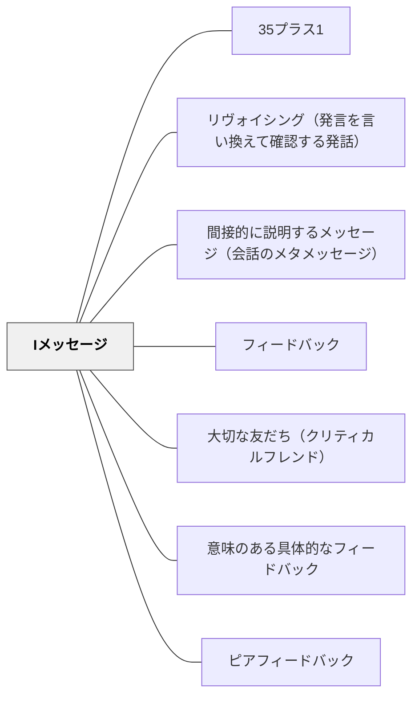

# Iメッセージ

> 「あなたはここが間違っている」ではなく、「私にはここが不明瞭に見えた」と語る。一人称のフィードバックは受け取りやすい。

## 背景（Context）

フィードバックの言語は、受け取る側の心理に大きな影響を与える。「あなたは〜だ」「あなたの〜は〜だ」という二人称（Youメッセージ）は、評価や判断として受け取られやすく、学習者が防衛的・攻撃的になるきっかけになることがある。

Iメッセージは、アドラー心理学やトーマス・ゴードンの親業訓練（Parent Effectiveness Training）から教育実践に取り入れられた概念で、「私はこう感じた」「私にはこう見えた」「私にとってはこの部分が分かりにくかった」という一人称での表現を用いる。

## 問題（Problem）

「あなたのプレゼンは分かりにくい」という言葉は、事実の指摘であっても、受け取る側には人格への攻撃として聞こえることがある。批評が「あなたへの判断」として受け取られると、学習者は改善の情報ではなく自己防衛に意識が向き、フィードバックが届かなくなる。

特に日本の教室文化では、直接的な批評は傷つけるものという感覚が強いため、正直で具体的なフィードバックを避ける傾向がある。しかし批評を避けることは、改善の機会を奪うことでもある。

## 力のかたち（Forces）

- 二人称の批評は学習者の防衛反応を引き起こしやすく、フィードバックが届かなくなる
- 一人称の表現は「私の経験・知覚」として伝えるため、押しつけにならない
- Iメッセージは観察・感情・影響を組み合わせることで、正直で温かいフィードバックを可能にする

## 解決（Solution）

フィードバックを伝える際、「あなたは〜だ」という評価的な二人称表現を意識的に避け、「私は〜と感じた」「私には〜に見えた」「私がこの文章を読んだとき、〜だった」という形で表現する。

Iメッセージの基本構造は「私は〔状況〕のとき、〔感情・知覚〕を経験した。それは〔影響〕だった」という形である。例えば「私はこのプレゼンを聞いたとき、データの根拠がどこにあるのかが分からなかった。そのため結論を信じるのが難しかった」という表現は、批評でありながら攻撃ではない。

ただしIメッセージも内容が曖昧では意味をなさない。[[パタン/意味のある具体的なフィードバック]]と組み合わせ、一人称の言語で具体的な情報を届けることが重要である。

## 結果（Consequences）

- 学習者が防衛的にならずにフィードバックを受け取りやすくなる
- 感情・経験を伝えることで、フィードバックの人間的なリアリティが増す
- Iメッセージの練習が学習者同士の[[パタン/ピアフィードバック]]の質を高める

## 関連パタン
- [[パタン/35プラス1]]
- [[パタン/リヴォイシング（発言を言い換えて確認する発話）]]
- [[パタン/間接的に説明するメッセージ（会話のメタメッセージ）]]

- [[パタン/フィードバック]] — 親パタン
- [[パタン/大切な友だち（クリティカルフレンド）]] — Iメッセージが活きる関係性の文脈
- [[パタン/意味のある具体的なフィードバック]] — 一人称で具体的な情報を伝える
- [[パタン/ピアフィードバック]] — 学習者同士がIメッセージを活用する場面

## クラスター図

## Actionable Insight

- ピアフィードバック前に「『あなたは〜』ではなく『私には〜に見えた』で伝えよう」と一言確認する——Iメッセージの枠組みを知るだけで受け取りやすいフィードバックに変わる
- 教師自身が「私はここの部分がわかりにくかった」という一人称フィードバックをモデルとして見せる——教師がモデルになることでIメッセージの文化がクラスに広がる
- フィードバック後に「どんな言葉で伝えたか」を振り返る時間を設ける——言語の選択への意識化がIメッセージのスキルを育てる

## 出典

Gordon, T. (1970). *Parent Effectiveness Training*. Wyden.
