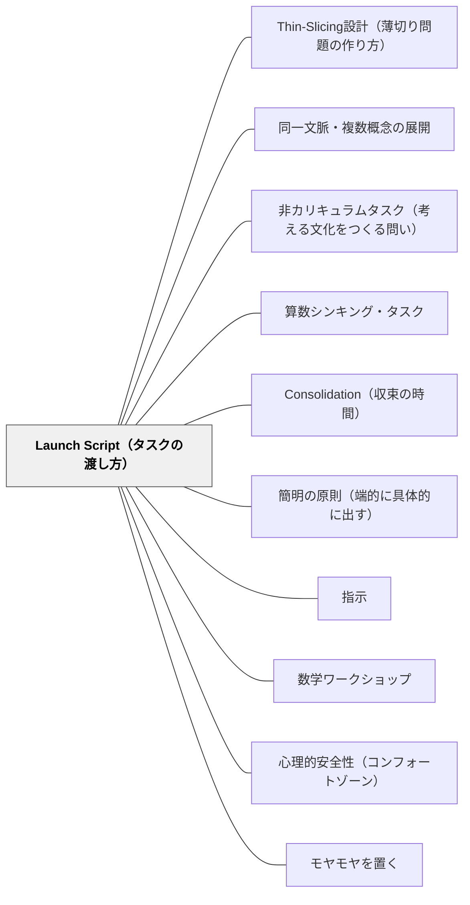

# Launch Script（タスクの渡し方）

> 問いを渡す最初の30秒が、子どもが「自分で考える」か「手順を待つ」かを分ける。渡しすぎないことが最重要である。

---

## Pattern Connection

**出典**: Liljedahl, P. & Giroux, M.（2024）*Mathematics Tasks for the Thinking Classroom, Grades K-5.* Corwin.（統合：2026-05-17）

- **既存パタンとの関連**: [[パタン/簡明の原則（端的に具体的に出す）]] の算数版として機能する。「一時一事の原則」とも重なる——問いを渡す場面では、問い"だけ"を渡す。[[パタン/指示]] の「動かす指示」が算数タスクの始まりにも必要。
- **補強された点**: 「渡しすぎない」が抽象的な原則に留まらず、「3文以内・口頭のみ・最初の5分は答えない」という具体的な実装手順が本書で与えられた。
- **修正・拡張された点**: 「ヒントを先に言う」ことが子どもの思考を奪うことが、BTCの実証研究によって裏付けられた。日本の算数授業でよく行われる「問題の状況をていねいに説明する」導入が、逆に考えることを阻害する場合があることを示唆する。
- **他のパタンへの波及**: [[パタン/Consolidation（収束の時間）]]（新規）はLaunch Scriptとセットで機能する。Launch→探究→Consolidationの流れを支える。

---

## 背景（Context）

Peter Liljedahl（2021）の *Building Thinking Classrooms (BTC)* は、「タスクをどう渡すか」が子どもが考え始めるかどうかに最も大きな影響を与えることを発見した。10年以上・数千の教室の観察から得られた知見である。

Liljedahl & Giroux（2024）は、BTC14実践のうち「タスクの渡し方」（Launch Script）を、50タスクすべてに具体的な言葉として実装した。各タスクには「このタスクをどう口頭で渡すか」の台本が付いており、教師は初めて使う場合でも失敗しにくい。

日本の算数授業では、問題の導入に多くの時間をかけることが多い——黒板に問題を書き、状況を説明し、補助質問を出し、動機づけをしてから問いを提示する。この手順は「全員が問いを理解してから考える」ことをねらうが、過剰な導入は逆に「この問いに対して何をすればよいか」を子どもに示してしまい、考えることの余地を奪う。

## 問題（Problem）

教師が問いを渡すとき、子どもが「入りやすいように」という配慮から、ヒント・手順・つまずきへの対処法を先に提示することがある。この行動は短期的には子どもの混乱を減らすが、長期的には「考え方を思い出す前に教師に聞く」という依存の文化を作る。

反対に、説明が少なすぎて子どもがどこから手をつければよいか全く分からない状態も問題である——「入口が狭すぎる問い」は参加者を減らす。

## 力のかたち（Forces）

- 問いを渡す前に説明しすぎると、子どもは「解法を探す」より「教師の言葉を思い出す」に向かう
- 説明が少なすぎると、多くの子が動き出せない
- 口頭で渡すと子どもは自分の言葉で問いを解釈し、考えが動き出しやすい
- 紙に書いた問題を渡すと「読んで理解する」が「考える」より先に来てしまう
- 最初の5分に教師が答えを出すと、「聞けば教えてくれる」文化が定着する

## 解決（Solution）

**3文以内・口頭のみで問いの核心を渡し、最初の5分は子どもの質問に「まずやってみて」と返す。**

---

### Launch Scriptの3部構成

| 部分 | 内容 | 例 |
|------|------|---|
| **状況の設定**（Context） | どんな場面か・何があるかを一文で示す | 「テーブルが1つあります。4人が座れます」 |
| **問いの提示**（The Task） | 「〜は？」「全部見つけて」を一文で示す | 「テーブルが増えていったら、何人座れるでしょう？」 |
| **始めの一手を促す**（The Nudge） | Mildの最初の問い・道具の提案 | 「まずテーブル2つのとき試してみて」 |

---

### 5つの実装原則

1. **3文以内**——問いの核心だけを渡す。背景説明・ヒント・手順を先に言わない
2. **口頭のみ**——紙に書いてしまうと、子どもが「読んで理解する」モードになる。黒板にも書かない（最初は）
3. **全員が聞いているか確認してから始める**——「みんな聞こえる？」「準備できた？」
4. **最初の5分は答えない**——「まずやってみて」「何か気づいたことある？」と返す
5. **行き詰まりは質問で突破する**——「もっと簡単な場合は？」「別の例を試してみた？」「もし〜だったら？」

---

### Launch Scriptの例：OCRから確認した実際の台本

**Task 1「Hexagon Havoc（六角形の大騒ぎ）」（K-2年、非カリキュラム）：**

> 「I want you to take one of these yellow hexagons and divide it into smaller shapes using these other pattern blocks. How many different ways can you do it?」

（日本語版）「この黄色い六角形を、他のパターンブロックを使って小さな形に分けてみてください。何通りの分け方ができますか？」

グループに六角形ブロック1枚と各種パターンブロックを渡すだけ。説明なし、ヒントなし。

---

**Task 2「Next Door Numbers（隣の数）」（K-2年、非カリキュラム）：**

> 「I want you to choose two numbers that are next to each other. Add them together. What do you notice?」

（日本語版）「隣り合った2つの数を選んで足してみてください。何か気づくことがありますか？」

小さな数から始めて、パターンを発見させる。「隣り合った」の意味は最初は自分で解釈させる。

---

**Task 8「Carnival Conundrum（カーニバルの謎）」（2-4年、非カリキュラム）：**

> 「At the school carnival, there is a game where you drop a ball at the top and try to get it into a cup at the bottom. The balls can go left or right at each peg. Can you figure out where to drop the ball to make it go into a specific cup?」

（日本語版）「学校のカーニバルに、上からボールを落として下のカップに入れるゲームがあります。ボールは各くぎで左か右に行きます。特定のカップに入れるには、どこからボールを落とせばいい？」

三角形のペグボードの図を渡す。ヒントは一切なし。

---

**Task 12「Tables at a Party（パーティーのテーブル）」（2-5年、非カリキュラム）：**

Liljedahl & Giroux（2024）のTask 12は、次のようなLaunch Scriptを持つ：

> 「テーブルが1つあって、4人が座れます。テーブルを2つつなげると、6人座れます。テーブルを増やしていったとき、何人座れるか調べてください。」

これだけである。ヒントなし、手順なし、図なし。Mildの「まず3つのとき」という始めの一手だけが付いている。

子どもは「4、6、…何かパターンがある？」「テーブルの並べ方が変わったらどう？」と自分で問いを広げていく。

---

### 「消防士的アプローチ」（Firefighter Approach）

Liljedahl & Giroux（2024）が特に強調するのは、**教師がグループをまわるタイミングと方法**。子どもが困り始めたら「消防士のように素早く動いて助けに行く」のではなく、「困っていることを見届けてから最低限のことだけを言う」姿勢。

- **最初の5分は教室の前に立っている**——子どもが「先生に聞けば教えてくれる」と思わないように
- **最初の接触は質問だけ**——「何が分かってる？」「どこまでやった？」を先に聞く
- **ヒントを出すなら2種類を区別する**：①入口を下げる（「まずこっちだけ」）か、②能力を上げる（「この方法を知ってる？」）か
- **全員が立って書いているか確認する**——座ったまま・ノートに書いている子に「ホワイトボード（黒板）に書いてみて」と促す

---

### 日本版の応用例：おはじきの分け方

**日本の教室で使うLaunch Script（Mild → Medium → Spicy形式）：**

> 「おはじきが10個あります。2つの山に分けてください。何通り見つけられるかな？」

Mild：「まずおはじきで実際に分けてみよう」
Medium：「全部見つけた？　どうすれば確実に全部見つけられる？」
Spicy：「おはじきが12個・15個のとき、何通り？　いつもそうなる？」

この導入では「いくつかあると分かっていて、その数を求める」のではなく、「自分でやってみたら分かっていく」構造になっている。

---

### 特別支援学級でのLaunch Scriptの調整

特別支援学級でMildがさらに入りにくい場合、Launch Scriptに次の要素を加える：

- **具体物を手元に置く**——おはじき・ブロック・積み木を最初から渡す
- **教師が一緒に最初の一手をやってみせる**——「こうやって分けてみた。次はどうする？」
- **問いを1文にする**——「これを2つに分けてみよう」だけで始める

「全員が問いを理解してから」ではなく「手を動かすことで問いが分かっていく」設計にする。

---

## 結果（Consequences）

- 子どもが「教師の言葉を待つ」のではなく「自分で試し始める」ことが増える
- 最初の5分の静寂・混乱・試行が、探究への真の入口になる
- 「ヒントをもらわないと分からない」という依存が減り、「まずやってみる」文化が育つ
- ただし、Launch Scriptだけを変えても、Consolidation（収束）がないと活動で終わる
- 「口頭のみ」の原則は、文字の読み書きに困難がある子への配慮としても機能する

## 関連パタン
- [[パタン/Thin-Slicing設計（薄切り問題の作り方）]]
- [[パタン/同一文脈・複数概念の展開]]
- [[パタン/非カリキュラムタスク（考える文化をつくる問い）]]

- [[パタン/算数シンキング・タスク]] — Launch Scriptが機能する全体的なタスク設計
- [[パタン/Consolidation（収束の時間）]] — Launch後の探究を概念に変える収束の設計
- [[パタン/簡明の原則（端的に具体的に出す）]] — 指示全般における「渡しすぎない」原則
- [[パタン/指示]] — 動かす指示・終末まで示す指示の基本
- [[パタン/数学ワークショップ]] — Launch→探究→Consolidationが機能する授業構造
- [[パタン/心理的安全性（コンフォートゾーン）]] — 「まずやってみる」文化の前提
- [[パタン/モヤモヤを置く]] — 最初の5分の混乱を「学びの入口」として扱う
- [[教材/算数シンキング・タスク集]] — 日本語版タスクに付いたLaunch Scriptの実例
- [[文献/Mathematics Tasks for the Thinking Classroom（Liljedahl & Giroux）]] — 一次資料

---

## クラスター図

## Actionable Insight

- **今週の算数の導入を1回だけ変えてみる**——「今日の問題は…です。どう解くかというと…」を止め、「〇〇があります。〜はいくつでしょう？　まず試してみて」の3文だけで始める。最初の5分は何も教えない
- **「まずやってみて」だけを準備する**——子どもが「どうやるの？」と聞いてきたとき、「まずやってみて」「もっと簡単な場合は？」「何か気づいたことある？」の3つの返しだけを事前に決めておく
- **特別支援学級では「手元に道具を置く」をLaunch Scriptに組み込む**——「おはじきを使っていいよ。これを2つに分けてみよう」——問いと道具を同時に渡すことで、理解が言葉より行動から始まる

---

## 出典

Liljedahl, P., & Giroux, M.（2024）. *Mathematics Tasks for the Thinking Classroom, Grades K-5*. Corwin（Corwin Mathematics Series）. ISBN 978-1-0719-1329-1.

Liljedahl, P.（2021）. *Building Thinking Classrooms in Mathematics*. Corwin.

> "The launch of the task is the most critical moment. Say too much and students stop thinking. Say too little and they can't get started."
> — Liljedahl & Giroux（2024）
