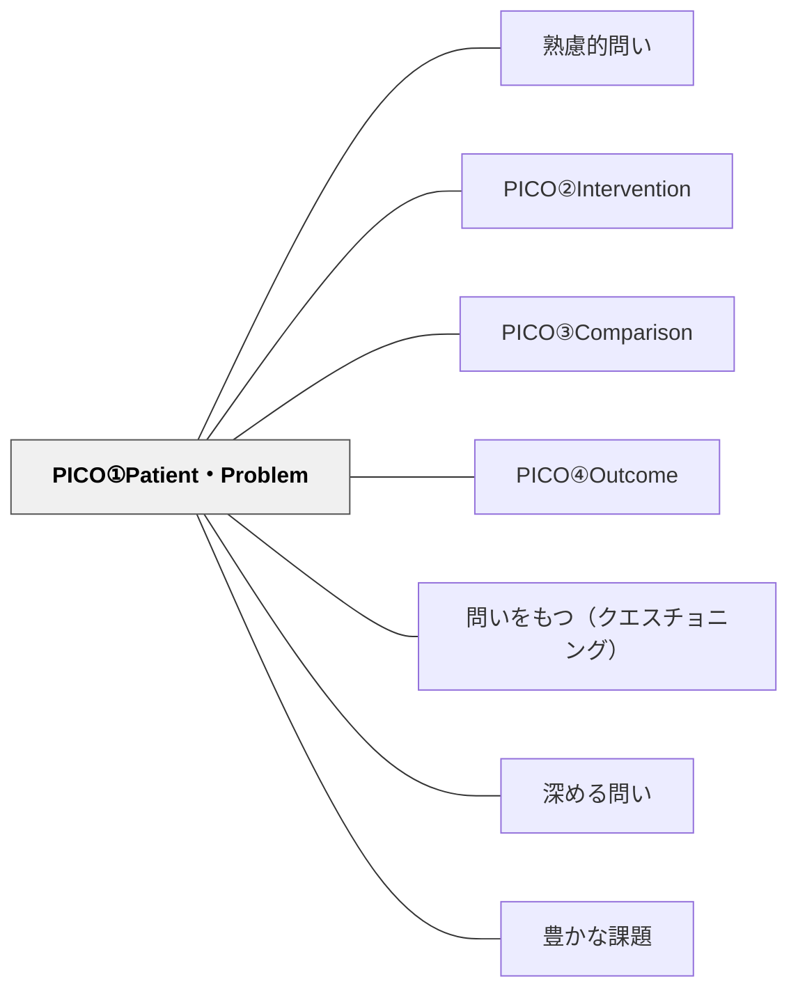

# PICO①Patient・Problem

> 「誰にとって・何の問題か」を明確にする

## 背景（Context）
PICOフレームは、エビデンスに基づいた実践（EBP）において、臨床・教育・政策の問いを構造化するための枠組みである。その第1要素「Patient／Problem（患者・対象者・問題）」は、問いの対象を具体的に定めるステップである。教育場面においても、誰の・どんな課題に取り組むのかを問いの冒頭で明示することで、調査や議論の焦点が定まる。

## 問題（Problem）
問いが抽象的なままでは、調査や議論の対象が拡散してしまう。「学習効果を上げるには？」のような問いは、誰を対象としているかが曖昧なため、集めた情報が問題解決に直結しない。学習者は問いを立てることが苦手なことが多く、まず「誰にとっての問題か」を言語化することが問いの精緻化への第一歩となる。

## 力のかたち（Forces）
- 問いの具体性 vs 一般性
- 対象を絞る厳密さ vs 広がりある探究
- 問いを立てる難しさ vs フレームによる足場がけ
- 個人の問題意識 vs 社会的・集合的な問い

## 解決（Solution）
「誰にとって・何の問題か？」という問いを最初に立てさせる。例えば「小学校低学年の読み書きが苦手な子どもにとって、どんな支援が有効か？」というように、対象（P）を具体的に記述することから問いを構築する。授業では問い立てワークシートの第1欄として使うとよい。

## 結果（Consequences）
- 調査・議論の対象が明確になり、情報収集の効率が上がる
- 学習者が自分ごととして問いに向き合いやすくなる
- 後続のPICO要素（I・C・O）との整合性が取れた問いになる

## 関連パタン
- [[パタン/熟慮的問い]] — 親パタン
- [[パタン/PICO②Intervention]] — 対象（P）に対してどんな働きかけをするかを定める次の要素
- [[パタン/PICO③Comparison]] — 比較対象を設定し問いに厳密さを加える第3要素
- [[パタン/PICO④Outcome]] — 成果・結果指標を明確にする最終要素
- [[パタン/問いをもつ（クエスチョニング）]] — 問いを構造的に立てる力の上位パタン
- [[パタン/深める問い]] — 精緻化された問いが探究を深める
- [[パタン/豊かな課題]] — PICO的に構造化された問いが豊かな課題の核心をつくる
- [[概念/教育評価論]] — エビデンスに基づく実践（EBP）との接続

## クラスター図

## Actionable Insight

- 問いを立てるとき最初に「誰にとって・何の問題か？」を書かせる——「学習効果を上げるには？」のような漠然とした問いが具体的な探究に変わる
- 問い立てワークシートの第1欄を「対象者・問題の記述」にする——PICO①がフレームとして機能し、後続の問い要素との整合性が取れる
- 「小学校低学年の読み書きが苦手な子どもにとって」のように対象を具体化して問いをスタートさせる——自分ごととして向き合いやすい問いが生まれる

## 出典
- [[文献/熟慮的問いのパターンリスト（動画記録）]]
