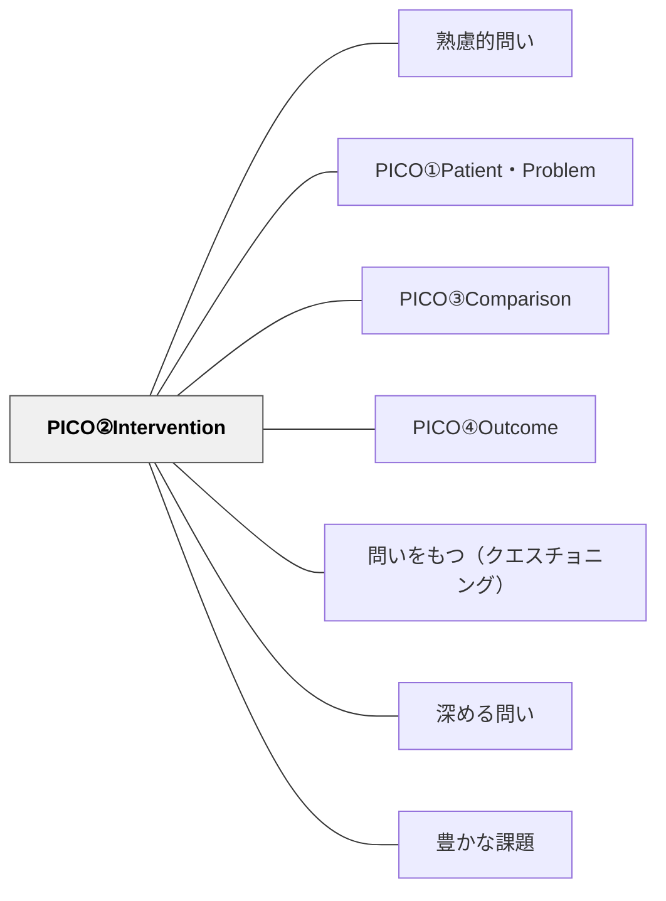

# PICO②Intervention

> 「何をするか・どんな介入・方法か」を明確にする

## 背景（Context）
PICOフレームの第2要素「Intervention（介入・方法）」は、問いの対象に対して何を行うかを具体的に記述するステップである。医療領域では治療法や薬剤が相当するが、教育では授業方法・支援策・環境設計などが該当する。何をするかを明確にすることで、実践や研究の方向性が定まる。

## 問題（Problem）
「良い教育をしたい」という願いは広く共有されているが、具体的に何を実施するのかが曖昧なままでは実行に移せない。また、方法を特定しないままエビデンスを探しても、関連する研究を絞り込むことができない。介入を言語化する習慣がないと、漠然とした実践が繰り返されてしまう。

## 力のかたち（Forces）
- 方法の明確化 vs 柔軟な実践の余地
- エビデンスの検索可能性 vs 実践の多様性
- 介入の標準化 vs 文脈への適応
- 仮説的介入の設定 vs 現実的な制約

## 解決（Solution）
「何をするか（Intervention）」を一文で具体的に記述させる。例えば「週2回のペア読書活動を6週間実施する」のように、方法・頻度・期間を含めると問いの検証可能性が高まる。授業での問い立て活動では、PICO①で定めた対象と組み合わせて「〇〇に対して△△をしたら？」という問いの形にまとめる。

## 結果（Consequences）
- 実践や研究の計画が具体化され、実行可能性が高まる
- 文献検索のキーワードが定まり、関連するエビデンスを見つけやすくなる
- 介入の意図が明確になることで、振り返りや評価がしやすくなる

## 関連パタン
- [[パタン/熟慮的問い]] — 親パタン
- [[パタン/PICO①Patient・Problem]] — 対象・問題を明確にする第1要素
- [[パタン/PICO③Comparison]] — 介入（I）と比較する対照条件を設定する第3要素
- [[パタン/PICO④Outcome]] — 介入の成果を測定する指標を定める第4要素
- [[パタン/問いをもつ（クエスチョニング）]] — 問いを構造的に立てる力の上位パタン
- [[パタン/深める問い]] — 精緻化された問いが探究を深める
- [[パタン/豊かな課題]] — PICO的に構造化された問いが豊かな課題の核心をつくる
- [[概念/教育評価論]] — エビデンスに基づく実践（EBP）との接続

## クラスター図

## Actionable Insight

- 「良い教育をしたい」という漠然とした願いを「何を・どのくらいの頻度で・どの期間実施するか」を一文で書かせる——方法を言語化するだけで実践の見通しが生まれる
- 授業改善を考えるとき「週2回のペア読書を6週間」のように「何をするか（Intervention）」を具体化させる——介入が明確になると振り返りと評価もしやすくなる
- 研究・探究の問いを立てるとき、「何をするか」欄をワークシートに設ける——問いの検証可能性が高まり、関連するエビデンスを探しやすくなる

## 出典
- [[文献/熟慮的問いのパターンリスト（動画記録）]]
