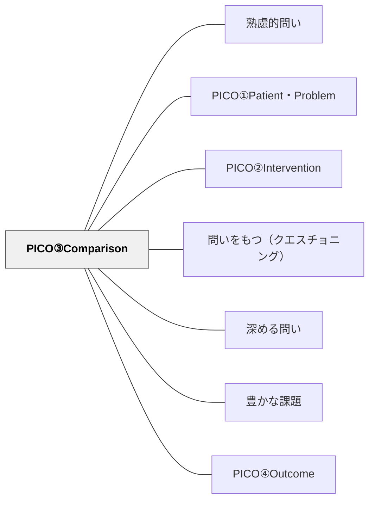

# PICO③Comparison

> 「何と比べるか」を明確にすることで、問いの焦点を鋭くする。

## 背景（Context）
探究や研究において、「何が効果的か」を問うだけでは答えが曖昧になりやすい。
比較対象が定まらないと、何を基準に評価すればよいかわからなくなる。
PICOフレームワークの第3要素として、Comparisonは問いの比較軸を定義する。
特に実践的・実証的な問いにおいて、比較基準の明確化は不可欠である。

## 問題（Problem）
「介入（Intervention）」だけを設定しても、何と比べてよいかが不明確なまま探究が進む。
比較対象がないと、効果の有無を判断する根拠が生まれない。
結果として、問いへの答えが「条件によっては効果的」という漠然とした形に終わる。

## 力のかたち（Forces）
- 「効果がある」という判断は、常に「何と比べて」という文脈を必要とする。
- 比較対象を設定することで、研究・探究のデザインが具体化される。
- 比較対象が多すぎると問いが複雑になり、少なすぎると現実から乖離する。
- 比較対象は「従来の方法」「何もしない状態」「別の介入」など多様な形をとりうる。

## 解決（Solution）
問いを設計する際に、「介入（Intervention）と何を比べるか」を明示的に言語化する。
「〇〇と比べて、△△はどのような効果があるか？」という形で問いを構造化する。
比較対象は、現実的に入手・観察可能なものを選ぶと問いが実行可能になる。
Comparisonを設定することで、問いは検証可能な形に近づく。

## 結果（Consequences）
問いの比較軸が明確になり、探究・研究の設計がしやすくなる。
「何と比べてよいのかわからない」という混乱を防ぐことができる。
一方、比較対象の選択が不適切だと、問いの答えが実践に活かせない可能性がある。
比較設定の妥当性を常に問い直す姿勢が必要である。

## 関連パタン
- [[パタン/熟慮的問い]] — 親パタン
- [[パタン/PICO①Patient・Problem]] — 対象・問題を明確にする第1要素
- [[パタン/PICO②Intervention]] — 比較される介入条件を設定する第2要素
- [[パタン/問いをもつ（クエスチョニング）]] — 問いを構造的に立てる力の上位パタン
- [[パタン/深める問い]] — 精緻化された問いが探究を深める
- [[パタン/豊かな課題]] — PICO的に構造化された問いが豊かな課題の核心をつくる
- [[概念/教育評価論]] — エビデンスに基づく実践（EBP）との接続
- [[パタン/PICO④Outcome]] — 比較の結果として何を見るかを定義する次の要素

## クラスター図

## Actionable Insight

- 探究の問いを「〇〇をするとどうなるか」から「〇〇をした場合と△△をした場合を比べると何が違うか」に書き換える——比較軸を加えることで問いが検証可能な形に変わる
- 比較対象として「従来の方法」「何もしない状態」「別のアプローチ」のどれかを選ぶよう学習者に考えさせる——比較対象の選択自体が批判的思考の練習になる
- 比較対象を決めた後「なぜその比較対象を選んだか」を一文書かせる——比較設定の妥当性を問い直す習慣が探究の質を高める

## 出典
- [[文献/熟慮的問いのパターンリスト（動画記録）]]
