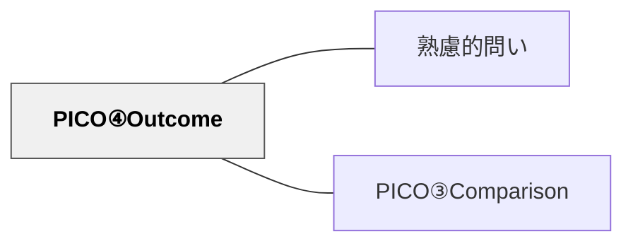

# PICO④Outcome

> 「どんな結果・効果を期待するか」を明確にすることで、問いに目的地を与える。

## 背景（Context）
探究や研究において、何を「成果」とみなすかを決めることは非常に重要である。
PICOフレームワークの第4要素として、Outcomeは問いの終着点を定義する。
成果が曖昧なままでは、どんなデータや観察が「答え」になるかわからない。
Outcomeを設定することで、問いは測定・評価・検証が可能な形になる。

## 問題（Problem）
介入や比較を設定しても、「何が変わればよいのか」が不明確なままだと探究が迷走する。
成果指標がないと、「効果があった」かどうかを判断する基準がない。
結果として、探究が「やりっぱなし」で終わり、学びの蓄積につながらない。

## 力のかたち（Forces）
- 成果は「テストの点数」のような量的なものだけでなく、「満足感」「理解の深さ」など質的なものもある。
- 成果を設定しすぎると問いが窮屈になり、柔軟な探究を妨げることがある。
- 成果が現実から乖離していると、問いへの答えが実践に活かせない。
- 成果の設定は、問いの目的（誰のために・何のために）と密接につながっている。

## 解決（Solution）
「この問いへの答えとして、何が変わっていれば『効果あり』と言えるか？」を言語化する。
Outcomeは「観察・測定・記述できるもの」として設定することが望ましい。
複数の成果を設定する場合は、主要な成果と副次的な成果を区別する。
「〇〇が改善されるか？」「△△が増えるか・減るか？」という形で明示する。

## 結果（Consequences）
問いが「何を確かめるための問いか」が明確になり、探究の方向性が定まる。
成果指標があることで、探究後に「問いへの答えが出たか」を自己評価できる。
一方、成果を固定しすぎると、想定外の発見を見落とすリスクがある。
探究の途中でOutcomeを見直す柔軟性も重要である。

## 関連パタン
- [[パタン/熟慮的問い]] — 親パタン
- [[パタン/PICO③Comparison]] — 成果を比較する基準となる第3要素

## クラスター図

## Actionable Insight

- 探究の問いを設定したら「何が変わっていれば答えが出たと言えるか」を一文で書かせる——成果指標を言語化することで探究の終着点が明確になる
- 「テストの点数」だけでなく「理解の深さ」「取り組みの姿勢」など質的な成果もOutcomeとして設定させる——多様な成果の視点が探究を豊かにする
- 探究の途中で「最初に設定したOutcomeは今も適切か？」と問い直す時間を取る——成果指標の見直しが柔軟で深い探究を支える

## 出典
- [[文献/熟慮的問いのパターンリスト（動画記録）]]
