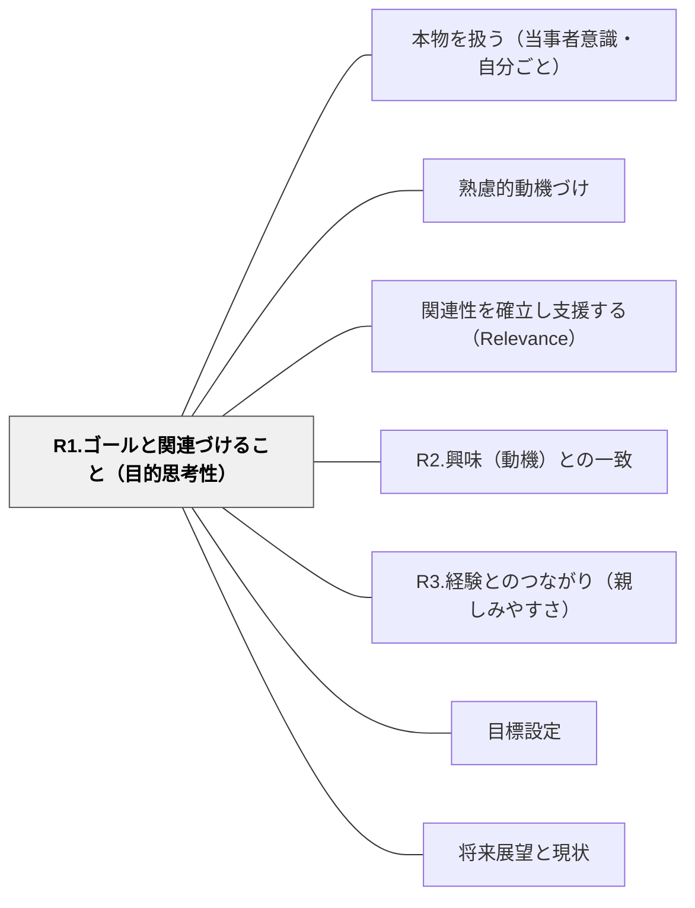

# R1.ゴールと関連づけること（目的思考性）

> 「これを学ぶと、自分の○○に役立つ」が見えたとき、学習は自分のこととして動き始める。ゴールとの接続が動機の方向性をつくる。

## 背景（Context）
関連性の確立において最も直接的なアプローチが、学習内容と学習者の個人的ゴール・将来の目標・職業的目的との接続である。学習者が「なぜ学ぶのか」を自分のゴールと結びつけられると、動機は外発から内発へとシフトしやすくなる。

## 問題（Problem）
教師は「この内容が重要だ」と知っているが、学習者には「自分の将来や目標にどう関係するのか」が見えていないことが多い。特に教科の知識と実生活・将来のつながりが不明瞭な場合に問題が顕著になる。

## 力のかたち（Forces）
- ゴールとの関連は学習者ごとに異なるため、全員への一律の説明では届かない場合がある
- 即時的な目標（今日の授業）と長期的な目標（将来のキャリア）の両方に接続できると効果的
- 学習者自身が「どう役立つか」を考える機会を設けると、受け取り方が深まる
- 関連性を誇張すると、後で期待外れになり信頼を損なう

## 解決（Solution）
**学習者が自分のゴール・目的・将来とこの学習の接続点を発見できるよう、具体的な文脈や事例・問いかけを提供する。**

「この技術を使う職業はどんなものがあるか？」「この問いが解けると、あなたの○○にどう活かせるか？」のような問いかけを通じて、学習者自身がゴールとの関連を見つけられるようにする。教師がゴールを「言う」だけでなく、学習者が「見つける」機会を設けることが重要。

## 結果（Consequences）
- 学習者が「自分のために学ぶ」という感覚を持てるようになる
- 学習内容への主体的な関与が生まれ、理解の質が向上する
- キャリア教育・総合学習など実社会とのつながりを重視する場面で特に有効に機能する

## クラスター図

## Actionable Insight

- 単元の始めに「この学習が役立つ職業・場面を一つ挙げてみよう」と問う——学習者自身がゴールとの接続を「見つける」経験が動機を内発化させる
- 「この技術を使う大人はどんな場面で使うか？」という問いを授業に埋め込む——将来のゴールとの接続が「なぜ学ぶか」の答えを学習者が自分で見つける機会になる
- 「この問いが解けると、自分の○○にどう活かせる？」と学習者に具体的に書かせる——自分のゴールと学習の接続点を言語化する経験が学習への主体的な関与をつくる

## 出典

- 一つの教育のパタン・ランゲージ（岩井輝久）

## 関連パタン
- [[パタン/本物を扱う（当事者意識・自分ごと）]]
- [[パタン/熟慮的動機づけ]] — 親パタン
- [[パタン/関連性を確立し支援する（Relevance）]] — 親パタン
- [[パタン/R2.興味（動機）との一致]] — 関連サブパターン
- [[パタン/R3.経験とのつながり（親しみやすさ）]] — 関連サブパターン
- [[パタン/目標設定]] — 関連パタン
- [[パタン/将来展望と現状]] — 関連パタン
