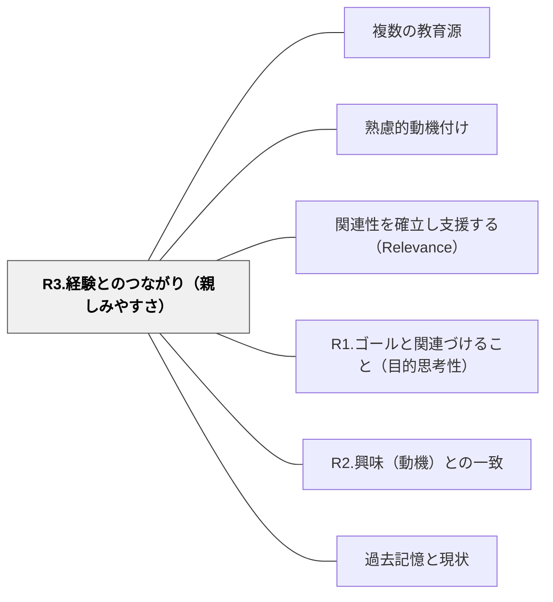

# R3.経験とのつながり（親しみやすさ）

> 新しい学びが過去の経験と結びつくとき、理解は深まり、取り組む意欲が自然に生まれる。知っていることが、知らないことへの橋になる。

## 背景（Context）
学習者は白紙で学習に臨むわけではなく、すでに豊かな経験・知識・体験を持っている。新しい学習をその既有経験と結びつけることで、親しみやすさと理解可能性が高まり、取り組む意欲が生まれる。

## 問題（Problem）
新しい概念や内容が「見たことも聞いたこともない」ものとして提示されると、学習者は取りつく島がなく距離を感じる。経験と切り離された学習は抽象的になりやすく、動機も理解も得られにくい。

## 力のかたち（Forces）
- 既有知識との接続（スキーマ活性化）は認知的処理を助け、記憶の定着にもつながる
- 学習者によって経験の内容は大きく異なるため、共通の経験を前提にしすぎるリスクがある
- 経験との接続が「昔話」になり、新しい概念への展開が弱くなる場合がある
- 日常の経験・体験的な活動は、親しみやすさを生む強力な素材になる

## 解決（Solution）
**新しい学習内容を学習者の日常経験・既有知識・過去の体験と明示的に結びつけることで、親しみやすさと取り組む意欲を生み出す。**

「みなさんも○○したことがあると思いますが…」という導入、身近な例を使った概念説明、学習者自身の経験を語る機会の提供などが有効である。学習の入口に「既知」を置き、そこから「未知」へと橋渡しする設計を意識する。

## 結果（Consequences）
- 学習者が新しい内容を「近いもの」として受け取り、取り組みへの障壁が下がる
- 既有経験が活性化されることで、新しい概念の理解が深まる
- 「自分の経験が役に立つ」という感覚が、学習者の自己効力感にもつながる

## クラスター図

## Actionable Insight

- 新しい概念を「みなさんも○○したことがあると思いますが、それが実は今日の学習と同じ仕組みです」と日常経験から始める——「知っていること」が「知らないこと」への橋になる
- 授業の前に「この内容に関連する自分の経験や思い出はあるか？」と問い、ペアで1分話させる——既有経験を活性化させてから学習に入ることで親しみやすさと理解の深さが増す
- 授業の最後に「今日学んだことは、あなたの日常生活のどんな場面と関係している？」と問う——学習と経験をつなぎ直す問いが知識の応用と定着を促す

## 出典

- 一つの教育のパタン・ランゲージ（岩井輝久）

## 関連パタン
- [[パタン/複数の教育源]]
- [[パタン/熟慮的動機付け]] — 親パタン
- [[パタン/関連性を確立し支援する（Relevance）]] — 親パタン
- [[パタン/R1.ゴールと関連づけること（目的思考性）]] — 関連サブパターン
- [[パタン/R2.興味（動機）との一致]] — 関連サブパターン
- [[パタン/過去記憶と現状]] — 関連パタン（経験の活用）
