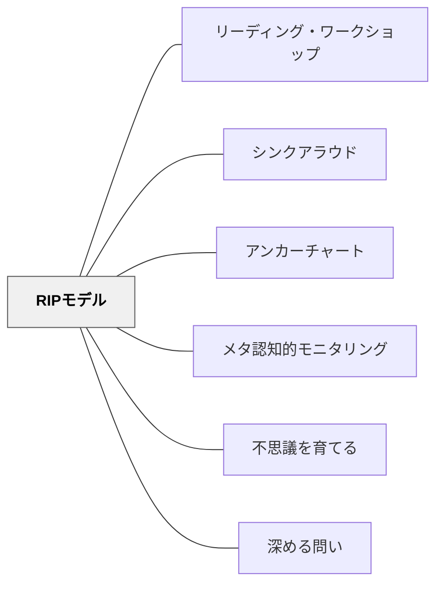

# RIPモデル

> 「予測可能な構造は、会議をより充実したものにする——教師にとっても、子どもにとっても。」

## [Pattern Connection]

Patrick Allen（2009）の **Conferring: The Keystone of Reader's Workshop** は、カンファリングに明確な構造を与えることで「誰もがカンファリングできる」への道を開く。RIPモデルは、Allen が自身の会議実践から帰納的に生み出した3段階の枠組みである。

- **補強点**：[[実践/カンファリング（読書会議）]] に「予測可能な構造」を与える。構造があることで子どもたちも「次に何が来るか」を知り、会議がより深くなる
- **拡張点**：[[パタン/シンクアラウド]] の「段階的手放しモデル」を会議という1対1の場に適用したもの——R段階では子どもが話し、I段階では教師がさりげなく指導し、P段階では子どもが次の一歩を自分で決める
- **他のパタンへの波及**：[[パタン/メタ認知的モニタリング]]・[[パタン/アンカーチャート]]・[[パタン/リーディング・ワークショップ]]

RIPの語源：「Read In Peace（読書に安らぎを）」でも「Rest In Peace（安らかに眠れ）」でもない——Allen は自ら笑いながら語る。RIPは Review, Read Aloud, Record → Instruction, Insights, Intrigue → Plan, Progress, Purpose の3ブロックの頭文字。

---

## 背景（Context）

カンファリングを始めようとする教師が直面する最初の壁は「何を聞けばいいかわからない」である。「本について話してみて」と言っても会話が広がらない。「どこまで読んだ？」「面白かった？」と続けるだけでは、会議が「確認作業」になる。

Debbie Miller（2002）はカンファリングの価値を示したが、「どのような構造で進めるか」は教師の経験と勘に依存していた。Allen（2009）はその構造を明示化し、「会議を毎日の日課にする」ための枠組みを提供する。

## 問題（Problem）

会議を始めると「何を聞けばいいか」「どこで終わればいいか」「何を記録すればいいか」がわからず、会議が短く表面的になるか、長くなりすぎて他の子どもへの対応ができなくなる。構造がないと、教師も子どもも「会議の目的」を共有できない。

## 力のかたち（Forces）

- 予測可能な構造があると、子どもたちは「次に何が来るか」を知り、自ら準備するようになる
- R段階を短くすることで、I段階の「本質的な対話」に時間を使える
- P段階で子ども自身が目標を決めると、次の会議までの行動が変わる
- 構造は「縛り」でなく「安心の枠」——構造の中で自由な対話が生まれる
- 記録（Record）があってはじめて、会議が「評価と指導の一体化」になる

## 解決（Solution）

**カンファリングをR・I・Pの3段階に沿って進める。各段階の目的と代表的な言葉を知ることで、会議を毎日の日課にする。**

---

### R：Review, Read Aloud, Record（振り返り・音読・記録）

**開幕の問い**：「今日、読者として自分について何か話してくれる？」（What can you tell me about yourself as a reader today?）

**Review**（前回の振り返り）

前回の会議で決めた目標や試したことについて確認する：
- 「前回、〇〇を試してみるって言ってたけど、どうだった？」
- 「今日の読書で、前回話したことがどこかで活きた？」

**Read Aloud**（音読・読み声の観察）

子どもに短い部分を音読してもらい、読み方のパターン・強さ・課題を観察する：
- 「少し読んで聞かせてくれる？どこでもいい部分で」
- 子どもが「見せたい場所」を選ぶことで、その子が大切にしていることが見える

**Record**（記録・共有）

子どもが今読んでいる本・気づき・疑問を記録する：
- 「このページを読んで、気になったこと、考えたこと、あった？」
- 教師は手元のノートに一言メモをとる

---

### I：Instruction, Insights, Intrigue（指導・気づき・探究）

RIPモデルの中核。ここで「1つのこと」に集中して応答する。

**Instruction**（指導）

子どもが使っているストラテジーに名前をつける、または一つの具体的な示唆を与える：
- 「今あなたがやったこと、それは推論（Inferring）だよ。テキストに書いていないことを、自分のスキーマ＋手がかりから考えた」
- 多くのことを一度に教えない——「1回の会議では1つのことだけ」

**Insights**（気づき）

子どもの発言から、教師が引き出した洞察を子どもと共有する：
- 「あなたが言ったことで、私はこんなことに気づいた。〇〇のシーンが、実はその前の場面と繋がっているんじゃないかと思った」
- 子どもの気づきを称賛し、さらに深める問いを返す

**Intrigue**（探究・興味）

子どもが引っかかっている点、または教師が好奇心を抱いた点を掘り下げる：
- 「あなたが今読んでいる本の、ここの部分——面白いと思わない？なぜ作者はここでこういう表現を選んだんだろう」
- 「私も気になった。一緒に考えてみよう」

---

### P：Plan, Progress, Purpose（計画・成長・目的）

**Plan**（次への計画）

会議の終わりに、子どもが次の読書までに試すことを一緒に決める：
- 「次に読むとき、今日話したことを意識してみて。どんな形で試してみる？」
- 子どもが自分の言葉で計画を語ることが大切——教師が決めるのではない
- 付箋に書いてリットログ（読書ノート）に貼る → 次の会議の「Review」の材料になる

**Progress**（成長の記録）

教師が記録する：その子の成長、今日の Teaching Point、次回確認すること

**Purpose**（目的）

その子が「自分はなぜ読んでいるのか」を意識できているか確認する：
- 「今日読んでいるのは、どんな目的で？（楽しみ？情報？）」
- 「この本は自分に合った本だと感じてる？」

---

### 会議の具体的な流れ（Jacob との会議から）

R段階：「どうしてる、Jacob？何を読んでいる？」→ 子どもが話す（教師はメモをとりながら観察、パターンを探す）

I段階：Jacob が "trust" というテーマを自分で見つける → 教師は「大きなアイデアを探している」と認識し、テキストに戻ってエビデンスを探す問いを返す → 子ども自身が自分の推論を言語化する

P段階：「次は何を試してみる？」→ 付箋に書いて本に挟む

---

### 「収集するな、会議せよ（Confer, don't collect）」——Allen の警告

RIPモデルが機能するためには、**記録がカンファリングを支配してはならない**。Allen 自身の失敗談：コンピュータラベルを大量に用意し、会議のたびに書き込んでいたが、学期末に山積みのラベルが整理されないまま残った。記録システムを試すことと、実際に会議することを混同していた。

「誰かの方法を無批判に真似るな。自分でためしてみて、機能するか確かめよ」——会議ノートは、自分の会議スタイルから育てるもの。

**Allen が自分のカンファリングフォームに設けた8つの基準**：
1. シンプルで柔軟
2. 物理的に持ち運びやすく書きやすい
3. RIP構造と連動している
4. 成長とパターンを記録しやすい
5. 書くスペースが十分ある
6. ストラテジーの使用の証拠を記録できる
7. 聴きながら書ける（functional）
8. 他教科の会議にも使えるよう改変可能

**タッチストーン会議 vs. Side-by-Side 会議**：毎日全員に短い声かけ（タッチストーン）を行うことと、RIPモデルに基づく本格的な個別会議を行うことは異なる。前者は daily check-in（「何を読んでる？」「どうしてる？」）、後者が本来のカンファリング。Allen は1日5〜6人の Side-by-Side 会議を目標にしている。

## 結果（Consequences）

- 子どもたちが「会議の構造」を知ることで、自分から準備して話しかけてくる
- 「1つのことを深める」という原則を守ることで、会議の質が上がる
- P段階の目標が次のR段階の出発点になり、成長の連続性が生まれる
- 記録が蓄積されることで、次のミニレッスンのテーマが見えてくる
- 教師が「毎日の日課としてのカンファリング」を実現できるようになる

## 関連パタン

- [[実践/カンファリング（読書会議）]] — RIPモデルが実践される場
- [[パタン/リーディング・ワークショップ]] — カンファリングを「要石」として位置づける授業構造
- [[パタン/シンクアラウド]] — 段階的手放しモデルとの対応
- [[パタン/アンカーチャート]] — P段階で決めた目標をチャートに記録する
- [[パタン/メタ認知的モニタリング]] — I段階の「Insights」はメタ認知の引き出し
- [[パタン/不思議を育てる]] — I段階の「Intrigue」は探究の入口
- [[パタン/深める問い]] — I段階の「Instruction/Insights/Intrigue」で深める問いが生まれる

## クラスター図

## Actionable Insight

- 今週、一人の子どもと会議するとき「今日、読者として自分について何か話してくれる？」という開幕の問いだけを変えてみる——子どもが話す量が変わる
- P段階で「次に試すことを付箋に書いてリットログに貼って」と言ってみる——「書いた目標」は「言っただけの目標」より次の会議で返ってくる確率が高い
- 「今日の会議で1つだけ教えた」という日をつくる——「1つだけ」という制約が会議を深くする
- **「Confer, don't collect」を確かめる**：自分の会議ノートを見て「この記録は子どもを理解するために使っているか？それとも記録すること自体が目的になっているか？」を問う
- **タッチストーンを毎日やってみる**：会議の有無にかかわらず、毎日全員に「今日何読んでる？」の一言だけかけてみる——それだけで次の本格的な会議の質が変わる

## 出典

Allen, P. A. (2009). *Conferring: The Keystone of Reader's Workshop*. Stenhouse Publishers.

> "I realized that, like all good rituals and routines, a predictable structure for reading conferences provides a pattern for me to follow each time I confer with a reader. More important, my students know that each side-by-side conference follows a similar pattern."

[[文献/Conferring（Allen）]]
