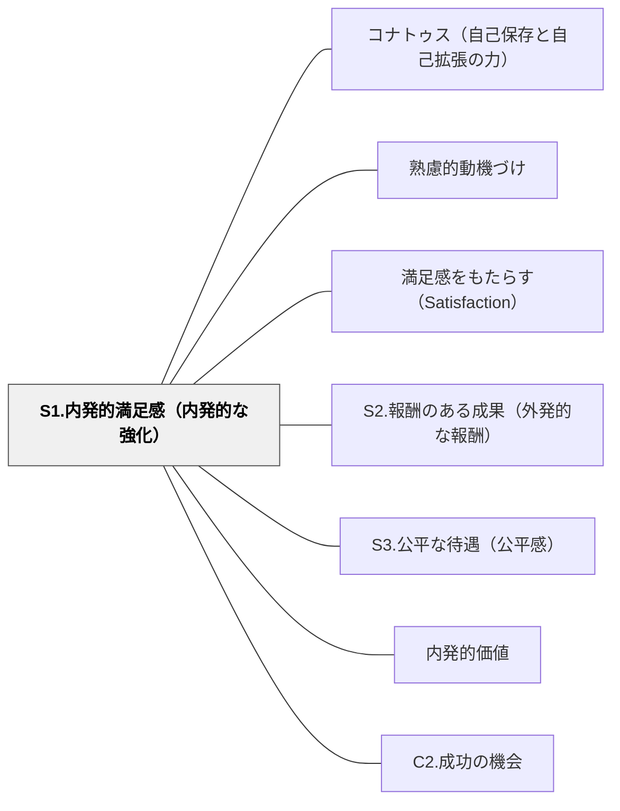

# S1.内発的満足感（内発的な強化）

> 「できた！」「わかった！」「面白い！」という内側からの喜びが、外からの報酬がなくても学びを続けさせる。

## 背景（Context）
満足感の中で最も持続的な動機の源泉が、活動そのものや達成から生まれる内発的な喜びである。チクセントミハイのフロー体験や、デシ＆ライアンの自己決定理論が示すように、内発的動機は長期的な学習継続の根幹となる。

## 問題（Problem）
外部報酬に依存した動機付けは、報酬がなくなると活動も止まってしまう。「テストのために覚える」「先生に褒められるためにやる」という動機では、テストが終われば学びも終わる。

## 力のかたち（Forces）
- 内発的満足感は強制的には生み出せないが、育まれる環境は設計できる
- 達成感・成長の実感・問いが解けたときの喜びが内発的満足感の主な源泉
- 外部評価が過度に強調されると、活動への内発的興味が低下するアンダーマイニング効果が起こる
- 活動への没頭（フロー状態）が内発的満足感の典型的な形態

## 解決（Solution）
**活動そのものの価値・達成感・成長の実感が感じられるような学習体験を設計することで、内側から生まれる満足感を育てる。**

達成を振り返る時間を設ける、自分の成長を可視化する機会を作る、課題への没頭を邪魔しない環境を整える、学習の結果が実際に役立つ場面を設けるといった方法が有効である。外部報酬は補助的に使いつつも、活動の価値そのものを実感できる体験を優先する。

## 結果（Consequences）
- 学習者が外部からの促しがなくても自発的に学ぼうとする姿勢が育つ
- 長期的な学習継続と、学ぶことへの肯定的な態度が形成される
- S2（外発的報酬）と組み合わせるとき、内発的動機を損なわないバランスを意識できる

## クラスター図

## Actionable Insight

- 活動の後に「今日の学びで一番面白かった・発見できた瞬間はどこ？」と振り返らせる——「できた・わかった・面白い」という内側の喜びを言語化する経験が内発的動機の土台をつくる
- 学習結果が「実際に役立つ場面」を単元に設ける（発表・作品展示・問題解決への応用など）——学びが現実に機能する体験が活動そのものへの価値を実感させる
- 外部評価（点数・賞賛）より先に「自分でどうだったか？」を自己評価させる習慣をつける——内側の評価を先に問うことがアンダーマイニング効果を防ぎ内発的動機を守る

## 出典

- 一つの教育のパタン・ランゲージ（岩井輝久）

## 関連パタン
- [[パタン/コナトゥス（自己保存と自己拡張の力）]]
- [[パタン/熟慮的動機づけ]] — 親パタン
- [[パタン/満足感をもたらす（Satisfaction）]] — 親パタン
- [[パタン/S2.報酬のある成果（外発的な報酬）]] — 関連サブパターン
- [[パタン/S3.公平な待遇（公平感）]] — 関連サブパターン
- [[パタン/内発的価値]] — 関連パタン
- [[パタン/C2.成功の機会]] — 関連パタン
