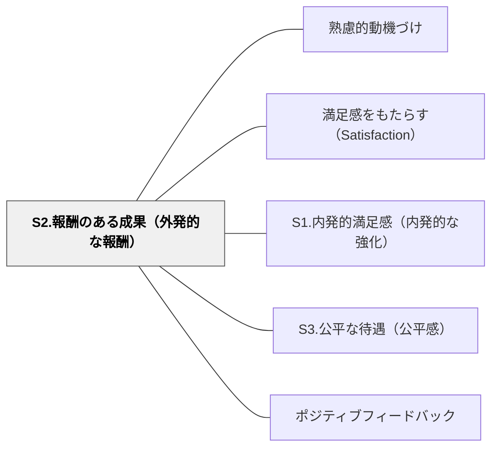

# S2.報酬のある成果（外発的な報酬）

> 達成を認められ、報われる体験が、学習の意味を強化する。外部からの承認は、特に学びはじめの段階で大きな力を持つ。

## 背景（Context）
内発的満足感の補完として、外部からの報酬・承認・評価が動機付けに果たす役割がある。賞賛・成績・ポイント・資格・修了証など、多様な形態の外部報酬が学習の継続と達成の確認に機能する。

## 問題（Problem）
成果が全く認められない環境では、「頑張っても無駄」という無力感が生じる。一方で、外部報酬だけに依存すると内発的動機が損なわれるというジレンマがある。

## 力のかたち（Forces）
- 外部報酬は即効性があり、行動を強化する強力な手段だが、依存が生じやすい
- アンダーマイニング効果：内発的に楽しんでいた活動に外部報酬を与えると興味が低下することがある
- 情報的フィードバック（「ここが良かった」）は内発的動機を損なわずに機能しやすい
- 報酬の公平性・透明性が保たれないと、不満と不信を生む

## 解決（Solution）
**達成に対して適切な承認・賞賛・外部評価を与えることで満足感を補強しつつ、内発的動機を損なわないよう情報的・承認的なフィードバックを中心に設計する。**

単なる「よくできました」ではなく、何が良かったかを具体的に伝える情報的フィードバックを中心にする、報酬がプロセスや成長に対して与えられるようにする、内発的価値を育てながら補助的に外部報酬を使うという設計が重要である。

## 結果（Consequences）
- 学習者が努力や達成を外から確認・承認され、継続意欲が維持される
- 外部報酬と内発的動機のバランスを意識した設計ができるようになる
- S1（内発的満足感）と連動させることで、長期的な動機付けの構造が強化される

## クラスター図

## Actionable Insight

- 「よくできました」だけでなく「ここの○○が特によかった」と具体的な内容を指して伝える——情報的フィードバックが内発的動機を損なわずに達成を強化する
- 報酬を「結果」だけでなく「プロセスや成長」に対しても与える（「最後まで粘り強く取り組めた」など）——プロセスへの承認が学習への取り組み方を方向づける
- 外部報酬を段階的に減らしながら「自分がどれだけできたか」という自己評価へと移行する設計を意識する——外部から内部へのシフトが自律的学習者を育てる

## 出典

- 一つの教育のパタン・ランゲージ（岩井輝久）

⚖ **緊張関係**: [[緊張関係マップ]] — [[パタン/内発的動機づけ]]・[[パタン/非随伴的な賞賛]] と拮抗する。判断軸：〈プロセスへの情報か操作かで選ぶ〉

## 関連パタン
- [[パタン/熟慮的動機づけ]] — 親パタン
- [[パタン/満足感をもたらす（Satisfaction）]] — 親パタン
- [[パタン/S1.内発的満足感（内発的な強化）]] — 関連サブパターン
- [[パタン/S3.公平な待遇（公平感）]] — 関連サブパターン
- [[パタン/ポジティブフィードバック]] — 関連パタン
