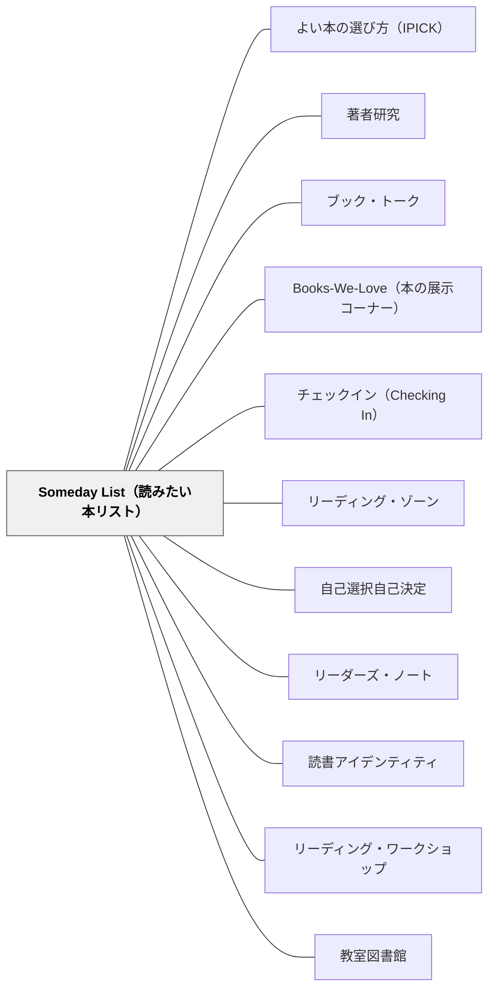

# Someday List（読みたい本リスト）

> 「次に何を読もう」と迷う時間をなくす——いつでも更新し続けるリストが、本を読み終えた瞬間に次の本への橋をかける。

---

## Pattern Connection

**出典**: Atwell, N., & Atwell Merkel, A. (2016). *The Reading Zone* (2nd ed.). Scholastic.

- **既存パタンとの関連**：[[パタン/自己選択自己決定]] の「自分で選ぶ」を「いつでも選べる状態に整えておく」として実装したものが Someday List である。選択の権利を保証するだけでなく、選択の準備が常に整っている状態を作る
- **補強された点**：[[パタン/リーディング・ゾーン]] の「本を読み終えたらすぐ次の本へ」という原則を、リストというツールで支える。「次が決まっている読者」と「次を決めていない読者」では、読書の継続率に大きな差が出る
- **修正・拡張された点**：[[パタン/ブック・トーク]] の効果が「記憶に残るかどうか」という不確実性を持つのに対し、Someday List はブック・トークで知った本を「後で読む」という具体的なアクションに変換する。ブック・トークとセットで使うことで、ブック・トークの効果が持続する
- **他のパタンへの波及**：[[パタン/Books-We-Love（本の展示コーナー）]] — 展示を見てリストに追記する流れ。[[パタン/チェックイン（Checking In）]] — 「次は何を読む？」という問いへの答えがリストから出てくる

---

## 背景（Context）

Atwell が CTL（Center for Teaching and Learning）で実践する読書の10ルールの一つに「Someday List（読みたい本リスト）を常に育てる」がある。

読書家にとって「次に何を読むか」は常に決まっている。書店で目に入った本、友人に薦められた本、ブック・トークで心に残った本——これらをリストに記録しておくことで、「読み終わったら次が決まっている」状態を常に保てる。

Atwell は学習者が Someday List を読書ノートや手帳の最初のページに作ることを勧める。年度を通じてこのリストが育ち続けることで、学習者は「自分が読みたいと思っている本の世界」を常に持てる。

## 問題（Problem）

本を読み終えた後に「次に何を読もうか」と迷う時間が、読書の継続を妨げる。

本を選ぶのに時間がかかる子どもは、その空白時間に読書への動機が冷めていくことがある。「今は特に読みたい本がない」という状態は、次第に「読書は苦手だ」「読まなくていい」という認識につながりやすい。

また、ブック・トークで「読みたい」と思った本を翌週には忘れてしまうことがある——記録がなければ、出会いは一時的な刺激に終わる。

## 力のかたち（Forces）

- 読書の継続は「次が決まっているかどうか」に大きく左右される——「次が決まっている」状態が読書の習慣を保証する
- リストは欲望の記録であり、「自分が読みたいと思った」という過去の自分からのメッセージ
- リストが長いほど「いつでも選べる」安心感が生まれる——短いリストは「また考えなければ」という負荷になる
- ブック・トーク・Books-We-Love・友人の推薦・図書館の棚——これらの出会いをリストに変換することで、偶然の出会いが「いつか読む」意図に変わる
- チェックインの「次は何を読む？」という問いに、リストから答えることで選書の主体性が確認できる

## 解決（Solution）

**読書ノートの最初のページ（または専用の用紙）に「Someday List」を作り、読みたいと思った本をタイトルと著者名でいつでも書き加える。本を読み終えたらリストから次の本を選ぶ。**

---

### Someday List の作り方

1. 読書ノートの最初のページ（または最後のページ）を「Someday List」専用にする
2. タイトル・著者名を走り書きでよい——ジャンル・薦めてくれた人のメモを添えると選ぶときの手がかりになる
3. 読んだ本にはチェックや日付を入れる——「読んだ本の歴史」と「読みたい本の未来」が一冊に見える
4. リストに追記するタイミングを教える：
   - ブック・トークを聞いたとき
   - Books-We-Love コーナーを見たとき
   - 友人・教師に「これ面白いよ」と言われたとき
   - 読んでいる本の中で別の本が登場したとき

---

### 教師の使い方

チェックインの「次は何を読む？」という問いで Someday List を確認する：

- リストが空の学習者には「一緒にブック・トーク聞いて何か書き込んでおこう」と支援する
- リストが1冊しかない学習者には Books-We-Love を案内する
- リストが育ち続けている学習者は「次が決まっている読者」として独立している

---

### 実際の運用例（CTL）

Atwell は学習者の Someday List を年度初めのオリエンテーションで作り始める。最初の Someday List は「これまでに聞いたことがある・読んでみたいと思った本のタイトルを書く」という簡単な課題から始まる。

年度末には多くの学習者の Someday List が10〜30冊以上になっている——「読み終えたリスト」と「これから読むリスト」の両方が育ち続けることで、学習者は自分が「読書家として成長している」ことを可視化できる。

## 結果（Consequences）

- 「次に何を読もうか」という迷いが減り、本を読み終えた後の空白時間がなくなる
- ブック・トークや Books-We-Love の効果が「いつか読む」という意図に変換されて持続する
- リストが蓄積することで「読みたい本がたくさんある自分」という読書家としての自己像が育つ
- チェックインで「次が決まっている」学習者と「決まっていない」学習者が即座に分かる
- ただし、リストに書いてもいつまでも読まない状態が続く場合は、選書の偏り（難しすぎ・ジャンルの固定）を確認する必要がある

## 関連パタン
- [[パタン/よい本の選び方（IPICK）]]
- [[パタン/著者研究]]

- [[パタン/ブック・トーク]] — ブック・トークで出会った本をリストに記録する
- [[パタン/Books-We-Love（本の展示コーナー）]] — 展示を見てリストに追記する導線
- [[パタン/チェックイン（Checking In）]] — 「次は何を読む？」の答えをリストから引き出す
- [[パタン/リーディング・ゾーン]] — 「次が決まっている」ことがゾーン体験の連続を保証する
- [[パタン/自己選択自己決定]] — 自分が読みたいと思った本を選ぶオーナーシップ
- [[パタン/リーダーズ・ノート]] — Someday List を読書ノートの中に組み込む
- [[パタン/読書アイデンティティ]] — 「読みたい本がたくさんある」という状態が読書家としての自己像を育てる
- [[パタン/リーディング・ワークショップ]] — 読みたい本リストが機能するワークショップの構造
- [[パタン/教室図書館]] — 教室図書館のバスケットやBook Talkが Someday List のネタ源になる

---

## クラスター図

## Actionable Insight

- 今週、読書ノートの最初のページを「Someday List」専用ページにする——タイトルを書くだけでOK、きれいに作る必要はない
- 次のブック・トークの後に「Someday List に書いた人？」と確認する——記録した学習者を認めることでリストを育てる文化が始まる
- 本を読み終えた学習者に「次は Someday List から選んだ？」と聞く——リストを実際に使う経験が「リストは役に立つ」という実感を作る

---

## 出典

Atwell, N., & Atwell Merkel, A. (2016). *The Reading Zone* (2nd ed.). Scholastic.

[[文献/The Reading Zone（Atwell）]]
