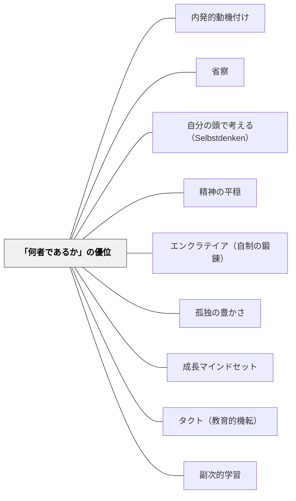

# 「何者であるか」の優位

> 人生の幸福にとって「自分は何者なのか」——その人の身におのずからそなわるものこそ、一貫して第一の、最も重要なものである。——ショーペンハウアー（1851）

---

## Pattern Connection

**ショーペンハウアー（1851/2013）「幸福について」統合（2026-05-31）：**

本パタンはショーペンハウアーの「三つの財宝」論を教育の文脈で再構成したものである。

- **既存パタンとの関連**：[[パタン/内発的動機付け]] の「自律性・有能感・関係性」は、ショーペンハウアーの「何者であるか」（内的性状の育成）と構造的に対応する。外部からの報酬（第三の財宝：名誉・評判）への過度な依存が内発的動機を損なうように、「いかなるイメージを与えるか」への固執は「何者であるか」の育成を阻む
- **補強された点**：[[パタン/省察]] の「自分の経験に問い返す」は「何者であるか」への問いの継続形式として読める。省察は「何者であるか」という自己理解を深める実践そのもの
- **修正・拡張された点**：[[パタン/自分の頭で考える（Selbstdenken）]] の「思索が先、読書は後」という時間的順序に、「思索を深めることが『何者であるか』を育てる」という存在論的な次元が加わる
- **他のパタンへの波及**：[[パタン/精神の平穏]] — 「何者であるか」が充実しているとき、外部の変化に揺さぶられない精神の平穏が生まれる；[[パタン/エンクラテイア（自制の鍛錬）]] — 欲望の管理が「何者であるか」の深化を支える

---

## 背景（Context）

学校という場は、多くの場合「何を持っているか」（成績・資格・知識量）と「いかなるイメージを与えるか」（評価・他者からの印象）の二項目を中心に設計されている。成績表・通知表・テスト結果・発表のうまさ——これらはすべて外部から測定可能なものだ。

しかしショーペンハウアーは1851年に、人生の幸福を決める三つの財宝のうち「その人は何者であるか」（人柄・知性・健康・徳性・気質）が他の二つを圧倒すると論じた。この第一の財宝は「恒常的で、いかなる境遇においても有効であり、運命に屈することもなく、奪い取ることもできない」。

## 問題（Problem）

外的評価（成績・称賛・評判）が子どもの学習の主動因になるとき、「何者であるか」の育成は後回しになる。

子どもは「テストで点を取るために」「先生に褒められるために」「友達より上手になるために」学ぶ。その結果、好奇心・粘り強さ・自分なりの考え方・問いを持つ力——つまり「その人は何者であるか」という内的性状は、外的な目標の陰に隠れる。

学校を出たとき、外的な評価軸が消えた後に残るものが「何者であるか」だ。しかし学校で「何者であるか」を育てる実践は少ない。

## 力のかたち（Forces）

- 外的評価は測定しやすく、制度的に扱いやすい——見えない「何者であるか」は評価しにくい
- 子どもは外的承認を求める自然な傾向を持つ——これ自体は正常だが、過度になると内的性状の育成を妨げる
- 「何者であるか」は日々の探究・読書・制作・対話の積み重ねによって育つ——一時的なイベントでは変わらない
- 外的財宝（成績・評判）は変化する。内的財宝（何者であるか）は「いかなる境遇においても有効」——安定した基盤になる
- 教師自身が「何者であるか」を問い続けているかどうかが、子どもへの伝わり方を決める

## 解決（Solution）

**「何者であるか」——好奇心・粘り強さ・考える力・関わり方・探究への姿勢——を外的評価より優先して観察し、フィードバックし、育てる。**

---

### 子どもにとっての「何者であるか」の読み替え

ショーペンハウアーが言う「人柄・知性・健康・気質・徳性」を教育文脈で読み直すと：

| ショーペンハウアーの原語 | 教育文脈での読み替え |
|---|---|
| 知性 | 好奇心・問いを立てる力・考え続ける力 |
| 気質 | 粘り強さ・立ち向かう姿勢・感情の調整 |
| 徳性 | 他者への配慮・正直さ・誠実さ |
| 健康 | 身体的・精神的な安定・安心感 |
| それらを磨くこと | 探究・練習・反省・学び続けること |

---

### 実践①：「何者か」を問うフィードバック

成果（正解・点数・作品の出来映え）だけでなく、プロセスと姿勢をフィードバックの対象にする。

- 「どうやって考えたの？」——思考のプロセスへの関心
- 「諦めそうになったとき、どうした？」——粘り強さへの観察
- 「この問いはどこから来た？」——好奇心の起点への注目

---

### 実践②：「何者であるか」を可視化する場

読書ログ・ライターズ・ノート・問いの記録——これらは「何者であるか」の成長を記録する場として機能する。成績表が「何を持っているか」の記録だとすれば、これらは「何者であるか」の軌跡だ。

ポートフォリオ評価は、ショーペンハウアーの第一の財宝の「教育的写し鏡」として設計できる。

---

### 実践③：「何者であるかを問う問い」を習慣にする

単元の最後や学期末に：
- 「今の自分はどんなことに興味がある？」
- 「どんな時に本当に夢中になった？」
- 「自分にとって『難しいけれど面白い』と感じたことは？」

これらの問いは「何を持っているか」（学んだ知識）でなく「何者であるか」（学び手としての自己）への問い返しだ。

---

## 自己教育での適用例

岩井も「何者であるか」という問いを自分に問い続けている実践者だ。数学デイリー（毎朝の数学研究）・パタン・ランゲージ研究・このWiki構築は、外部からの評価（校長からの評価・同僚からの評判）に動機を置かず、「自分の内的関心に従って学ぶ」という第一の財宝の実践に他ならない。

- **子どもとの共通点**：内的関心から動く学習は、外的評価がなくても継続する
- **大人ならではの深み**：「何者であるか」は長い時間をかけて蓄積される——今の自分の探究が5年後・10年後の「何者であるか」を決める

---

## 結果（Consequences）

- 子どもが「自分はどんな学習者か」という自己認識を育て、外的評価への依存が減る
- フィードバックの言語が「正解・不正解」から「あなたの考え方・姿勢・探究」へと移る
- 学校を出た後も学び続ける動機の基盤ができる
- ただし、「何者であるか」は測定・評価しにくいため、制度的な評価との緊張が生まれる
- 「内的性状を育てる」という価値が教師間・保護者間で共有されていないと、孤立した実践になるリスクがある

## 関連パタン

- [[パタン/内発的動機付け]] — 「何者であるか」の育成は内発的動機の最深部に対応する
- [[パタン/省察]] — 「何者であるか」を継続的に問い返す実践
- [[パタン/自分の頭で考える（Selbstdenken）]] — 思索が「何者であるか」を育てる
- [[パタン/精神の平穏]] — 内的財宝が充実するとき生まれる安定した状態
- [[パタン/エンクラテイア（自制の鍛錬）]] — 欲望の管理が「何者であるか」の深化を支える
- [[パタン/孤独の豊かさ]] — 孤独を楽しめることが「何者であるか」の豊かさの証
- [[パタン/成長マインドセット]] — 「何者であるか」は固定でなく成長するという信念
- [[パタン/タクト（教育的機転）]] — 教師のタクトは「何者であるか」の実践知として育つ
- [[パタン/副次的学習]] — 教師自身が「何者であるか」を問う姿勢が副次的に伝わる
- [[文献/幸福について（ショーペンハウアー）]] — 本パタンの一次資料

---

## クラスター図

## Actionable Insight

- **今日のフィードバックを1つ「何者か」に変える**：「正解だった」の代わりに「どうやって考えたの？」と問う。1回でいい。この一言が「プロセスへの関心」を子どもに伝える
- **週1回「好奇心の記録」を書かせる**：「今週、一番面白かったことは？」「どんな問いが浮かんだ？」——答えを問わず、好奇心そのものに注目する時間を作る
- **教師自身が「自分は今、何者であるか」を問う**：授業の後に「今日の自分の教師としての姿勢はどうだったか」を30秒振り返る。成果（うまくいったか）でなく姿勢（自分らしく教えられたか）への問いが第一の財宝の自己教育になる

---

## 出典

ショーペンハウアー、鈴木芳子（訳）（2013）『幸福について』光文社古典新訳文庫（原著 Schopenhauer, A. (1851). Aphorismen zur Lebensweisheit. In Parerga und Paralipomena.）

> 「人生の幸福にとって『自分は何者なのか』、すなわち、その人の身におのずからそなわるものこそ、一貫して第一の、最も重要なものである。なぜならそれは恒常的で、いかなる境遇においても有効であり、さらに他の二項目における財宝のように運命に屈することもなければ、私たちから奪い取ることもできないからである」——ショーペンハウアー（1851/2013）
