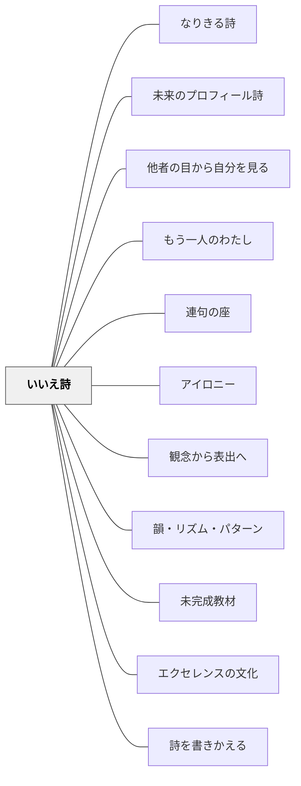

# いいえ詩

> 「いいえ」で見慣れた世界を否定すると、その先に新しいイメージが生まれる。

## [Pattern Connection]

**白谷明美（年不詳）統合（2026-05-16）：**

白谷明美『詩が生まれるとき書けるとき』第一章5節「発想の転換遊び」を統合。

- **[[パタン/アイロニー]] との関連**：アイロニーが「対比・矛盾の緊張から感情を動かす」技法であるのに対し、「いいえ詩」は「一つの事実を否定して新しいイメージへ転換する」というより単純な操作で同じ驚きと発見を生む。アイロニーの子ども向け入口として位置づけられる。
- **[[パタン/観念から表出へ]] の補強**：見慣れた事物を「いいえ」で否定するという操作が、観念形成の引き金になる。「否定の先に何があるか」を考える時間が内側の観念を育てる。
- **他のパタンへの波及**：[[パタン/なりきる詩]] の前段として使える。「いいえ詩」で否定した先に「ではどんな存在か」と問うことで、なりきりへの橋渡しになる。

**白谷明美（年不詳）第2次統合（2026-05-21）：**

OCR全文精読により、いいえ詩の体系が補強・拡張された。

- **3ステップ構造の明示化**：本書に「①今見えているものを『いいえ』で否定してこわす ②否定したものを見方を変えて見直す ③新しいイメージのつながりを発見する」という3ステップが明記されている。「いいえのメガネ」で否定するだけでなく、「見直し」と「新しいつながりの発見」まで意識的に進める設計が必要。
- **詩りとりリレー大会**：「あせ　いいえ　海の水　いいえ　想像力の結晶　いいえ　天使の涙……」と連鎖させる応用形。一つの「いいえ」から次の「いいえ」へ連鎖させることで、イメージが無限に広がる体験が生まれる。[[パタン/連句の座]] の「前の句を受けてつなぐ」と同じ構造。
- **おもての目・うらの目**：白谷明美は詩が生まれることを「見たままの事実（おもての目）とそこから湧き起こるイメージ（うらの目）が『ぴったり重なる』こと」と定義する。「いいえ詩」は「おもての目（事実の文）」から「うらの目（新しいイメージ）」へと意図的に切り替える操作——この理論がいいえ詩の根拠にある。
- **自己探求の詩群との接続**：「いいえ」という否定の操作は、[[パタン/未来のプロフィール詩]]（短所を否定して願いを発見）・[[パタン/他者の目から自分を見る]]（自分の固定イメージを否定して多視点で見る）・[[パタン/もう一人のわたし]]（「正しい自分」を否定して内なる葛藤を認める）すべての基底操作として機能する。

## [The Pattern]

> 空はすいすい　いいえ、魚がとんでいる  
> たんぽぽは黄色い　いいえ、たんぽぽはぼくに笑いかけている

### 背景（Context）

詩を書く学習で、子どもたちは「見えたまま」「感じたまま」を書く。それ自体は大切だが、「詩らしいイメージ」の驚きや新しさはなかなか生まれない。目の前の事実を「正確に描く」のと、「新しく見直す」のは別の認知的操作が必要である。

### 問題（Problem）

どうすれば、見慣れた日常の事物から「詩らしいイメージ」の驚きを生み出せるか。子どもに「もっと詩らしく」「イメージで書いて」と言うだけでは、何をどう変えればよいかが伝わらない。

### 力のかたち（Forces）

- 「見えたまま」を書くことには安心感がある。それを崩す操作が必要
- 「否定する」という行為は子どもにとって遊び的で楽しい
- 「いいえ」の後に続く言葉は、正解がないため子どもが自由に発想できる
- 短い形式（2行）で完成するため、書くことへの抵抗が低い
- 群読・発表会形式にすると「みんなの発見の違い」が可視化され、詩のおもしろさが共有される

### 解決（Solution）

**「見慣れた事実の文」に続けて「いいえ、〜だ」と否定する、2行一組の詩を書く。**

手順：
1. 身近なものを一つ選ぶ（空、花、給食、窓、消しゴム…何でもよい）
2. そのものについて「当たり前のこと」を1行書く
3. 「いいえ、」とつけて、まったく別のイメージを続ける

---

**例 1（白谷明美の授業例より）**

```
空はすいすい
いいえ、魚がとんでいる
```

---

**例 2（子どもの作品例）**

```
たんぽぽはまんまるい黄色い花
いいえ、太陽がずっとわらっているんだ
```

```
消しゴムは消すもの
いいえ、消しゴムは失敗を食べてくれる
```

---

**「いいえのメガネ」で見る**

白谷明美はこの技法を「いいえのメガネをかけて世界を見る」と表現する。普段は「そうだ」と思って通り過ぎているものに「いいえ」と言うことで、世界の別の顔が見えてくる。

授業では一枚の景色の絵（または窓から見える風景）を使い、全員で「いいえ詩」を出し合うと、同じ景色から子どもたちがまったく異なるイメージを出すことに驚く。この驚きが「詩って面白い」という気づきになる。

**群読発表会**

複数の子どもの「いいえ詩」を集めて群読する。同じ「空はすいすい」の後に「いいえ、〜だ」が子どもの数だけ続く形式にすると、発見の違いが際立ち、詩の豊かさが伝わる。

### 結果（Consequences）

- 書くことへの抵抗が低い：「いいえ」の先に「正解」がないため、全員が参加しやすい
- 詩の独自性が生まれやすい：否定という操作が子ども一人ひとりの発想の違いを引き出す
- 「詩らしさとは何か」を体感で理解できる：言葉が「事実の記述」から「イメージの表現」へ転換する瞬間を経験できる
- 「いいえ」だけでは深まらない子もいる：教師が「そのいいえの後に何が見える？」と問い返すことで深化を促せる

## 関連パタン

- [[パタン/なりきる詩]] — 「いいえ」の先にある新しいイメージを「なりきる」ことで深化させる
- [[パタン/未来のプロフィール詩]] — 「いいえ（短所を否定）」→「でも……（願いを発見）」の自己探求版
- [[パタン/他者の目から自分を見る]] — 「わたし」の固定イメージに「いいえ」と言う自己探求版
- [[パタン/もう一人のわたし]] — 「正しい自分」に「いいえ」と言って内なる葛藤を認める
- [[パタン/連句の座]] — 詩りとりリレー大会の「いいえを連鎖させる」構造が連句の「受けてつなぐ」と対応
- [[パタン/アイロニー]] — 対比・逆説という詩的構造の原理
- [[パタン/観念から表出へ]] — 否定する前に観察・感覚の材料を育てる
- [[パタン/韻・リズム・パターン]] — 「〜〜　いいえ、〜〜」という形式のリズム
- [[パタン/未完成教材]] — 「いいえ、」の後の空白を子どもが埋める未完成の足場
- [[パタン/エクセレンスの文化]] — 白谷明美の詩の授業で子どもの作品を全体で共有する文化
- [[パタン/詩を書きかえる]] — 詩の形式を変換する類型的な詩の技法

## クラスター図



## Actionable Insight

- 詩の単元の1時間目に「いいえ詩体験」を入れる。黒板に「〇〇はXXだ」を書いて「いいえ、　　　　だ」の空欄を作り、全員に短冊に書いて貼らせる——5分でクラスの「いいえのメガネ」がずらりと並ぶ
- まず教師が「空は青い→いいえ、空は深い海だ」とやって見せる——手順のモデルを見せることで全員が安心してスタートできる
- 書いた詩を持ち寄り、同じ題材の「いいえ」を群読する——発見の違いが「詩の豊かさ」として可視化される瞬間が生まれる
- 創作詩の授業の前日に「いいえ詩ノートに3つ」の宿題を出す——生活の中で「いいえのメガネ」をかける習慣が観察力と詩的感覚を育てる

## 出典

白谷明美（年不詳）『詩が生まれるとき書けるとき　だれにでもできる楽しい詩のつくり方』教育出版センター（第一章5節「発想の転換遊び」）

> いいえ詩は、見慣れたものを「いいえのメガネ」で見ることで、新しいイメージを発見する詩です。

## 出典

白谷明美（年不詳）『詩が生まれるとき書けるとき　だれにでもできる楽しい詩のつくり方』教育出版センター

## 関連実践

- [[実践/詩を紹介する・詩を創作する]]
- [[実践/詩歌の授業（詩を書く・詩を読む）]]
