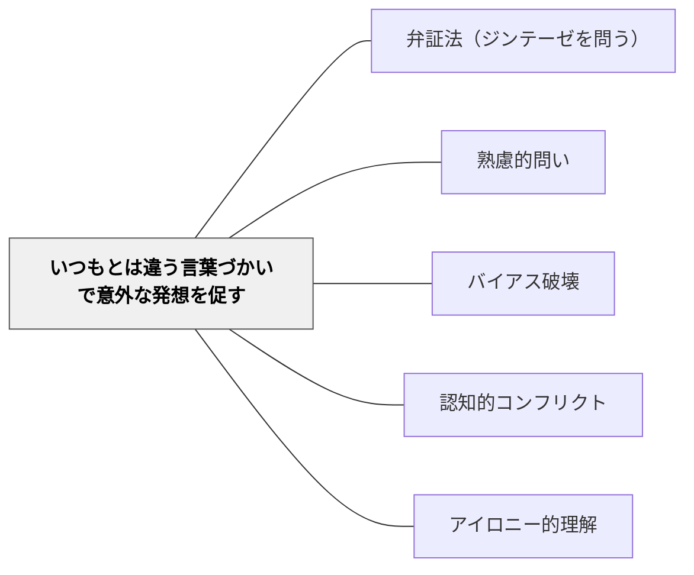

# いつもとは違う言葉づかいで意外な発想を促す

> 普段と異なる語彙・表現・言語で問うことで、思考の惰性が断ち切られ、意外な発想が生まれる。

## 背景（Context）

人は慣れ親しんだ言葉の中で考えるため、同じ語彙を使い続けると思考も同じパターンを繰り返しやすい。専門用語や業界の言葉遣いが「当たり前」になると、その枠の外に出ることが難しくなる。言葉そのものを変えることで、思考の回路が切り替わることがある。

## 問題（Problem）

同じ言葉で同じ問いを繰り返すと、参加者は「いつも通りの答え」を繰り返す。習慣的な語彙は思考の慣性を生み、新しい視点や発見を妨げる。学習の停滞感は、言葉の停滞から来ていることも多い。

## 力のかたち（Forces）

- 慣れない言葉遣いは参加者に混乱や抵抗感を与える場合がある
- 「なぜそんな言い方をするのか」という問いが逆に深い対話を生むこともある
- 外国語・詩的表現・専門外の領域の言葉など、使い方のバリエーションが多い
- 言葉を変えることで、「意味をもう一度考える」必要が生まれる

## 解決（Solution）

「これを詩的に言い換えると？」「英語で表現するとしたら、どの言葉が近い？」「子どものような言葉で言うと？」「業界外の人に伝わる言葉にすると？」のように、普段使わない語彙・文体・言語での問いを試みる。たとえばビジネス用語を使わずに「助け合い」という言葉で経営を語らせる、日本語で議論している概念を英語で一言に要約させる、などの応用がある。

## 結果（Consequences）

- 思考の慣性が断ち切られ、普段は出てこない発想が現れることがある
- 言葉と意味の関係を意識するメタ認知が育つ
- 言葉の変換に時間がかかりすぎると、議論の流れが止まる場合がある

## 関連パタン
- [[パタン/弁証法（ジンテーゼを問う）]]

- [[パタン/熟慮的問い]] — 親パタン
- [[パタン/バイアス破壊]]
- [[パタン/認知的コンフリクト]]
- [[パタン/アイロニー的理解]]

## クラスター図

## Actionable Insight

- 「この概念を子どもに説明するとしたら、どう言う？」と問いかける——普段使う専門用語を捨てて言い換える経験が概念の本質への理解を深める
- 英語や他の言語で「この感覚に一番近い言葉は何？」と問う——翻訳の難しさが概念のニュアンスと意味の多層性への気づきを生む
- グループ討論の途中で「今言ったことを詩的な一行にまとめると？」と急に問う——言葉のモードを切り替える問いが思考の慣性を断ち切り新しい発想を引き出す

## 出典

- [[文献/熟慮的問いのパターンリスト（動画記録）]]
