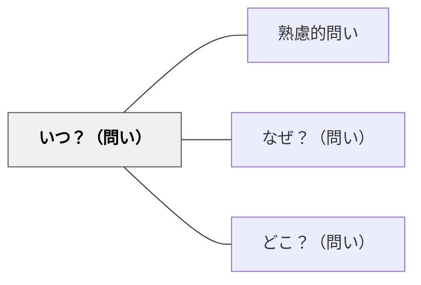

# いつ？（問い）

> 時間・時期・タイミング・順序を問うことで、出来事や知識の時間的文脈を把握する。

## 背景（Context）
知識や事実は時間的文脈の中に位置づけられて初めて意味を持つことが多い。歴史的出来事の前後関係、科学的発見のタイミング、プロセスの順序など、「いつ」という問いは時間的理解を促す基本的な認識の枠組みである。

## 問題（Problem）
学習者は事実や知識を時間的文脈から切り離して覚えることが多く、「いつ起きたか」「なぜその順序なのか」を理解しないまま暗記する傾向がある。時間軸の理解なしには、因果関係や発展の過程を把握することが難しい。

## 力のかたち（Forces）
- 時間的順序の把握は因果関係の理解を促進する
- 「いつ」を問うことで、特定の文脈や条件が明確になる
- タイミングの重要性への気づきが、戦略的・計画的思考を育てる
- 時系列の整理は、複雑な情報を構造化する有効な方法である

## 解決（Solution）
「それはいつ起きたか？その前後には何があったか？なぜそのタイミングだったのか？」と問いかける。例えば歴史学習では「明治維新はなぜあのタイミングで起きたか？前後の出来事と関連して考えよう」と時間軸に沿った問いを立てる。年表・タイムライン・フローチャートなどの視覚ツールと組み合わせると効果的である。

## 結果（Consequences）
- 知識が時間的文脈の中に位置づけられ、理解が立体的になる
- 因果関係・前後関係の把握が深まる
- 時間軸思考が、歴史・科学・プロジェクト管理など多分野に応用できるようになる

## 関連パタン
- [[パタン/熟慮的問い]] — 親パタン
- [[パタン/なぜ？（問い）]] — 原因・動機を問うことで「いつ」と連携する
- [[パタン/どこ？（問い）]] — 空間的文脈を問うペアパタン

## クラスター図

## Actionable Insight

- 歴史や科学の学習で「それはいつ起きたか？その前後には何があったか？」と時間軸に沿った問いを立てる——知識が時間的文脈の中に位置づけられ理解が立体的になる
- 「明治維新はなぜあのタイミングで起きたか？」のように「なぜそのタイミングか」を問う——タイミングへの問いが因果関係の理解を深める
- 年表・タイムラインと組み合わせて「いつ？」を問う——視覚ツールが時系列思考の足場になる

## 出典
- [[文献/熟慮的問いのパターンリスト（動画記録）]]
