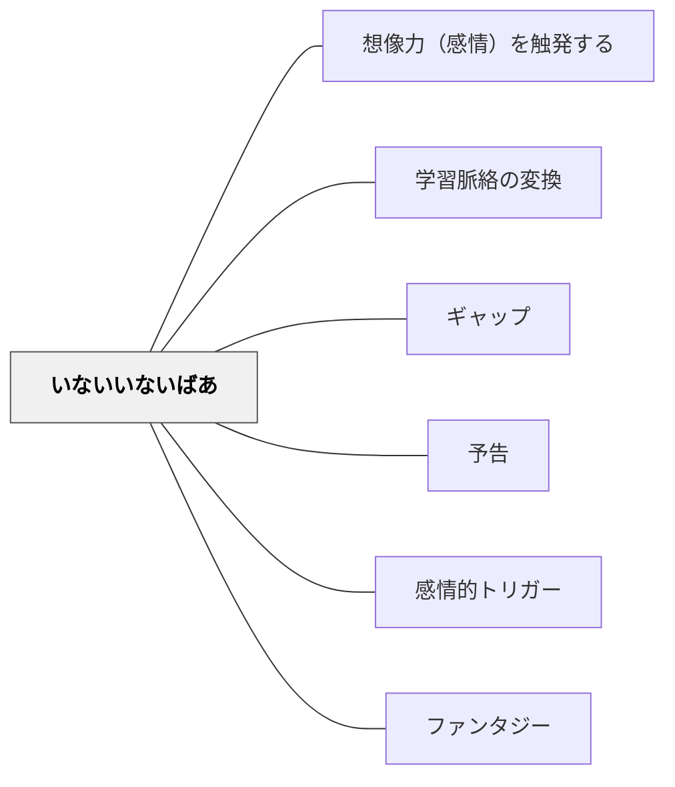

# いないいないばあ

> 「隠れて現れる」構造が、感情的な関与と認知的な喜びを引き起こす

## 背景（Context）

「いないいないばあ」は乳幼児が最初に喜ぶ遊びの一つである。隠れたものが現れる瞬間の驚きと喜びは、人間の根本的な感情構造に根ざしている。この「隠れて現れる」パターンは、教育のあらゆる場面に応用できる。

## 問題（Problem）

すべての情報を最初から提示すると、発見・驚き・解決の喜びが生まれない。謎がなければ答えを求める動機も生まれず、学習への感情的な関与が低下する。

## 力のかたち（Forces）

- 「一部が隠れている」状態が好奇心と期待を生む
- 「現れる」瞬間の驚き・発見・確認の喜びが感情的な報酬となる
- この構造は、穴埋め問題・謎かけ・伏線回収・クイズなど様々な形で現れる
- 「隠す」と「見せる」のバランスが重要で、隠しすぎは挫折感を生む

## 解決（Solution）

学習の中に「隠れて現れる」構造を意図的に設計する。具体的には：音読で一部の言葉を隠し、思い出させる実践（穴空き問題の原理）。授業の冒頭で「謎」や「問い」を提示し、学習の末に「解決」が現れる構成。概念の一部だけを先に示し、残りを探究の中で「発見」させる設計。

「この授業で何かが明らかになる」という期待感を最初に作り出し、授業全体を「いないいないばあ」の構造として設計する。

## 結果（Consequences）

学習者の好奇心・集中・感情的関与が高まる。「わかった！」という発見の喜びが学習への動機を強化する。ただし、謎を解くための十分な情報や足場がなければ、期待が失望に変わることもある。

## 関連パタン

- [[パタン/想像力（感情）を触発する]]
- [[パタン/学習脈絡の変換]]
- [[パタン/ギャップ]]
- [[パタン/予告]]
- [[パタン/感情的トリガー]]
- [[パタン/ファンタジー]]

## クラスター図

## Actionable Insight

- 授業の冒頭に「今日の授業では、ある謎が明らかになります」とだけ言って学習に入る——全体を最初に見せない設計が好奇心と期待感を持続させる
- 重要な概念の一部だけを最初に示し「残りを探究の中で見つけよう」と設計する——発見の構造を埋め込むことで「わかった！」という喜びが学習への動機を強化する
- 穴あき問題や言葉を隠した音読で「隠れているもの」を思い出させる活動を取り入れる——「現れる」瞬間の確認の喜びが記憶への定着を高める

## 出典

キアラン・イーガン（2010）『想像力を触発する教育――認知的道具を活かした授業づくり』北大路書房
