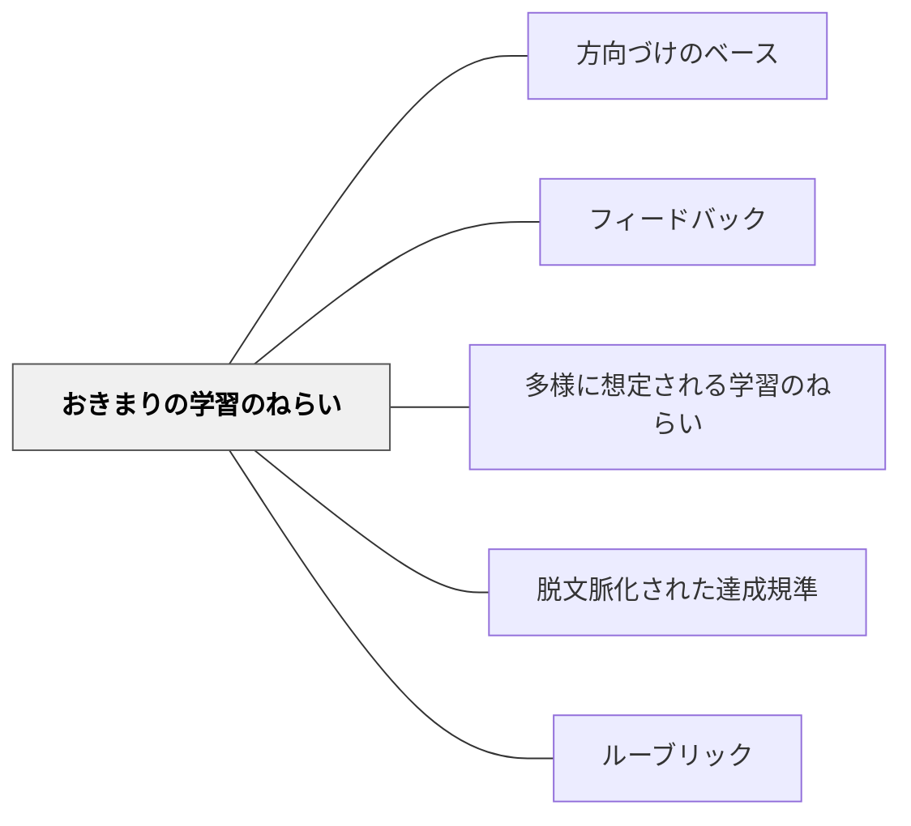

# おきまりの学習のねらい

> 全員が達成すべき、ゆるがぬ基礎的な目標。

## 背景（Context）

学習目標には二種類ある。全員が必ず達成すべき「おきまりの目標」と、達成の形が多様に現れる「多様な目標」。おきまりの目標は、それができるかできないかで大きな表現の差が生まれるわけではないが、基礎として欠かせない。

## 問題（Problem）

すべての目標を同じように扱うと、評価・フィードバックが煩雑になる。基礎的な目標と挑戦的な目標を区別することで、フィードバックの優先順位が明確になる。

## 力のかたち（Forces）

- おきまりの目標は達成確認が比較的容易
- チェックリスト型の評価と相性が良い
- 基礎目標だけを追うと、学習が形式的になるリスクがある

## 解決（Solution）

**全員が達成すべき基礎目標を明確に定義し、チェックリストなどで確認しながらフィードバックする。それ以上の目標は「多様に想定されるねらい」として別に扱う。**

例：
- 文の終わりには句点（。）をつける
- 名前を書く
- 決められた形式で提出する

## 結果（Consequences）

- フィードバックの優先順位が整理され、効率的に機能する
- 基礎が揃った上で、多様な表現が生まれやすくなる

## クラスター図

## Actionable Insight

- 単元の始めに「全員が必ずできるようになること（おきまり）」を3つ以内で明示する——何が必須かが見えると学習者も教師もフィードバックの優先順位を整理できる
- おきまりの目標はチェックリスト形式で確認できるよう設計する——「できた・できていない」が明確な基礎目標は形成的評価の効率を高める
- おきまりが達成できた学習者が「多様に想定されるねらい」へ自然に移行できる課題設計をする——基礎を揃えてから多様な表現が生まれる構造が全員の学びを支える

## 出典

- 一つの教育のパタン・ランゲージ（岩井輝久）

## 関連パタン
- [[パタン/方向づけのベース]]

- [[パタン/フィードバック]] — 親パタン
- [[パタン/多様に想定される学習のねらい]] — おきまりとは異なる柔軟な目標
- [[パタン/脱文脈化された達成規準]] — 転移可能な規準との関係
- [[パタン/ルーブリック]] — 目標の種類を構造化するツール
