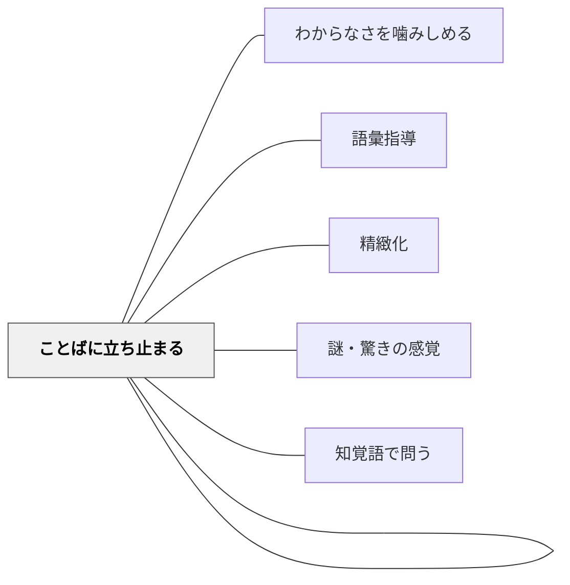

# ことばに立ち止まる

> 一語に立ち止まったとき、詩の全体が別の光を帯びる。

---

## Pattern Connection

**近藤真（年不明）統合（2026-05-20）：**

近藤真の「詩を読む」授業を一貫して特徴づける方法論は「一語に立ち止まること」だ。「てふてふ」「鞑靼海峡」「ババ糞」「悲しい」「離陸」——これらの語に複数の授業時間をかけて探究した。意味の「正解」を与えるのではなく、語の音・感触・歴史・感情を生徒と共に掘り下げた。

- **既存パタンとの関連**：[[パタン/わからなさを噛みしめる]] で「意味がわからなくても体が感じる」という接触を経た後で、「では一語を深く探ってみよう」という探究が始まる——本パタンはわからなさを噛みしめる授業の次の段階として機能する
- **補強された点**：[[パタン/語彙指導]] が「10〜15回の意味のある出会い」を条件とするのに対し、本パタンは「一語に何時間もかける」という質的深化を提供する——「語彙の量的習得」と対をなす「語彙の深さ体験」
- **他のパタンへの波及**：[[パタン/精緻化]] の「なぜ？を問う」に対応する。詩の一語への「なぜこの語でなければならなかったか」という問いは、精緻化的質問の詩版

---

## 背景（Context）

詩の授業で「意味を理解する」ことを目標にすると、語は「意味の容器」として処理される。「てふてふ＝蝶」「鞑靼海峡＝ある地名」——意味が決まると語は透明になり、詩の表面だけが読まれる。

しかし詩人が「蝶」でなく「てふてふ」と書いたのには理由がある。「海峡」でなく「鞑靼海峡」と書いたのには理由がある。その理由は「語の音・感触・歴史・文化的重み」の中にある。この理由を探ることが、詩を詩として読む体験の核心だ。

## 問題（Problem）

詩の授業で語の意味を調べると「わかった」で終わりやすい。「てふてふ＝蝶」と分かったとき、その語の探究は終わる。しかし詩人がなぜその語を選んだかという問いは、意味を知った後から始まる。「意味を超えた語の力」を授業の中でどう体験させるか。

## 力のかたち（Forces）

- 語の意味は辞書で「答え」が出る——意味確認で授業が終わりやすい
- しかし語には音・歴史・感情・連想という辞書に書かれていない次元がある
- 一語に長時間をかけることは「効率が悪い」と感じやすい——しかし深さが詩との本物の出会いを作る
- 語の音を声に出して繰り返すことで、意味とは別の感覚が開く（音象徴の体験）
- 「なぜこの語でなければならないか」という問いに答えはない——だが問い続けることが詩を生きた言語として受け取らせる

## 解決（Solution）

**詩の中の一語を選んで、音・意味・感情・選択の4次元を多角的に探究する時間を意図的に設ける。**

---

### 探究の4次元

| 次元 | 問いの例 | 活動 |
|---|---|---|
| **音の次元** | 「この語を声に出したとき、どんな感じがする？」 | 繰り返し音読、目をつぶって聞く |
| **意味の次元** | 「辞書に何と書いてある？他にどんな意味がある？」 | 複数の辞書を引く、語源を調べる |
| **感情の次元** | 「この語を読んで、体のどこかが反応した？何を感じた？」 | 感触を絵・言葉で記録 |
| **選択の次元** | 「なぜ詩人はこの語を使ったのか？別の語では何が変わるか？」 | 代替語を試す、詩に当てはめて読む |

---

### 授業例 1：「てふてふ」（安西冬衛「春」）

O中学校・中学2年生の授業。「春」全文を読んだ後、一語「てふてふ」に全員の注意を向ける。

1. 「現代語で読むと？」→「ちょうちょう」
2. 「声に出してみよう——『てふてふ』」（クラス全体で繰り返す）
3. 「『ちょうちょう』と何が違う？」——音の感触の比較
4. 「なぜ詩人は旧仮名遣いで書いたのか」——音と意味のずれを探究
5. 「『てふてふ』はどこを旅している？　鞑靼海峡とは？」——地名との組み合わせが作る異質感
6. 「この詩で『てふてふ』がいなくなったら、何が変わる？」

核心発問：「なぜ『てふてふ』でなければならなかったのか」——この問いに正解はない。しかし問い続けることで詩の全体が変わって見えてくる。

---

### 授業例 2：「悲しい」（浜口国雄「便所掃除」）

「便所掃除」の授業で「悲しい」という語に立ち止まる。

1. 「悲しい、という言葉を辞書で調べよう」——感情語の複数義・語源を探る
2. 「便所掃除の場面で『悲しい』とはどういうことか」——抽象的な感情語と具体的な体験のぶつかり合い
3. 「他に何と言えばよかったか」——代替語を試す
4. 「なぜこれが『悲しい』なのか」——言語化できない感情を語に近づけていく

---

### 授業例 3：「離陸」（浜口国雄「便所掃除」最終連）

詩の最後の行「便所は　離陸する」に立ち止まる。

1. 「離陸とは何の言葉？」——飛行機の比喩という気づき
2. 「便所が離陸するとはどういうことか？」——具体的な映像を頭に描かせる
3. 身体で「離陸」を表現させる——立ち上がる、腕を広げる、顔を上げる
4. 「詩人はここで便所を超えて何を離陸させたかったのか」——比喩の深層へ

「ことばの離陸」——ことばが日常的意味を超えて飛翔する瞬間。この体験が詩との本物の出会いになる。

---

### 小学校・低学年への展開

- 「この言葉、声に出すとどんな感じ？」を詩の授業に1回入れる（低学年でも可能）
- 擬音語・擬態語（ふわふわ・ごつごつ）から始めると音と感触のつながりが掴みやすい
- 「この言葉を使わずに同じことを言うとしたら？」——代替語の探究が言語感覚を育てる

## 結果（Consequences）

- 「語は意味の容器」という処理から「語は生きた力を持つ」という感覚への転換が起きる
- 詩の読みがスピードから深さへ変わる——少ない語で長時間過ごせる読者が育つ
- 「なぜこの言葉なのか」という問いが、書く時の語選択の感覚にも影響する
- 一語を深く探ることで、詩の全体が別の光を帯びて見えてくる

## クラスター図

## Actionable Insight

- 詩の授業で「一語選手権」——「この詩でいちばん気になる語」を1語選ぶ。声に出して繰り返し、感触を言葉にする（5分）——語への注意が詩の読みを変える入口になる
- 「辞書を2冊引く」——一語について2つ以上の辞書を比較すると「意味の幅」が見え、語が生きていることが分かる
- 「この語を別の語に置き換えると？」——代替語を実際に詩に入れて読んでみる。「てふてふ」を「ちょうちょう」にした詩を読むとき、何が失われるかが肌で分かる

## 関連パタン

- [[パタン/わからなさを噛みしめる]] — 語のわからなさを探究の入口として使う上位パタン
- [[パタン/語彙指導]] — 語彙の深い学習の一形態
- [[パタン/精緻化]] — 一語を多角的に掘り下げることが精緻化の詩版
- [[パタン/謎・驚きの感覚]] — 「なぜこの語か」という謎が探究の動機になる
- [[パタン/知覚語で問う]] — 語の感触・感覚を発問として使う
- [[パタン/ことばに立ち止まる]] — 本パタン自体
- [[文献/中学生のことばの授業（近藤真）]] — 一次資料

## 出典

近藤真（年不明）『中学生のことばの授業　詩・短歌・俳句を作る、読む』太郎次郎社エディタス（第II部：「春」二題を読む、「便所掃除」を読む）
