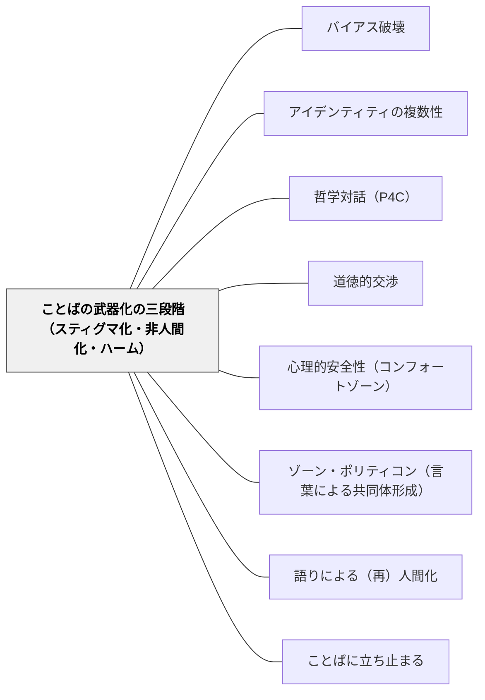

# ことばの武器化の三段階（スティグマ化・非人間化・ハーム）

> ことばは緩やかに武器になる——差別的ラベルが繰り返されるとき、それはスティグマ化から非人間化へ、そしてハームへと段階的に進行する。この三段階を「早期警戒システム」として知っていれば、介入できる。

## Pattern Connection（Pentón Herrera, 2026）

**位置づけ**：Pentón Herrera（2026）は「ことばの武器化（Language Weaponization）」を「支配集団が言語を用いてマイノリタイズされた集団に害を与える緩やかで政治的なプロセス」と定義し、その進行を三段階のフレームワークで分析した。この三段階は教室内のいじめ・排除の言語的プロセスにもそのまま適用できる。

**言語条件づけ（Language Conditioning）との関係**：差別的ラベルはある日突然機能するのではなく、繰り返し・暴露・強化（Eifert, 1987）を通じて感情的・イデオロギー的重みを蓄積する。「あいつはXだ」という言い方が日常化するとき、Xというラベルは条件づけを通じて感情的に帯電する——これがスティグマ化の言語的メカニズムである。

**このWikiの他のパタンへの接続**：
- [[パタン/バイアス破壊]] は「バイアスへの気づきと問い直し」だが、本パタンはそのバイアスが言語を通じて「段階的に害として実装されるプロセス」を扱う——バイアス破壊の前段階として機能する
- [[パタン/ゾーン・ポリティコン（言葉による共同体形成）]] はアリストテレスが示した「言語による共同体の建設」だが、本パタンはその逆——「言語による共同体の破壊」のメカニズムを示す対概念として読める
- [[パタン/語りによる（再）人間化]] は第2・第3段階への対抗実践として直接接続する

**Carruthers（2026）との接続——評価的学習と脱人間化：**

Carruthers（2026）の「評価的学習」（Section 6・8）は、ことばの武器化の**認知的メカニズム**を説明する。信念・期待が感情的評価を直接変える「上位下達型評価変化」が存在し、「あいつらはXだ」という陳述的信念の蓄積が、Xグループへの感情的評価（共感・関心）を徐々に変化させる。Charlesworth et al.（2020）はこの評価的陳述だけで暗黙的態度が変わることを実験で示している——条件づけ（繰り返しペアリング）は不要で、陳述を聞くだけで評価が変わる。

また部族的思考（Section 7）の観点からは、人間の情報処理系はもともとジェネリクス（「XはYだ」）として社会集団を記録する——この形式が本質主義的推論を活性化し、「あいつらは全員そういうものだ」という固定化へ向かわせる。スティグマ化の言語的習慣化がこのジェネリクス記憶を強化し、非人間化を促進する。

---

## 背景（Context）

ことばは中立ではない。「あいつはのろまだ」「あの子は変だ」——教室で繰り返されるラベリングは、単なる言葉遊びではなく、段階的に関係を変容させる力を持っている。Pentón Herrera（2026）はこの力を「ことばの武器化」として概念化し、歴史的事例（ウガンダのLGBTQ＋弾圧・キューバのUMAPとその言語化）と理論（Foucault, 1980; Fairclough, 2010; Ahmed, 2014）を交差させて分析した。

この枠組みを小学校教師として使う意義は二つある。第一に、クラスで起きている排除や傷つけが「どの段階」にあるかを識別する言語が得られる。第二に、介入のタイミングが見える——第1段階で止められれば、第2・第3段階は防げる。

## 問題（Problem）

差別的ラベリングや排除は「突然始まる」と思われやすいが、実際には緩やかに進行する。スティグマ化の段階では「それほど深刻ではない」と見過ごされやすく、非人間化の段階では変化に気づきにくく（習慣化しているため）、ハームの段階になってはじめて「深刻な問題」として認識される。教師がこのエスカレーションのパターンを知らなければ、早期介入の機会を逃す。

## 力のかたち（Forces）

- スティグマ化の段階では「ただのあだ名」「冗談」と見なされやすく、介入のハードルが曖昧になる
- 言語条件づけは繰り返しと日常化によって進行するため、当事者も観察者も気づかないうちに「当たり前」になる
- 非人間化段階では道徳的脱感作が起きており、「かわいそうだ」という共感が働かなくなる
- 支配集団と被支配集団の関係は固定的ではなく、流動的——子どもたちも状況によって役割が変わる
- 早期介入は「問題を大げさにする」と感じさせることがある——三段階の理解があれば「なぜ今止めるか」を説明できる

## 解決（Solution）

**三段階フレームワークを「早期警戒システム」として授業・学級経営に組み込む。ことばが段階的に武器化するプロセスを可視化し、第1段階で止める介入を設計する。**

---

### 三段階の識別と介入

| 段階 | 現象の特徴 | 教室での例 | 介入の方向 |
|---|---|---|---|
| **第1段階：スティグマ化** | 特定の子にラベルが貼られ始める。「われわれ vs. 彼ら」の境界線が生まれる | 「あの子はXだから」「Xな子はあっちに行って」 | ラベルに名前をつける。「その言葉はどんな気持ちにさせるか」を問う |
| **第2段階：非人間化** | ラベルが習慣化し、当事者が「もの扱い」される。「〜な人」でなく「〜なやつ」 | 「あいつは無視していい」「Xたちとは話せない」 | 「その子には家族がいて、好きなものがあって……」と人間として語り直す場を作る |
| **第3段階：ハーム** | 物理的・心理的・感情的な意図的ハームが起きる。周囲もそれを「仕方ない」と感じ始める | 仲間外れ・嘲笑・暴力が習慣化する | 個別の緊急対応 + クラス全体での価値の再構築 |

---

### 「ラベルに立ち止まる」授業

第1段階の介入として最も有効なのは、ラベルが生まれた瞬間に「立ち止まって問う」こと。

> 「今、Xという言葉が出た。この言葉を聞いてどう感じた？」  
> 「Xという言葉はいつ、誰が使い始めたのだろう？」  
> 「Xと呼ばれたら、あなたはどう感じるか？」

これは [[パタン/ことばに立ち止まる]] の言語探究を、権力的・感情的な次元に拡張する応用である。

---

### 二重意識（Du Bois, 1903）への気づき

支配的ラベルを繰り返し受けた子は、そのラベルを「自分の目」として内在化することがある（二重意識）。「自分はXだから無理」「Xな人間は〜」——これは支配集団の視点が自己認識に入り込んだ状態。

介入として：「他の人がつけたラベルで、自分のことを見ていないか？」という問いを、個別の対話や哲学対話の中で提示する。

---

### P4C（哲学対話）の活用

**学習素材の例（高学年向け）**：
- 絵本・物語の中で「あだ名やラベルが出てくる場面」を素材に使う
- 「その言葉はなぜ力を持っているのか？」「言葉は変えられるか？」という問いを立てて対話する

→ [[パタン/哲学対話（P4C）]] との接続：P4Cが「言語の権力的使用を批判的に検討する場」として機能する。

## 結果（Consequences）

- 教師と子どもが「ことばのエスカレーション」を共通言語で語れるようになる
- 第1段階で止める介入が早くなり、いじめ・排除の慢性化を防ぐ
- 子ども自身が「今のことばは第1段階だ」という認識を持てると、自己調整と相互調整が起きる
- 過度に警戒的になると、通常の対話も「危険なラベル」と感じさせるリスクがある——問いの姿勢（探究・好奇心）と告発の姿勢を区別することが重要

## 関連パタン

- [[パタン/バイアス破壊]] — ことばの武器化を支えるバイアスを意識化し問い直す
- [[パタン/アイデンティティの複数性]] — スティグマ化は単一属性への強制帰属から始まる。複数性の教育が対抗実践になる（セン：帰属の幻想）
- [[パタン/哲学対話（P4C）]] — 対話がことばの権力的使用を批判的に検討する場となる
- [[パタン/道徳的交渉]] — 「このラベルは正しいのか」という道徳的問いを顕在化させる
- [[パタン/心理的安全性（コンフォートゾーン）]] — スティグマ化が最初に壊すのは心理的安全性——安全な場づくりが第1段階への防衛になる
- [[パタン/ゾーン・ポリティコン（言葉による共同体形成）]] — 言語による共同体建設（アリストテレス）の逆：言語による共同体破壊のメカニズム
- [[パタン/語りによる（再）人間化]] — 非人間化への直接的対抗実践
- [[パタン/ことばに立ち止まる]] — 一語が持つ権力と感情の重みに立ち止まる言語探究

## クラスター図

## Actionable Insight

- 差別的なラベルや侮蔑的なあだ名が出た瞬間に「その言葉を聞いてどう感じたか」と問い、ラベルを透明にせず立ち止まる——第1段階での介入が最も効果的で、慢性化を防ぐ
- 「Xな子」という言い方が増えてきたら、その子の好きなもの・家族・得意なことを具体的に語る場を作る——人間としての複数性を可視化することが非人間化を止める
- 高学年向けに「あだ名・ラベルの歴史」をテーマにした哲学対話を1時間設ける——「この言葉はいつから・誰が使い始めたか」という問いがことばの権力を批判的に照らし出す

## 出典

- Pentón Herrera, L. J. (2026). *Language Weaponization*. Cambridge University Press. DOI: 10.1017/9781009789318
- Du Bois, W. E. B. (1903). *The Souls of Black Folk*.
- Eifert, G. H. (1987). Language conditioning: Clinical issues and applications in behavior therapy. *Advances in Behaviour Research and Therapy, 9*(4), 173–222.

[[文献/Language Weaponization（Pentón Herrera）]]
