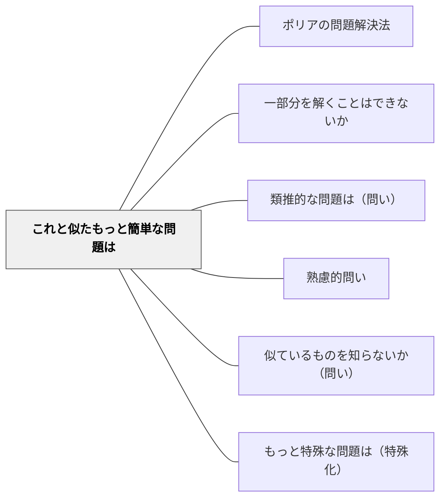

# これと似たもっと簡単な問題は

> 問題を単純化して足がかりを作り、そこから元の問題へと橋を架ける。

## 背景（Context）
難しい問題に直面したとき、全体をいきなり解こうとすると詰まってしまうことが多い。類似した単純な問題を解くことで思考のパターンを掴み、それを応用して本来の問題に取り組む戦略は、問題解決の基本的な技法である。

## 問題（Problem）
学習者は難問に圧倒されると思考が停止しやすい。「何から手をつければよいか」が分からないまま時間が過ぎる。問題の核心的な構造は共通していても、数値や条件の複雑さによって思考が阻まれることがある。

## 力のかたち（Forces）
- 単純な事例は思考の練習台になり、解法の本質を浮き彫りにする
- 成功体験が小さくても自信と方向感を与える
- 単純化した問題の解法を元の問題に拡張することで、段階的理解が生まれる
- 「何を単純化できるか」を考えること自体が問題の構造分析になる

## 解決（Solution）
「この問題と同じ構造で、もっと簡単な問題を作ってみよう。数字を小さくしたら？条件を一つ減らしたら？」と問いかける。例えば「100個のものを並べる問題なら、まず3個や4個で試してみよう」と具体的に誘導する。単純な場合の解法を確認してから、元の問題に戻ることで解法が見えてくる。

## 結果（Consequences）
- 思考の詰まりが解消され、解法への道筋が開ける
- 単純化と一般化の往復によって、問題の本質的構造が理解される
- 問題解決における「分割」戦略の習慣が育つ

## 関連パタン
- [[パタン/ポリアの問題解決法]]
- [[パタン/一部分を解くことはできないか]]
- [[パタン/類推的な問題は（問い）]]
- [[パタン/熟慮的問い]] — 親パタン
- [[パタン/似ているものを知らないか（問い）]] — 類似問題の探索
- [[パタン/もっと特殊な問題は（特殊化）]] — 特殊化による単純化の深化

## クラスター図

## Actionable Insight

- 難問の前に「数字を小さく（100→3）してみよう」と言い、まず単純な場合で解かせる——成功体験が小さくても方向感と自信を与え、元の問題への橋になる
- 「この問題の核心は何？一つだけ残して条件を全部取り除いたら？」と問う——本質だけの単純版を作る作業が問題の構造分析を自然に促す
- 「単純な場合で見つけたパターンを、元の難しい問題に当てはめるとどうなる？」とつなぐ——単純化から一般化への往復が問題解決の応用力を育てる

## 出典
- [[文献/熟慮的問いのパターンリスト（動画記録）]]
- ジョージ・ポリア（1954）『いかにして問題をとくか』丸善出版
