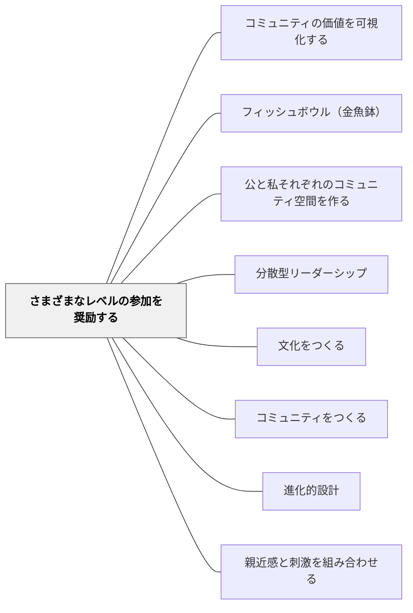

# さまざまなレベルの参加を奨励する

> コミュニティへの参加は強制できない。焚き火を起こし、そのぬくもりに引き寄せる。

## 背景（Context）

コミュニティには様々な深さで関わる人がいる。全員が中心的なリーダーである必要はない。むしろ、様々なレベルの参加が共存することで、コミュニティは豊かで持続的になる。

## 問題（Problem）

「みんなが積極的に参加すべき」という期待を持つと、周辺から見ている人を疎外し、参加への障壁を高める。その結果、コミュニティが縮小していく。

## 力のかたち（Forces）

- 周辺から観察することも学習である（正統的周辺参加：ウェンガー）
- コアメンバーへの過剰な要求は燃え尽きを招く
- 周辺メンバーは離れた後に、学んだことを別の場所で活かすことがある

## 解決（Solution）

**参加を強制せず、それぞれのレベルで参加できる構造を設計する。**

ウェンガーの3層モデル：

| レベル | 割合 | 内容 |
|--------|------|------|
| コアグループ | 10〜15% | 積極的に議論・プロジェクトを引き受けるリーダー層 |
| アクティブグループ | 15〜20% | 定期的に参加するが、コアほど熱心ではない |
| 周辺メンバー | 残り | 傍観者として参加。見かけほど消極的ではない |

- 周辺メンバーのための「ベンチ」をつくる（観察できる席・役割）
- 参加への招待を繰り返す（強制でなく）
- コミュニティの中心に**焚き火を起こし、ぬくもりに引き寄せる**

学校での実践例：係活動でのリーダーと補佐の役割分担、クラス会議での「見学者」の許容

## 結果（Consequences）

- より多様な背景・関与度の人がコミュニティに留まれるようになる
- 周辺メンバーが徐々に内側に移動する自然なプロセスが生まれる
- コミュニティの大きさと多様性が維持される

## 関連パタン
- [[パタン/コミュニティの価値を可視化する]]
- [[パタン/フィッシュボウル（金魚鉢）]]
- [[パタン/公と私それぞれのコミュニティ空間を作る]]
- [[パタン/分散型リーダーシップ]]

- [[パタン/文化をつくる]] — 親パタン
- [[パタン/コミュニティをつくる]] — 多様な参加を支えるコミュニティ構造
- [[パタン/進化的設計]] — 有機的に育てる参加の構造
- [[パタン/親近感と刺激を組み合わせる]] — 安心があるから近づける

## クラスター図

## Actionable Insight

- 係活動やプロジェクトに「見学者・サポーター」の役割を明示的に作る——周辺から参加できる席があることで、コミュニティの入り口が広がる
- 「発言しなくていい、聴いているだけでもいい」と一言伝える——これだけで参加への心理的ハードルが下がり、少しずつ内側に引き寄せられる
- コアメンバーに対して「まず周辺メンバーへの招待役になってほしい」と伝える——焚き火を起こすのはリーダーの役割だと明確にすることで自然なコミュニティ拡大が起きる

## 出典

- エティエンヌ・ウェンガー他（2002）『コミュニティ・オブ・プラクティス』翔泳社、第3章 p.99
- 動画記録：[[文献/コミュニティオブプラクティスと文化をつくるパタン（動画記録）]]
