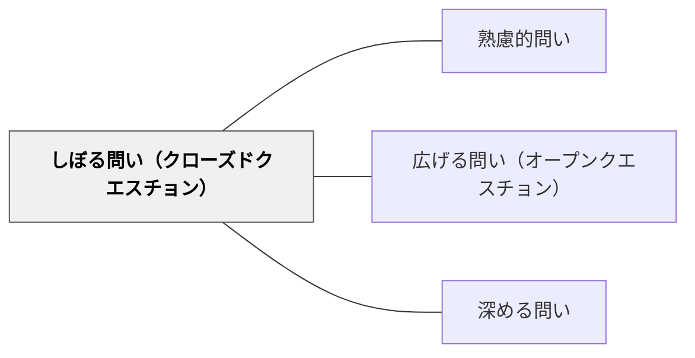

# しぼる問い（クローズドクエスチョン）

> はい・いいえや選択肢など、答えの範囲を限定した問いで、焦点化・確認・評価を行う。

## 背景（Context）
学習の場では、特定の理解の確認や選択・判断を求める場面がある。答えが広がりすぎると焦点が定まらず、議論や評価が難しくなる。答えの範囲を絞った問いは、確認・判断・焦点化に効果的である。

## 問題（Problem）
すべての問いをオープンにすると、議論が発散しすぎて収拾がつかなくなる場合がある。また、学習の理解度を確認する場面では、はっきりした答えを求める問いが必要である。クローズドクエスチョンを意図的に使わなければ、確認と評価の機会が不明確になる。

## 力のかたち（Forces）
- 選択肢を与えることで、考えやすくなる学習者がいる
- 明確な答えを求めることで、知識の確認ができる
- 絞られた問いは議論の焦点を定める効果がある
- 閉じた問いだけでは思考の広がりが生まれない

## 解決（Solution）
「これは正しいですか？」「AとBどちらが大きいと思う？」「三つの選択肢のうち、どれが答えだと思う？」と答えの範囲を限定した問いを使う。たとえば実験結果の予測で「温度は上がる・下がる・変わらない、どれだと思う？」と三択にする。理解確認では「この公式は正しい？間違っている？」と二択で問う。

## 結果（Consequences）
- 全員が参加しやすく、理解度の確認がしやすくなる
- 選択の理由を問うことで、次の深める問いへ移行できる
- 焦点が明確な議論と合意形成が生まれやすくなる

## 関連パタン
- [[パタン/熟慮的問い]] — 親パタン
- [[パタン/広げる問い（オープンクエスチョン）]] — 対になる問いの形式
- [[パタン/深める問い]] — 確認の後に掘り下げる

## クラスター図

## Actionable Insight

- 理解確認の場面で「正しいか・間違っているか」「AかBか」と二択・三択で問う——全員が参加しやすく理解度の確認がしやすくなる
- 「温度は上がる・下がる・変わらない、どれだと思う？」と三択にする——選択肢を与えることで考えやすくなる学習者が参加できる
- しぼる問いで答えを確認した後、「なぜそう思う？」と続けて深める問いへ移行する——確認の後の掘り下げがより深い学習へつながる

## 出典
- [[文献/熟慮的問いのパターンリスト（動画記録）]]
