# その過程が本当に働いたかを確かめる

> 「この内容は適切だ」という専門家の判断は、そこで止まる。その課題で狙ったはずの考え方が、子どもの中で実際に働いたかどうかは、別に確かめなければ分からない。確かめる方法は一つしかない——解いている最中を見に行くことである。

## [Pattern Connection]

- **既存パタンとの関連**：本パタンは Messick（1994）の構成概念妥当性の**実質的側面（substantive aspect）**を、この Wiki の評価設計パタン群へ接続する。[[パタン/テストを作成する]] と [[パタン/逆向き設計]] は「何を問うか」を扱い、[[パタン/主要概念で評価する]] は「何に重みを置くか」を扱ってきた。どれも**内容が適切かどうか**の層で止まっている。Messick が要求するのは、そこから**もう一歩進むこと**である——その課題で標榜されている過程が、受験者において実際に働いているという**経験的証拠**を集めよ、と
- **[[パタン/理解のしるしを読む（fit と match）]] との違い（重要）**：両者は同じ問題の両側にある。あちらは**子どもの理解を読む**技術で、正答が理解の証拠にならないことを扱う。本パタンは**課題を検証する**技術で、その課題が狙った過程を引き出せているかを扱う。**読む対象が「子ども」か「課題」か**が違う。実務では同じ観察から両方の情報が取れるが、目的が違うので、集めた情報の行き先が違う——あちらは明日その子にどう手を打つか、こちらはこの課題を来年も使うか
- **[[概念/質的判断（曖昧な規準とメタ規準）]] との緊張**：サドラーの第四の特徴は「判断が下される時点で、それが正しいかを独立に確かめる方法はしばしば無い。最終的な上告先はまた別の質的判断である」と言う。本パタンは、サドラーが不可能だと言ったその独立な検証を、**経験的手続きとして提案している**。この緊張は解消しない。ただし所在は明確で——サドラーは**質の判断**について語り、Messick は**過程の作動**について語っている。「この作文は良いか」は独立に検証できないが、「この子は書きながら読み手を意識していたか」は、聞けば分かる余地がある
- **このWikiの視点との接続**：この Wiki は「理解と言語表出は別である」という立場を取る（身体化認知・ジェスチャー研究の系譜）。think-aloud は**言語表出に強く依存する手続き**であり、そのままでは表出の少ない子を取りこぼす。したがって本パタンでは、**声に出させること以外の証拠源**——手の動き、操作の手数、解く順序、消しゴムの跡、視線——を同格に置く。Messick 自身が眼球運動・反応時間・部分点間の相関を並べているのは、都合のよいことに、この方向と一致している
- **自己教育への波及**：独学では、課題を作る人と解く人が同一人物になる。「章末問題が解けた」とき、その問題が狙った考え方が働いたのか、その本の問題の作り方に慣れただけなのかを、誰も外から確かめてくれない。**自分で自分に think-aloud する**という奇妙な手続きが要る
- **他のパタンへの波及**：[[パタン/採点の形を中身の形に合わせる（構造的忠実性）]] とは同じ論文の兄弟パタンで、あちらが「引き出したものをどう合わせるか」、本パタンが「そもそも引き出せているか」を扱う。設計の順序としては本パタンが先に来る

## 背景（Context）

単元の課題を作るとき、教師が確かめているのはたいてい「内容が適切か」である。学習指導要領のこの内容に対応しているか、既習事項の範囲に収まっているか、この単元の中心をつかんでいるか。指導案の検討会でも、同僚から返ってくるのはこの層のコメントである。

Messick はこれを構成概念妥当性の**内容的側面（content aspect）**と呼び、内容の関連性・代表性・技術的質の証拠がそこに含まれるとする。そして続けて言う——伝統的に、内容の関連性と代表性は**専門家の職業的判断によって評価される**。それを記録することが内容的側面への対応になる、と。

しかしそれでは足りない。六側面の二番目、**実質的側面**が置かれるのはここである。

> 実質的側面は、テスト反応に観察される一貫性についての理論的根拠と、課題遂行の過程モデル（Embretson, 1983）、そして——**その理論的過程が実際に受験者によって働かされていることの経験的証拠**を含む。

Messick はこれを二つの必要として整理している。

**第一の必要**——領域の**内容**をカバーするだけでなく、領域の**過程**を適切にサンプリングする課題が要る。「この単元の内容を全部含んでいる」ことと、「この単元で働いてほしい考え方を全部呼び出している」ことは、別のことである。

**第二の必要**——内容についての伝統的な専門家判断を**超えて進み**、表向きサンプリングされた過程が課題遂行において本当に働いているという**経験的証拠**を積むこと。

この「超えて進む（move beyond）」が要点である。指導案の検討会でどれだけ議論しても、それは専門家判断の層にとどまる。子どもがその課題を解いている最中に何が起きているかは、そこからは出てこない。

## 問題（Problem）

**「この問題を解けたから理解している」は、観察ではなく推論である。** そして同じ正答が、意図した過程からも、意図しない近道からも出てくる。

文章題を出す。答えが合っている。教師は「立式ができている」と読む。しかしその子は、問題文の中の数字を二つ拾い、「あわせて」という語を見つけ、たし算をした。場面をイメージしていない。数量の関係を捉えていない。それでも答えは合う。

図形の問題を出す。「三角形の面積を求めなさい」。答えが合っている。しかしその子は、図の中でいちばん長い辺と、それに見た目で垂直そうな線を掛けて2で割った。高さの意味を理解していない。それでもその図では答えが合う。

読解問題を出す。「筆者の考えが書かれている一文を抜き出しなさい」。答えが合っている。しかしその子は、最後の段落の「〜のです」で終わる文を選んだ。文章を読んでいない。それでも答えは合う。

Messick の言葉で言えば、これらはすべて**構成概念に無関係な易しさ（construct-irrelevant easiness）**の働いた場面である——課題形式の中にある余計な手がかりが、構成概念とは無関係な仕方で正答を可能にしている（[[パタン/余計な難しさを外す（構成概念に無関係な分散）]] が扱う脅威の、易しさの側）。

そして厄介なのは、**この失敗が課題の側の失敗である**ことである。子どもが手を抜いたのではない。**課題が、狙った過程を要求しない形で作られている**。だから同じ課題を来年も出せば、来年も同じことが起きる。

しかし課題の側の失敗は、正答率からは見えない。むしろ正答率が高いほど、「よい課題だ」と評価されて残っていく。**狙いを外した課題ほど、正答率が高くて生き残る**——これが実質的側面を確かめない教室で起きる、静かな逆選択である。

さらに、教師の側にも見えにくい理由がある。教師は課題を作った本人であり、**その課題を解くときに何が働くべきかを知っている**。だから子どもの答案を見るとき、自分の頭の中の過程を投影して読んでしまう。答案の上には答えしか書かれていないのに、教師はそこに過程を読み込む。

## 力のかたち（Forces）

- **全員には確かめられない vs サンプルで足りるのか**——40人に一人ずつ声に出して解いてもらう時間はない。三人で足りるのか。三人が意図した過程で解いたとして、残り37人もそうだと言えるのか。**言えない。しかし三人のうち二人が別の過程で解いていたら、その課題は確実に狙いを外している**。証明はできないが、反証はできる——これが実務上の正しい期待値である
- **声に出させること自体が過程を変える**——考えていることを言葉にしながら解くと、解き方が変わる。言語化が思考を整理してしまい、普段より上手に解けることがある。逆に、言語化に注意が取られて解けなくなることもある。**観察が対象を変える**という、この種の手続きに固有の限界
- **時間のコスト**——一人5分でも三人で15分。単元ごとにやれば年間で相当な時間になる。**「作った課題を全部検証する」は成立しない**。どの課題を検証するかの選択が先に要る
- **教師が「意図した過程」を言語化できているか**——検証の前提は、何が働いてほしいかが言葉になっていることである。「よく考えてほしい」では検証できない。「与えられた数量の関係を図に置き換えてから式を立てる」まで具体化されて初めて、働いたかどうかを見に行ける。**この言語化の要求が、実は本パタンの最大の効果でもある**
- **think-aloud が苦手な子への配慮**——言語表出に困難のある子、話しながら作業できない子、注目されると固まる子。この手続きは、そのままでは**表出の得意な子だけを標本にする**。標本が偏れば、検証の結論も偏る
- **診断とひっかけの境界**——「どうやって考えたの」と聞かれることが、子どもにとって「間違っているから聞かれた」という信号になりうる。**正答した子にこそ聞く**という本パタンの要求は、この信号を強める方向に働く。聞き方の設計が要る
- **課題を捨てられるか**——検証の結果「この課題は狙いを外している」と分かったとき、その課題を作り直す時間が要る。分かっても直せないなら、検証は苦痛を増やすだけになる

## 解決（Solution）

**課題を全体に出す前に、数人に「解きながら考えていることを声に出して」もらう。あるいは解いた直後に「どうやって考えたか」を聞く。狙った過程が働いていなければ、子どもを直すのではなく課題を直す。**

Messick が挙げる証拠源は五つある。

| 証拠源 | 原文 | 教室で使える形 |
|---|---|---|
| 思考発話プロトコル | think-aloud protocols | 解きながら声に出してもらう |
| 眼球運動記録 | eye-movement records | どこを見ているか、指はどこを追っているか |
| 部分点間の相関パターン | correlation patterns among part scores | 大問①ができる子が③もできるか。予想と合うか |
| 課題区分ごとの反応時間の一貫性 | consistencies in response times for task segments | どこで手が止まったか、どこが速すぎたか |
| 課題過程の数理的・計算論的モデリング | mathematical or computer modeling | 教室では使わない |

そして Messick 自身が、最も簡単な水準を明示している。

> 最も単純な水準では、これは**解き方について回答者に尋ねること**、あるいは**フィールド試行中に練習問題を解きながら声に出してもらうこと**を含みうるだろう。

つまり、この論文が要求する検証の最小形は——**聞くこと**である。設備も統計も要らない。

### 「代表的」という語の二つの意味——このパタンの理論的な芯

内容的側面と実質的側面を橋渡しする中核概念は**代表性（representativeness）**である。ところが Messick は、この語に**二つの異なる意味**があり、どちらもパフォーマンス評価に当てはまると言う。

- **認知心理学者の言う表象・モデル化（representation / modeling）**の意味（Suppes, Pavel, & Falmagne, 1994）
- **ブルンスヴィク的な生態学的サンプリング（ecological sampling）**の意味（Brunswik, 1956; Snow, 1974）

そして二つを、こう割り当てる。

> **課題や文脈の選択は、代表的サンプリングの問題である。構成概念が現実に働く様子をどれだけ包括的に忠実にシミュレートできているかは、表象の問題である。**

この区別は、教室で二つの別々の問いに翻訳できる。

**サンプリングの問い**——この単元で扱う問題たちは、この領域で実際に起きることを代表しているか。教科書の練習問題は、その領域の課題空間から、どういう偏りをもって選ばれているか。（この問いは [[パタン/理解のしるしを読む（fit と match）]] の「慣習を外す一問」の設計と同じ場所に立っている）

**表象の問い**——この課題は、その考え方が現実に働く様子を、どれだけ忠実に再現しているか。学校の文章題の中の「買い物」は、買い物のときに働く考え方を呼び出しているか。

二つは独立に失敗しうる。**代表的な課題を選んでも、その課題が過程を忠実にシミュレートしていないこと**はあるし、逆に一つひとつは忠実でも、選び方が偏っていることもある。

### 手順——三人・五分・一問

実行可能な形にすると、こうなる。

**第一段：その課題で働いてほしい過程を、一文で書く。** 「与えられた二つの数量の関係を図に置き換えてから式を立てる」。書けなければ検証できない。**書けないという結果自体が、最初の発見である**。

**第二段：全体に出す前に、三人に解いてもらう。** 選ぶのは、上位・中位・下位から一人ずつ。休み時間の5分でよい。「これ、まだ誰にも出してない問題なんだけど、考えてることを声に出しながらやってみてくれる？」

**第三段：口を出さない。** 助言も、うなずきも、表情も抑える。詰まっても待つ（[[パタン/待ち時間（問いのあとの3秒）]]）。詰まった場所こそが情報である。

**第四段：第一段で書いた一文が働いたかを判定する。** 働いていなければ——**子どもではなく、課題を直す**。ここが本パタンの分岐点である。子どもの理解不足として処理した瞬間、これは検証ではなく診断に化ける。

---

### 具体例1：試し刷り——「どうやって考えた？」を出す前に三人だけ（算数・第5学年）

「単位量あたりの大きさ」の導入問題を作った。二つの部屋の混み具合を比べる場面で、面積も人数も違う。狙った過程は一文で書けた——「**そろえるものを自分で決めて、そろえてから比べる**」。

作った問題を全体に出す前に、休み時間に三人に解いてもらった。上位・中位・下位から一人ずつ。「まだ誰にも出してない問題なんだけど、考えてることを声に出しながらやってみて」。

A児（上位）は「面積でわると1平方メートルあたりの人数が出る」と即座に言い、正しく解いた。しかし**「そろえる」という言葉は一度も出なかった**。手続きとして知っていた。

B児（中位）は「うーん、どっちが混んでる……人数は右が多いけど、部屋も右が広い」と言い、しばらく黙り、「一人あたりの広さを出せばいいのかな」と言った。狙った過程が働いている。

C児（下位）は数字を見て「12÷8」と書いた。「どうしてわり算にしたの」と聞くと「大きいほうを小さいほうでわるから」と答えた。**過程はまったく働いていない。しかも答えは合っていた。**

三人のうち、狙った過程で解いたのは一人だけだった。しかも三人とも正答した。もしこの問題をそのまま全体に出していたら、正答率は高く出て、「よい導入問題だった」と記録されていた。

問題を直した。数値を変え、**わり算の向きを間違えると答えが不自然になる**組み合わせにした。さらに、答えを書く欄の前に「何をそろえて比べますか」という一行を足した。C児型の解き方が、そのままでは通らなくなる。

翌年から、この「試し刷り」を単元の中心となる問題にだけ行うようにした。**全部の問題ではやらない。単元に一問でよい。** そして三人で足りる——三人のうち二人が別の過程で解いたら、その課題は確実に狙いを外している。

---

### 具体例2：正答した子に聞く——キーワードで立式していた（算数・第3学年）

文章題の練習時間。「公園に子どもが15人います。8人帰りました。何人残っていますか」型の問題を10問。正答率はほぼ10割だった。

その中に一問だけ、「**リボンが15cm あります。8cm 使いました。残りは何cm ですか**」ではなく、「**赤いリボンが15cm、青いリボンが8cm あります。ちがいは何cm ですか**」という問題を入れておいた。どちらもひき算だが、場面が違う。

丸つけでは区別がつかない。そこで、正答した子のうち三人に聞いた。「これ、どうしてひき算にしたの？」

- D児「『のこりは』って書いてあるから」——しかしこの問題に「のこりは」は書かれていない。D児は前の9問の記憶で答えていた
- E児「『ちがい』はひき算だから」——語と演算の対応を覚えている。場面は見ていない
- F児「赤のほうが長いから、はみ出てるところを聞いてる」——場面を見ている

三人とも丸である。しかし理解の水準は三段階違う。ここまでは [[パタン/理解のしるしを読む（fit と match）]] が扱っている話である。

本パタンが加えるのは、その先である。**この結果は、子どもの診断であると同時に、課題の診断でもある。** D児とE児がキーワードで解けたのは、この問題群がキーワードと演算の対応で解けるように作られているからである。10問中9問が「のこりは」型だったから、10問目も同じ構えで通ってしまった。

**課題の側を直す。** 翌年から、練習の10問のうち三問を、キーワードが逆向きに働く問題にした。「『ぜんぶで』と書いてあるがひき算になる問題」を混ぜる。すると、キーワード方略は10問中三問で失敗するようになり、その失敗が子どもにも教師にも見えるようになる。

ここが子どもの診断との分岐である。D児に「場面を考えなさい」と個別に指導することもできる。しかしそれは毎年、毎学級でやり直しになる。**課題を直せば、来年の学級でも効く。**

---

### 具体例3：説明文の読み取り——目の動きと指を見る（国語・第4学年）

「筆者の主張が書かれている一文を抜き出しなさい」。この設問は毎年出しており、正答率は高い。狙った過程は「**文章全体の流れを追い、具体例と主張を区別する**」。

think-aloud を試したが、うまくいかなかった。読みながら声に出すのは難しく、三人とも黙って読み、読み終わってから答えを言った。過程が見えない。

そこで証拠源を変えた。Messick が挙げている**眼球運動**の、教室でできる版である——**指がどこを追っているか、視線がどこで止まったか**を見る。特別な機器は要らない。横に座って、教科書の上の指を見ているだけでよい。

- G児は、最初の段落から順に指を動かし、最後の段落で止まり、そこから上に戻って一文を選んだ。**流れを追っている**
- H児は、本文をまったく追わず、いきなり最後の段落に指を置いた。**位置の慣習で解いている**
- I児は、太字と「〜べきです」「〜のです」という文末だけを飛び石のように追っていた。**形式的な手がかりで解いている**

三人とも正答した。そしてH児とI児が正答できたのは、**この教材の主張が最後の段落にあり、文末が「〜のです」だったから**である。教材の作られ方が、そのまま近道を供給していた。

課題を直した。同じ設問を、**主張が中ほどにあり、文末が特徴的でない説明文**で出す。難しくしたのではなく、近道を一つ塞いだだけである。正答率は下がった。下がったことが、この設問がようやく狙った過程を要求し始めたしるしである。

なお、指と視線を見る方法は**言語表出をまったく要求しない**。この Wiki の立場——理解と言語表出は別の層に属する——に照らせば、think-aloud より優先されるべき証拠源である場面が多い。

---

### 具体例4：教材やテストを配る前の「試し刷り」を手続きにする（学年・教科横断）

上の三例に共通する形を、手続きとして固定する。印刷屋の試し刷りと同じ発想である。

**単元の中心となる課題を一つだけ選び、印刷して配る前に、三人に解いてもらう。**

決めておくことは四つだけでよい。

1. **一単元一問**——全部やろうとすると二週間で止まる（[[パタン/理解のしるしを読む（fit と match）]] が慣習外しの一問について述べているのと同じ上限）
2. **三人**——上位・中位・下位から一人ずつ。全員は無理だが、三人で反証はできる
3. **五分**——休み時間か、朝の準備時間。授業時間を使わない
4. **口を出さない**——助言もうなずきも表情も抑える。詰まった場所が情報である

そして最も大事なのが、**結果の行き先**である。狙った過程が働いていなかったとき、直すのは課題のほうである。この一点を最初に決めておかないと、試し刷りは事前の個別指導に化ける。

学年で回すこともできる。同学年の三人で、単元ごとに一人ずつ担当する。年間で一人あたり数回になり、その記録を単元の指導記録に一行残す。「この問題は、キーワードで解けてしまう。数値を変えること」。翌年の自分か、翌年の担当者が読む。

---

### 具体例5：自己教育での適用——自分に think-aloud する（数学の独学）

独学では、課題を作る人と解く人が同一人物になる。だから第三者による検証が存在しない。

数学の独学で、章末問題が解けたとき、そこで働いた過程を確かめる方法として、次のことを試している。

**解き終わったあと、解答を見る前に、白紙に「どうやって考えたか」だけを書く。答えではなく、過程を。**

書いてみると、二種類に分かれる。

- **書ける**——「この式を見て、左辺が積の形だから因数分解を疑い、定数項の約数を試した」。過程が意識に上っている
- **書けない**——「なんとなくこの形を見たことがあって、そのまま書いた」。手が覚えている。答えは合っているが、過程は言語化できない

後者が悪いわけではない。[[パタン/守・破・離（習熟の三段階）]] の言うように、身体化された手続きは熟達のしるしでもある。問題は、**後者ばかりが増えているとき、それが熟達なのか、その本の問題の作り方への慣れ（fit）なのかが区別できない**ことである。

だから、書けなかった問題については、**別の本の同じ範囲の問題を一問だけ解いてみる**。別の本は、別の作り方をしている。そこで通用しなければ、それは本への慣れだった。

これは Messick が言う二つの意味の「代表性」を、独学者が自分で確保しようとする試みにあたる。**サンプリング**の側は「別の本を混ぜる」ことで、**表象**の側は「過程を書けるか」で確かめている。独学において「露わにされず吟味されない価値の専制」が最も強く働くのは、課題の選択と検証を同じ人が独占しているからである。

---

### 特別支援の視点：声に出させること以外の証拠源を同格に置く

think-aloud は、言語表出に強く依存する手続きである。この Wiki の立場——理解と言語表出は別の層に属する——に照らせば、この手続きをそのまま使うことには、はっきりした危険がある。

**話しながら作業できない子がいる。** 二重課題になり、どちらも成立しなくなる。この子について「過程が働いていない」と読むのは、指標の誤用というより理論上の誤りである。

**注目されると固まる子がいる。** 教師が横に座って見ていること自体が、普段の解き方を変えてしまう。

**言語化そのものに困難がある子がいる。** 「どうやって考えたの」に答えられないことは、考えていないことを意味しない。

したがって、証拠源の優先順位を組み替える。Messick が並べた五つのうち、教室で使えるものは実は**言語に依存しないものが多い**。

- **手の動き・指の位置**——どこを見て、どこを追い、どこで止まったか（具体例3）
- **操作の手数**——数える回数が減ったか。図を描いたか、描かずに解いたか
- **解く順序**——大問の何番から手をつけたか。飛ばした問題はどれか
- **消しゴムの跡**——何を書いて消したか。消された式は、働いた過程の化石である
- **手が止まった場所**——反応時間の一貫性の、教室版

そして問い方も変える。「どうやって考えたの」ではなく、

- 「**もう一回、同じことを別の数でやってみて**」——過程が働いていれば再現できる
- 「**手だけでやってみて**」——言語を経由しない
- 「**先生がわざと間違えるから、どこが違うか教えて**」——生成ではなく検出を求める。表出の負荷が一段下がる（[[パタン/間違いがある達成規準を示す]] と同型）

聞き方についても注意が要る。**正答した子に「どうやって考えたの」と聞く**というのが本パタンの要求だが、これは子どもにとって「間違っているから聞かれた」という信号になりうる。だから聞く前に枠づけを置く。「これは、この問題が**いい問題かどうか**を先生が確かめてる。きみを試してるんじゃない」。実際そのとおりであり、嘘がない。**課題を検証しているのだと明示することが、そのまま子どもの安全を確保する**。

## 結果（Consequences）

**利点**

- **狙いを外した課題が特定できる**——正答率では見えない失敗が見える。しかも三人で足りる。証明はできないが反証はできるので、**費用対効果が異常に良い**
- **課題の改善が翌年に効く**——子どもの診断は毎年やり直しになるが、課題の改善は蓄積する。「この問題はキーワードで解ける。数値を変えること」という一行が、翌年の自分か後任に効く
- **教師の言語化が進む**——第一段の「働いてほしい過程を一文で書く」が要求されることで、「よく考えてほしい」という曖昧な狙いが具体化する。**この効果が実は最大**かもしれない。書けなければ検証できないので、検証しようとすること自体が言語化を強制する
- **正答した子から情報が取れる**——教師の見取りは自然にできていない子へ向かう。本パタンは、情報のもっとも乏しかった「できている子」の中に手を入れる
- **子どもとの関係が変わる**——「先生の問題がいい問題かどうか確かめたい」という枠づけは、評価される側とする側の関係を一時的に反転させる。子どもは検証の協力者になる（[[パタン/被教育者からフィードバックを得る]] と同じ構造）
- **教材研究と接続する**——どの近道が可能かを特定する作業は、その内容の構造分析そのものである

**注意点・リスク**

- **観察が対象を変える**——声に出しながら解くことは、普段の解き方ではない。この手続きで得られるのは「声に出しながら解いたときの過程」であって、普段の過程ではない。**この限界は消えない**。だから言語に依存しない証拠源と併用する
- **三人で一般化しない**——三人が狙った過程で解いたことは、40人がそうだという証拠にはならない。**反証には使えるが、証明には使えない**。「三人ともうまくいったから良い課題だ」と結論しない
- **標本が偏る**——声に出すのが得意な子ばかりを選ぶと、検証の結論も偏る。上位・中位・下位から一人ずつという指定は、この偏りへの最低限の対処である
- **診断に化ける**——最大のリスク。狙った過程が働いていなかったとき、その子への個別指導を始めてしまうと、これは課題の検証ではなくなる。**直すのは課題のほう**という一点を、始める前に決めておく
- **「試された」と受け取られる**——正答した子に聞くことは、疑われている信号になりうる。枠づけの一文を必ず先に置く
- **持続しない**——全部の課題でやろうとすると止まる。**一単元一問**という上限を最初に決める
- **直せないなら検証しない**——「この課題は狙いを外している」と分かっても作り直す時間がなければ、検証は無力感を増やすだけになる。作り直す時間まで含めて計画に入れる
- **サドラーの反論が残る**——判断の正しさを独立に確かめる方法はしばしば無い、という [[概念/質的判断（曖昧な規準とメタ規準）]] の第四特徴は、本パタンにも及ぶ。「狙った過程が働いた」という判定自体が、結局は教師の質的判断である。本パタンが主張できるのは、**その判断の材料を、答案の上の答えから、解いている最中の観察へ移した**ということまでである

## 関連パタン

- [[パタン/採点の形を中身の形に合わせる（構造的忠実性）]] — 同じ Messick 論文の兄弟パタン。本パタンが「狙った過程を引き出せているか」、あちらが「引き出したものをどう合わせるか」を扱う。設計の順序では本パタンが先
- [[パタン/理解のしるしを読む（fit と match）]] — 最も近い親戚。あちらは**子ども**を読む技術、本パタンは**課題**を検証する技術。同じ観察から両方の情報が取れるが、結果の行き先が違う
- [[パタン/答えの出どころを推し量る（誤答の解釈）]] — 誤答から過程を推し量る。本パタンは正答から過程を確かめるので、非対称を埋める関係にある
- [[パタン/問い返し（リヴォイシング）]] — 「どうしてそう思った？」を返す最短の手立て。本パタンの第二段を、授業の中でその場でやる形
- [[パタン/つぶやき技法]] — 思考発話を教室の日常の技法に落としたもの。本パタンは同じ技法を課題の検証に転用する
- [[パタン/思考の可視化]] — 過程を見えるようにする手立て全般。本パタンはそれを評価設計の検証に使う
- [[パタン/焦点づけられた自己説明]] — 過程を言語化させる手続き。本パタンの証拠源であると同時に、それ自体が学習方略でもある
- [[パタン/例示は理解の試金石（具体例で理解を確かめる）]] — 「別の数でやってみて」と同型。言語表出に頼らずに過程の作動を確かめる
- [[パタン/テストを作成する]] — 逆向き設計の手順に一段足す。作った課題を出す前に三人に解いてもらう工程
- [[パタン/逆向き設計]] — 評価を先に作る設計。作った評価が狙った過程を要求するかは、別に確かめなければならない
- [[パタン/パフォーマンス課題]] — 真正な課題ほど文脈的手がかりが増え、意図しない近道も増える。本パタンの検証がとくに要る場面
- [[パタン/待ち時間（問いのあとの3秒）]] — 試し刷りの最中に口を出さないこと。詰まった場所が情報である
- [[パタン/間違いがある達成規準を示す]] — 生成ではなく検出を求める形。言語表出の負荷を下げた証拠源になる
- [[パタン/被教育者からフィードバックを得る]] — 子どもを課題の検証の協力者に置く構造。本パタンの枠づけと同じ
- [[パタン/測れていないものを疑う（構成概念の過少代表）]] — 課題が狙った過程を引き出せていないとき、その構成概念は過少代表されている。両者は同じ失敗の別の記述
- [[パタン/余計な難しさを外す（構成概念に無関係な分散）]] — 近道が働くのは「無関係な易しさ」、余計な負荷が働くのは「無関係な難しさ」。本パタンの検証は両方を同時に拾う
- [[概念/妥当性（スコアの意味についての評価判断）]] — 上位の枠組み。実質的側面は構成概念妥当性の六側面のひとつ
- [[概念/質的判断（曖昧な規準とメタ規準）]] — 正面から緊張する側。「判断の正しさを独立に確かめる方法はしばしば無い」という第四特徴は、本パタンへの反論でもある
- [[概念/教授学的契約（やり過ごしの均衡）]] — 「わかりましたか」が機能しない理由。本パタンは契約を迂回して過程の情報を取る手立て
- [[概念/認知加速とダイナミック・アセスメント（学習する力そのものを狙う）]] — 結果ではなく過程を評価対象に置く系譜。本パタンは課題の検証としてそこに合流する
- [[文献/Validity of Psychological Assessment（Messick, 1994）]] — 出典。実質的側面は「Substantive Theories, Process Models, and Process Engagement」節、証拠源の列挙と「代表的」の二義もそこにある

## クラスター図

```mermaid
flowchart LR
    ne3819de381aee9818ee7a88be3818ce69cace5bd93e381abe5838de38184e3819fe3818be38292e7a2bae3818be38281e3828b["その過程が本当に働いたかを確かめる"]
    ne68ea1e782b9e381aee5bda2e38292e4b8ade8baabe381aee5bda2e381abe59088e3828fe3819be3828befbc88e6a78be980a0e79a84e5bfa0e5ae9fe680a7efbc89["採点の形を中身の形に合わせる（構造的忠実性）"]
    ne79086e8a7a3e381aee38197e3828be38197e38292e8aaade38280efbc8866697420e381a8206d61746368efbc89["理解のしるしを読む（fit と match）"]
    ne7ad94e38188e381aee587bae381a9e38193e3828de38292e68ea8e38197e9878fe3828befbc88e8aaa4e7ad94e381aee8a7a3e98788efbc89["答えの出どころを推し量る（誤答の解釈）"]
    ne5958fe38184e8bf94e38197efbc88e383aae383b4e382a9e382a4e382b7e383b3e382b0efbc89["問い返し（リヴォイシング）"]
    ne381a4e381b6e38284e3818de68a80e6b395["つぶやき技法"]
    ne6809de88083e381aee58fafe8a696e58c96["思考の可視化"]
    ne784a6e782b9e381a5e38191e38289e3828ce3819fe887aae5b7b1e8aaace6988e["焦点づけられた自己説明"]
    ne4be8be7a4bae381afe79086e8a7a3e381aee8a9a6e98791e79fb3efbc88e585b7e4bd93e4be8be381a7e79086e8a7a3e38292e7a2bae3818be38281e3828befbc89["例示は理解の試金石（具体例で理解を確かめる）"]
    ne38386e382b9e38388e38292e4bd9ce68890e38199e3828b["テストを作成する"]
    ne98086e59091e3818de8a8ade8a888["逆向き設計"]
    ne38391e38395e382a9e383bce3839ee383b3e382b9e8aab2e9a18c["パフォーマンス課題"]
    ne5be85e381a1e69982e99693efbc88e5958fe38184e381aee38182e381a8e381ae33e7a792efbc89["待ち時間（問いのあとの3秒）"]
    ne99693e98195e38184e3818ce38182e3828be98194e68890e8a68fe6ba96e38292e7a4bae38199["間違いがある達成規準を示す"]
    ne8a2abe69599e882b2e88085e3818be38289e38395e382a3e383bce38389e38390e38383e382afe38292e5be97e3828b["被教育者からフィードバックを得る"]

    ne3819de381aee9818ee7a88be3818ce69cace5bd93e381abe5838de38184e3819fe3818be38292e7a2bae3818be38281e3828b --- ne68ea1e782b9e381aee5bda2e38292e4b8ade8baabe381aee5bda2e381abe59088e3828fe3819be3828befbc88e6a78be980a0e79a84e5bfa0e5ae9fe680a7efbc89
    ne3819de381aee9818ee7a88be3818ce69cace5bd93e381abe5838de38184e3819fe3818be38292e7a2bae3818be38281e3828b --- ne79086e8a7a3e381aee38197e3828be38197e38292e8aaade38280efbc8866697420e381a8206d61746368efbc89
    ne3819de381aee9818ee7a88be3818ce69cace5bd93e381abe5838de38184e3819fe3818be38292e7a2bae3818be38281e3828b --- ne7ad94e38188e381aee587bae381a9e38193e3828de38292e68ea8e38197e9878fe3828befbc88e8aaa4e7ad94e381aee8a7a3e98788efbc89
    ne3819de381aee9818ee7a88be3818ce69cace5bd93e381abe5838de38184e3819fe3818be38292e7a2bae3818be38281e3828b --- ne5958fe38184e8bf94e38197efbc88e383aae383b4e382a9e382a4e382b7e383b3e382b0efbc89
    ne3819de381aee9818ee7a88be3818ce69cace5bd93e381abe5838de38184e3819fe3818be38292e7a2bae3818be38281e3828b --- ne381a4e381b6e38284e3818de68a80e6b395
    ne3819de381aee9818ee7a88be3818ce69cace5bd93e381abe5838de38184e3819fe3818be38292e7a2bae3818be38281e3828b --- ne6809de88083e381aee58fafe8a696e58c96
    ne3819de381aee9818ee7a88be3818ce69cace5bd93e381abe5838de38184e3819fe3818be38292e7a2bae3818be38281e3828b --- ne784a6e782b9e381a5e38191e38289e3828ce3819fe887aae5b7b1e8aaace6988e
    ne3819de381aee9818ee7a88be3818ce69cace5bd93e381abe5838de38184e3819fe3818be38292e7a2bae3818be38281e3828b --- ne4be8be7a4bae381afe79086e8a7a3e381aee8a9a6e98791e79fb3efbc88e585b7e4bd93e4be8be381a7e79086e8a7a3e38292e7a2bae3818be38281e3828befbc89
    ne3819de381aee9818ee7a88be3818ce69cace5bd93e381abe5838de38184e3819fe3818be38292e7a2bae3818be38281e3828b --- ne38386e382b9e38388e38292e4bd9ce68890e38199e3828b
    ne3819de381aee9818ee7a88be3818ce69cace5bd93e381abe5838de38184e3819fe3818be38292e7a2bae3818be38281e3828b --- ne98086e59091e3818de8a8ade8a888
    ne3819de381aee9818ee7a88be3818ce69cace5bd93e381abe5838de38184e3819fe3818be38292e7a2bae3818be38281e3828b --- ne38391e38395e382a9e383bce3839ee383b3e382b9e8aab2e9a18c
    ne3819de381aee9818ee7a88be3818ce69cace5bd93e381abe5838de38184e3819fe3818be38292e7a2bae3818be38281e3828b --- ne5be85e381a1e69982e99693efbc88e5958fe38184e381aee38182e381a8e381ae33e7a792efbc89
    ne3819de381aee9818ee7a88be3818ce69cace5bd93e381abe5838de38184e3819fe3818be38292e7a2bae3818be38281e3828b --- ne99693e98195e38184e3818ce38182e3828be98194e68890e8a68fe6ba96e38292e7a4bae38199
    ne3819de381aee9818ee7a88be3818ce69cace5bd93e381abe5838de38184e3819fe3818be38292e7a2bae3818be38281e3828b --- ne8a2abe69599e882b2e88085e3818be38289e38395e382a3e383bce38389e38390e38383e382afe38292e5be97e3828b

    classDef hub fill:#f0f0f0,stroke:#555,color:#000,font-weight:bold
    class ne3819de381aee9818ee7a88be3818ce69cace5bd93e381abe5838de38184e3819fe3818be38292e7a2bae3818be38281e3828b hub
```

## Actionable Insight

- **次の単元の中心になる課題を一つ選び、「この問題で働いてほしい考え方」を一文で書く**——書けなければ、それが今日の発見。書けるまで課題は完成していない
- **その課題を印刷して配る前に、三人に解いてもらう**——上位・中位・下位から一人ずつ、休み時間の5分。「まだ誰にも出してない問題なんだけど、考えてることを声に出しながらやってみて」
- **試し刷りの最中は、口を出さない。詰まっても待つ**——助言もうなずきも表情も抑える。詰まった場所が情報である
- **狙った過程が働いていなかったら、子どもではなく課題を直す**——始める前にこの一点を決めておく。決めていないと、検証は個別指導に化ける
- **正答した子に「どうしてそうしたの」を一日三人だけ聞く。聞く前に「きみを試してるんじゃなくて、この問題がいい問題か確かめてる」と言う**——この枠づけがないと、聞くこと自体が罰の信号になる
- **think-aloud が難しい子には、指と視線を見る**——特別な機器は要らない。横に座って、教科書やプリントの上の指を追う。どこから読み始め、どこで止まり、どこへ戻ったか
- **「わかった？」を「もう一回、別の数でやってみて」に置き換える**——過程が働いていれば再現できる。言語表出をまったく要求しない検証
- **単元の指導記録に一行だけ残す**——「この問題はキーワードだけで解ける。来年は数値を変える」。子どもの診断は毎年やり直しだが、課題の改善は蓄積する
- **自己教育では、解答を見る前に「どうやって考えたか」だけを白紙に書く**——書けなかった問題については、別の本の同じ範囲を一問解く。通用しなければ、それは本への慣れだった

## 出典

Messick, S. (1994). *Validity of psychological assessment: Validation of inferences from persons' responses and performances as scientific inquiry into score meaning* (Research Report RR-94-45). Educational Testing Service. (ERIC Document Reproduction Service No. ED 380 496)

> "The substantive aspect refers to theoretical rationales for the observed consistencies in test responses, including process models of task performance (Embretson, 1983), along with empirical evidence that the theoretical processes are actually engaged by respondents in the assessment tasks."
>
> — 実質的側面とは、テスト反応に観察される一貫性についての理論的根拠を指し、課題遂行の過程モデル（Embretson, 1983）と、**その理論的過程が評価課題において受験者によって実際に働かされているという経験的証拠**を含む。（Aspects of Construct Validity）

> "Two important points are involved: One is the need for tasks providing appropriate sampling of domain processes in addition to traditional coverage of domain content; the other is the need to move beyond traditional professional judgment of content to accrue empirical evidence that the ostensibly sampled processes are actually engaged by respondents in task performance."
>
> — 二つの重要な論点が関わっている。ひとつは、領域内容の伝統的なカバレッジに加えて、**領域の過程を適切にサンプリングする課題**が必要だということ。もうひとつは、内容についての伝統的な専門的判断を**超えて進み**、表向きサンプリングされた過程が課題遂行において実際に働いているという**経験的証拠**を積む必要があるということである。（Substantive Theories, Process Models, and Process Engagement）

> "Such evidence may derive from a variety of sources, for example, from 'think-aloud' protocols or eye-movement records during task performance, from correlation patterns among part scores, from consistencies in response times for task segments, or from mathematical or computer modeling of task processes."
>
> — そうした証拠は多様な源から得られる。たとえば、**思考発話プロトコル**、課題遂行中の**眼球運動記録**、**部分点どうしの相関パターン**、課題区分ごとの**反応時間の一貫性**、あるいは課題過程の数理的・計算論的モデリングである。（同節）

> "Possibly most illuminating of all, however, are direct probes and modeling of the processes underlying test responses... At the simplest level, this might involve querying respondents about their solution processes or asking them to think aloud while responding to exercises during field trials."
>
> — おそらく最も多くを照らし出すのは、テスト反応の背後にある過程への直接の探りとそのモデル化である。……**最も単純な水準では、これは解き方について回答者に尋ねること、あるいはフィールド試行中に練習問題を解きながら声に出してもらうことを含みうる。**（Sources of Evidence in Construct Validity）

> "The core concept bridging the content and substantive aspects of construct validity is representativeness. This becomes clear once one recognizes that the term 'representative' has two distinct meanings, both of which are applicable to performance assessment. One is in the cognitive psychologist's sense of representation or modeling (Suppes, Pavel, & Falmagne, 1994); the other is in the Brunswikian sense of ecological sampling (Brunswik, 1956; Snow, 1974). The choice of tasks or contexts in assessment is a representative sampling issue. The comprehensiveness and fidelity of simulating the construct's realistic engagement in performance is a representation issue."
>
> — 内容的側面と実質的側面を橋渡しする中核概念は**代表性**である。このことは、「代表的」という語に**二つの異なる意味**があり、そのどちらもがパフォーマンス評価に当てはまると認めれば明らかになる。ひとつは認知心理学者の言う**表象・モデル化**の意味であり（Suppes, Pavel, & Falmagne, 1994）、もうひとつはブルンスヴィク的な**生態学的サンプリング**の意味である（Brunswik, 1956; Snow, 1974）。**評価における課題や文脈の選択は、代表的サンプリングの問題である。構成概念が現実に働く様子をどれだけ包括的に忠実にシミュレートできているかは、表象の問題である。**（Substantive Theories, Process Models, and Process Engagement）

> "construct-irrelevant easiness occurs when extraneous clues in item or task formats permit some individuals to respond correctly or appropriately in ways irrelevant to the construct being assessed."
>
> — 構成概念に無関係な易しさは、項目や課題の形式にある**余計な手がかり**によって、一部の個人が、評価されている構成概念とは無関係な仕方で正しくあるいは適切に応答できてしまうときに生じる。（Sources of Invalidity）

Embretson (Whitely), S. (1983). Construct validity: Construct representation versus nomothetic span. *Psychological Bulletin, 93*, 179–197.——構成概念の表象と過程モデル。課題を要素過程へ分解し、機能的モデルへ組み立てる手続き

Loevinger, J. (1957). Objective tests as instruments of psychological theory. *Psychological Reports, 3*, 635–694 (Monograph Supplement 9).——反応の一貫性・パフォーマンスの規則性が領域の過程を反映するという要求

Snow, R. E., & Lohman, D. F. (1989). Implications of cognitive psychology for educational measurement. In R. L. Linn (Ed.), *Educational measurement* (3rd ed., pp. 263–331). Macmillan.——過程への直接の探りとモデル化の方法論

Brunswik, E. (1956). *Perception and the representative design of psychological experiments* (2nd ed.). University of California Press.——生態学的サンプリングとしての「代表性」

Snow, R. E. (1974). Representative and quasi-representative designs for research on teaching. *Review of Educational Research, 44*, 265–291.——ブルンスヴィク的代表性の教育研究への適用

Suppes, P., Pavel, M., & Falmagne, J-C. (1994). Representations and models in psychology. *Annual Review of Psychology, 45*, 517–544.——表象・モデル化としての「代表性」

Wiggins, G. (1993). Assessment: Authenticity, context, and validity. *Phi Delta Kappan, 75*, 200–214.——「文脈の複雑さは文脈的手がかりによって扱いやすくなる」。真正な課題ほど近道が増える理由

Sadler, D. R. (1989). Formative assessment and the design of instructional systems. *Instructional Science, 18*(2), 119–144.——判断の正しさを独立に確かめる方法はしばしば無いという反論の出所（質的判断の第四特徴）
