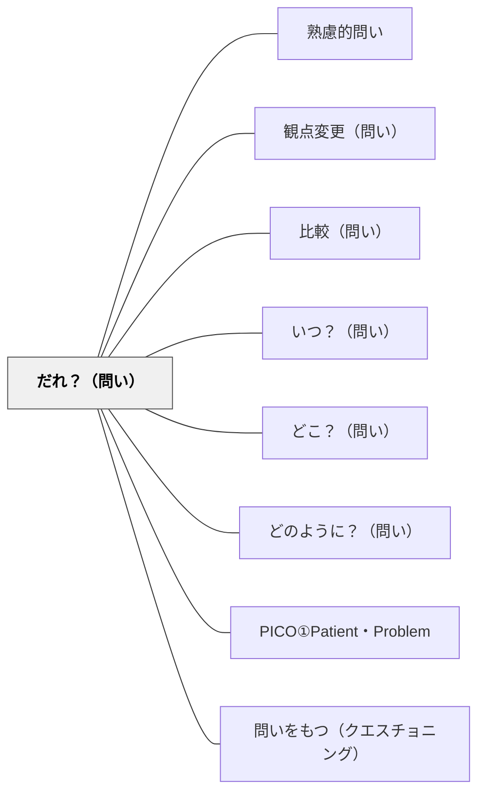

# だれ？（問い）

> 人・主体・登場人物を問うことで、議論の焦点を具体的なアクターに絞り込む。

## 背景（Context）
学習や対話の場において、物事や出来事が語られるとき、「誰がそれをしているのか」「誰が影響を受けているのか」という主体が曖昧なまま話が進みやすい。主体が不明確だと、責任の所在や行為者の意図が見えにくくなる。

## 問題（Problem）
議論が抽象的・一般論的になり、「誰の話をしているのか」がはっきりしないため、学習者が自分ごととして考えにくくなっている。主体のない語りは思考を浅くする。

## 力のかたち（Forces）
- 抽象的な議論は安全だが、学びを深めにくい。
- 主体を特定すると議論が具体化し、責任・視点・感情が浮かび上がる。
- 「誰」という問いは時に敏感な話題を開くため、場の安全性が必要となる。

## 解決（Solution）
「だれが？」「だれにとって？」「だれが決めたのか？」と主体を問う問いを意図的に挿入する。人物・立場・役割を明示させることで、議論に具体性と多様な視点をもたらす。

## 結果（Consequences）
議論が具体的な人物・立場・視点に根ざすようになり、共感や批判的思考が促される。一方、特定の人物に焦点が当たることで話が個人攻撃にならないよう注意が必要である。

## 関連パタン
- [[パタン/熟慮的問い]] — 親パタン
- [[パタン/観点変更（問い）]] — 「誰の立場で見るか」へと展開できる
- [[パタン/比較（問い）]] — 異なる人物・主体を比較する問いと連携する

- [[パタン/いつ？（問い）]] — 5W1H の「時」：誰・いつをセットで問う兄弟パタン
- [[パタン/どこ？（問い）]] — 5W1H の「場所」：誰・どこをセットで問う兄弟パタン
- [[パタン/どのように？（問い）]] — 5W1H の「方法」：誰がどのようにを問う兄弟パタン
- [[パタン/PICO①Patient・Problem]] — 「誰にとっての問題か」を明確化するフレームワーク
- [[パタン/問いをもつ（クエスチョニング）]] — 5W1H を使って問いを構造化する上位パタン

## クラスター図

## Actionable Insight

- 「誰がそれをしているのか」「誰が影響を受けているのか」を授業の途中で問う——主体が明確になると議論が具体化し、共感や批判的思考が生まれる
- 歴史や社会の事柄を話し合うとき、「誰の立場で語っているか」を確認する——視点を明示することで多様な立場への気づきが生まれる
- グループ討論で「誰が決めたのか？」を問う——責任の所在を問うことが当事者意識と批判的思考を促す

## 出典
- [[文献/熟慮的問いのパターンリスト（動画記録）]]
