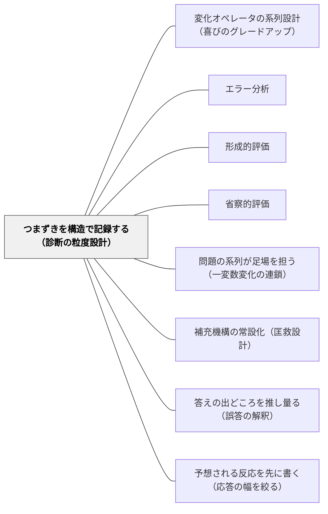

# つまずきを構造で記録する（診断の粒度設計）

> 正答率は何が難しかったかを教えるが、なぜ難しかったかは教えない。記録の粒度が補充の精度を決める。

## 背景（Context）

教育現場における学習記録の最も普及した形式は「正答率」である。何問中何問正解したかという数値は、単純で比較しやすく、保護者への説明にも使いやすい。戸田城外（1930）『推理式指導算術』が提唱した「教授サイクル」でも「成績調査——誤算の原因を教師が知る」という段階が組み込まれていた。

しかし正答率という記録は、「どの問題で詰まったか」は教えるが、「なぜ詰まったか」は教えない。算数の問題で3問間違えた記録があっても、それが「逆（未知数交換）の問題だったから」なのか「質的変化（場面の転換）の問題だったから」なのかは正答率からは読み取れない。

推理式指導算術プロジェクト（岩井輝久, 2026）では、つまずきを変化オペレータ（同・逆・＋α・質的変化・複合）の種別で記録する設計原則を「学習履歴の構造化軸」として位置づけた（第1弾§5.2）。また失敗モードF8として「学習履歴が正答率に堕ちてつまずきオペレータが記録されない」ことを明示的に警告している（第2弾§9）。

## 問題（Problem）

正答率だけを記録すると、「どの問題が難しいか」はわかるが「なぜ難しかったか」がわからない。その結果、補充の設計が「もう一度全部やり直し」という一律の対応になる。

学習者が10問中4問を間違えても、その4問がすべて「逆（未知数交換）」の問題だったのか、ランダムに混在していたのかで、次に出すべき問題はまったく異なる。前者なら「逆問題の基本系列」を集中的に補充すればよいが、後者なら全体を見直す必要がある。粗い記録は補充の精度を下げ、学習者の弱点に対応できないまま次の単元へと進むことになる。

## 力のかたち（Forces）

- **記録コスト vs 診断精度**: 変化種別ごとに記録するには正誤だけの記録より手間がかかる。しかし粒度の粗い記録は補充設計の根拠として機能しない——「何を記録するか」は「何を設計できるか」を直接決める
- **データの豊富さ vs 解釈の複雑さ**: 記録軸を増やすほど見取りの解像度は上がるが、記録の分析に必要な知識も増える。教師が「変化オペレータ」という設計概念を理解していて初めてデータが生きる
- **テストデータ vs 授業観察**: 形式的なテストから得られるデータと、授業中の「どこで手が止まったか」の観察は、異なる情報を持つ。両者を同じ軸で記録できると診断の解像度が上がる
- **個人の弱点 vs クラス全体の傾向**: 種別ごとの記録は個人の弱点の把握に役立つが、クラス全体の傾向（例:「質的変化でクラス全体が詰まる」）も読める——補充を個別対応にするか全体指導にするかの判断材料になる

## 解決（Solution）

**つまずきを「どの変化の種別（オペレータ）で詰まったか」という構造的粒度で記録する。記録軸を「正誤」から「変化種別×正誤」に変えることで、「逆が弱い」「質的変化で迷う」という構造的な見取りが可能になり、補充の設計がデータから直接導ける。**

### 記録設計の4原則

**① 記録軸を「正誤」から「変化種別×正誤」に変える**

単に○×を記録するのでなく、「逆問題で×」「質的変化問題で×」という形で、どの種別に弱いかを記録する。問題に変化オペレータのラベルを貼り（同／逆／＋α／質的変化／複合）、そのラベルごとに正誤を集計する。

**② 集計の焦点を種別別の正答率に変える**

「この子は10問中6問正解」ではなく、「逆（未知数交換）で3問中1問正解（33%）」「質的変化問題で3問中1問正解（33%）」「同・確認問題で4問中4問正解（100%）」という種別別の見取りが可能になる。

**③ 補充設計をデータから直接導く**

「逆が弱い→逆問題の基本系列を追加」という補充設計がデータから直接導ける。「一律のやり直し」ではなく、種別に対応した的確な補充ができる。複合問題で詰まった場合は「どの下位オペレータが弱いか」を遡って確認する。

**④ 授業中の観察メモも同じ軸で記録する**

テストのデータだけでなく、授業中の「どこで手が止まったか」の観察メモも同じ軸で記録できる。「A児は④質的変化の問題で必ず鉛筆が止まる」という観察は、テストデータの補完として機能する。

---

### 具体例1：割合の単元における種別別記録表

基本原形：「30人の学級の40%は何人？」という問題セットを10問出題した場合。

| 変化オペレータ | 問数 | 正解数 | 正答率 | 次の手立て |
|---|---|---|---|---|
| ①同（確認） | 3問 | 3問 | 100% | 維持。次の単元へ移行可 |
| ②逆（未知数交換） | 3問 | 1問 | 33% | 逆問題の基本系列（3〜5問）を補充 |
| ③＋α（条件追加） | 2問 | 1問 | 50% | ＋α問題の丁寧な解説と追加練習 |
| ④質的変化 | 2問 | 0問 | 0% | 「場面が変わっても構造は同じ」という確認から再入 |

この記録から「逆と質的変化が弱い」と即座に読み取れ、「②逆問題を5問→④質的変化問題を5問」という補充系列の設計ができる。

---

### 具体例2：分数の単元における観察記録との統合

授業中の観察と小テストを同じ軸で統合する記録の例。

B児の分数単元記録（第3週時点）：

- 授業観察：「分数÷整数（逆問題）」で毎回鉛筆が止まる。「なぜ逆にするの？」と問うと沈黙する（②逆オペレータの概念的理解が弱い）
- 小テスト：確認問題4/4正解。逆問題2/4正解。質的変化1/3正解。
- 診断：「②逆の手続きはわかるが概念理解が弱い」「④質的変化は視覚的な足場が必要」
- 補充設計：逆問題を具体物（おはじき）を使って再確認→質的変化の「見比べる」問題を2問追加

---

## 結果（Consequences）

**利点**

- 補充の精度が上がる——「一律やり直し」ではなく種別に対応した補充になるため、学習者の時間と負担が最小化される
- 教師の見取り力が上がる——「正答率60%」から「逆が弱く質的変化が未達」という言語化が可能になる
- 次の問題系列の設計に直接使える——記録がそのまま補充系列の設計仕様になる
- 授業観察と定量データの統合ができる——同じ軸で記録することで、テストと観察の情報が合流する

**注意点・リスク**

- 記録の粒度を細かくするほど記録コストが増す——全員・全問題で種別記録をするのは現実的でない。重点的に見たい単元・学習者に絞って適用するか、ラベル付きの小テストを設計してデータ収集を簡略化する
- 変化オペレータの概念を教師が理解していないと、記録軸を設定できない——まず[[パタン/変化オペレータの系列設計（喜びのグレードアップ）]]を理解してから本パタンを適用する
- 「全問正解でも構造理解なし」への対応——種別ごとに全正解でも、なぜ正解したかが理解によるものか手続きの記憶によるものかは記録からは読み取れない。カンファリングや口頭確認を補完的に使う

## 関連パタン

- [[パタン/変化オペレータの系列設計（喜びのグレードアップ）]] — 変化の種別を設計する（上位）と、種別ごとのつまずきを記録する（本パタン）は対になる設計。記録がなければ種別設計の効果が見えない
- [[パタン/エラー分析]] — エラー分析は「間違いから学べるよう奨励する学習者の姿勢」を扱う。本パタンは「教師・システムがつまずきをどの粒度で記録・分類するか」という診断設計の型——両者を組み合わせると「学習者自身がどの種別で間違えたかを分析する」という実践が生まれる
- [[パタン/形成的評価]] — 形成的評価は「何のために記録するか」（改善のための評価という目的・哲学）を扱う上位パタン。本パタンは「どの粒度で記録するか」という具体的な実装の型——形成的評価の目的を実現するために、本パタンの記録設計が機能する
- [[パタン/省察的評価]] — 省察的評価の観察記録・逸話的記録は「どこで手が止まったか」を記録する実践。本パタンはその記録を「変化種別」という軸で構造化する——省察と構造化記録を組み合わせることで教師のドメイン知識が蓄積する
- [[パタン/問題の系列が足場を担う（一変数変化の連鎖）]] — 一変数に絞った問題系列の設計（上位）と、どの変数で詰まったかの記録（本パタン）は相補的——記録のデータが次の系列設計の修正根拠になる
- [[パタン/補充機構の常設化（匡救設計）]] — 本パタンの種別ごとの記録が「補充が必要な子の発見」ステップを直接支える。記録なしに補充機構は動かない。セットで機能する

- [[パタン/答えの出どころを推し量る（誤答の解釈）]] — つまずきを記録する前に、それが7つのどの型かを見分ける角度
- [[パタン/予想される反応を先に書く（応答の幅を絞る）]] — 記録したつまずきを、次の単元の「予想される反応」に還流させる

## クラスター図

## Actionable Insight

- **次の小テストに変化オペレータのラベルを貼る**: テストを返却する前に、各問題に「同／逆／＋α／質的変化」のラベルを教師が付け、種別ごとの正答数を集計する——集計だけで「どの種別が弱いか」が見える
- **「逆問題で詰まった子」リストを作る**: 採点後に「逆問題2問以上間違えた学習者」を一覧にする——翌週の少人数補充の対象者が自動的に決まる。「全体的に弱い子」ではなく「逆が弱い子」という特定ができる
- **授業観察メモの書き方を変える**: 「B児がつまずいていた」ではなく「B児が④質的変化の問題で鉛筆を止めた（3回目）」と書く——観察の記録に種別ラベルを1語加えるだけで、後からの分析可能性が大幅に上がる

## 出典

戸田城外（1930）『推理式指導算術』全3冊
岩井輝久（2026）推理式指導算術プロジェクト設計文書（第1弾§5.2、第2弾§9）
