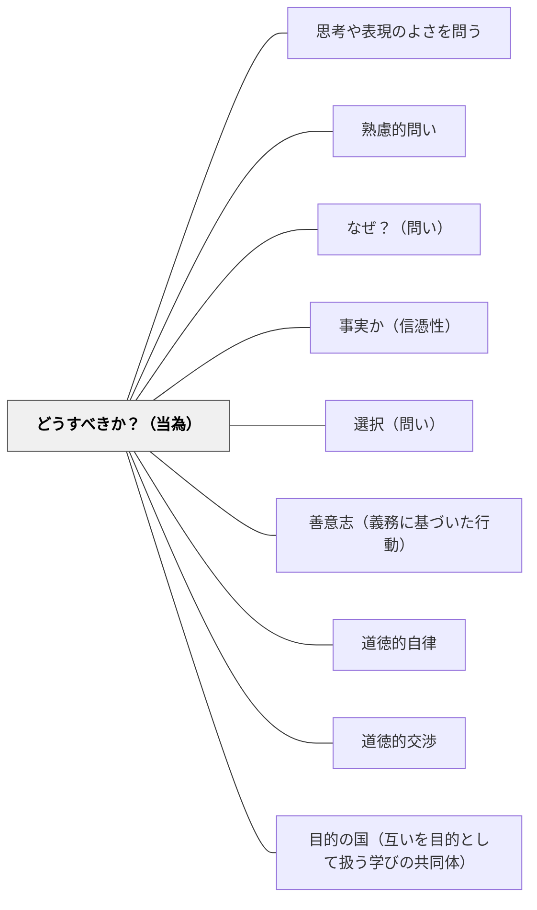

# どうすべきか？（当為）

> 規範・べき論・倫理的判断を問うことで、価値判断と道徳的推論を引き出す。

---

## [Pattern Connection]

**カント（1785）道徳形而上学の基礎づけ統合：**

- **哲学的根拠の提供**：「どうすべきか」という問い（当為 / Sollen）には、カントの定言命法がその最も厳密な哲学的形式を与える。特に普遍化の定式——「もし全員がこのように行動したらどうなるか」——は、規範的問いの思考ツールとして授業でそのまま使える。「自分だけ例外」が許されない論理を確認することが、当為の問いを最も鋭く立てる方法になる
- **is/ought の区別の哲学的根拠**：本パタンの「力のかたち」で扱う「事実（is）と当為（ought）の区別」は、カントの感性界（現象世界 = こうなっている）と叡智界（道徳法則の世界 = こうすべき）の区分と対応する。「現にこうなっている」と「こうすべきだ」は別の論理圏に属する——この区別を教室で明示することが、道徳的推論の基礎訓練になる
- **完全義務・不完全義務による当為の構造化**：「どうすべきか」の問いには段階がある。完全義務（状況によらず絶対にすべき/すべきでない）と不完全義務（できる限りすべきだが方法・程度に裁量がある）を区別して問うと、規範的議論の射程が明確になる。「これは例外なき義務か、それとも程度と状況に依存するか」が第二の問いになる
- **接続するパタン**：[[パタン/善意志（義務に基づいた行動）]] — 当為（すべき）の動機的根拠。義務から行動するとき、当為の問いが本物になる。[[パタン/道徳的自律]] — 当為を外から受け取るのでなく、自分で立法するとき本物の規範的推論になる。[[パタン/道徳的交渉]] — 当為の問いを授業レベルで実践するパタン

---

## 背景（Context）
事実の理解から一歩進んで、「どうすべきか」「何が正しいか」という規範的・倫理的な問いは、市民性・道徳的判断力・批判的思考の核心に位置する。STEM教育が事実と方法論を扱うのに対し、「当為（Sollen）」の問いは価値の次元に踏み込む。

## 問題（Problem）
学習者は記述的な知識（何であるか）と規範的な判断（何であるべきか）を混同したり、規範的問いを回避したりする傾向がある。「それは誰が決めることか」「価値観の問題に正解はない」という誤解が、規範的思考の訓練を妨げることがある。

## 力のかたち（Forces）
- 規範的問いは、学習者の価値観・信念・倫理観を明示化する
- 「すべき」を問うことで、事実（is）と当為（ought）の区別が身につく
- 倫理的ジレンマを通じた問いは深い議論と批判的思考を促す
- 価値判断の根拠を問うことが、論理的な倫理推論を育てる

## 解決（Solution）
「この状況でどうすべきか？その判断の根拠は何か？他の立場から見るとどうか？」と問いかける。例えば生命倫理の授業では「延命治療を続けるべきかどうか、どのような価値観を優先するか？」と問う。賛否両論の立場を取らせ、根拠を示して議論させることで、規範的推論の力が育つ。答えの一致を目指すのではなく、推論の質を高めることに焦点を当てる。

## 結果（Consequences）
- 倫理的・規範的思考力が養われ、複雑な現実問題への準備ができる
- 事実と価値の区別が明確になり、議論の精度が高まる
- 自分の価値観と他者の価値観を対話的に比較・検討できるようになる

## 関連パタン
- [[パタン/思考や表現のよさを問う]]
- [[パタン/熟慮的問い]] — 親パタン
- [[パタン/なぜ？（問い）]] — 規範的判断の理由を問う
- [[パタン/事実か（信憑性）]] — 事実と価値を区別する批判的問い
- [[パタン/選択（問い）]] — 価値判断に基づく選択を促す
- [[パタン/善意志（義務に基づいた行動）]] — 当為の問いの動機的根拠
- [[パタン/道徳的自律]] — 当為を外から受けるのでなく自分で立法する
- [[パタン/道徳的交渉]] — 授業レベルの当為実践
- [[パタン/目的の国（互いを目的として扱う学びの共同体）]] — 人格の定式による当為の問いの多角化

## クラスター図

## Actionable Insight

- 道徳・社会科の授業で「この状況でどうすべきか？」と問い、まず自分の判断を一文で書かせてから理由を問う——事実の記述と価値判断の区別が倫理的推論の練習になる
- 「自分と反対の立場に立ってみたら、どんな理由が考えられるか」と問う——対立する立場への想像力が価値判断の根拠を深く考える力を育てる
- 「答えの一致より推論の質を高める」ことを目標として議論を設計する——全員が同じ答えに至ることを目指さない問いが価値観の違いを学習の素材として活用する
- 「もし全員がこのように行動したらどうなるか（普遍化テスト）」を当為の問いに重ねる——カントの定言命法の最も使いやすい形式。「自分だけ例外」が許されない論理が規範的推論の中核を鍛える
- 「この行動は例外なく守るべきか（完全義務）、それともできる限りすべきだが方法は選べるか（不完全義務）か」と分類させる——当為の問いに構造が生まれ、倫理的議論の射程が明確になる

## 出典
- [[文献/熟慮的問いのパターンリスト（動画記録）]]
- [[文献/道徳形而上学の基礎づけ（カント、中山元訳）]]

Kant, I. (1785). *Grundlegung zur Metaphysik der Sitten*（道徳形而上学の基礎づけ）.
邦訳: カント著, 中山元訳（2012）『道徳形而上学の基礎づけ』光文社古典新訳文庫.
