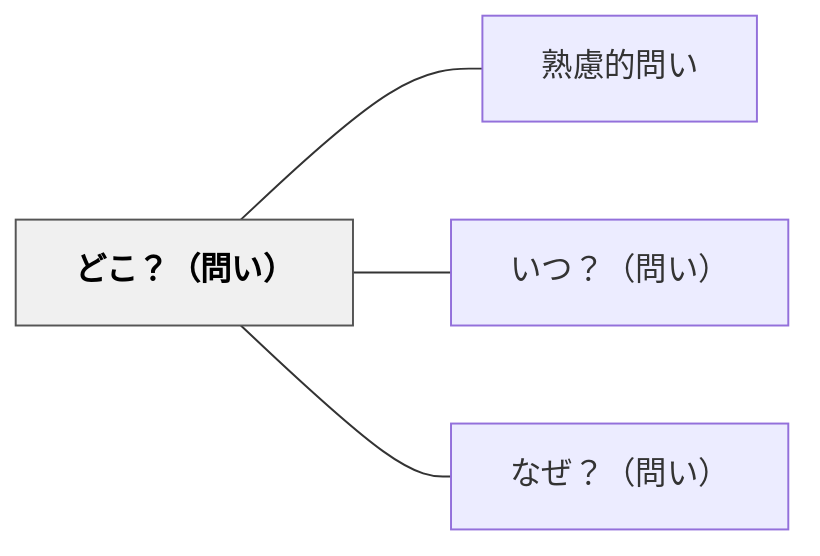

# どこ？（問い）

> 場所・位置・空間・範囲を問うことで、知識や出来事の空間的文脈を把握する。

## 背景（Context）
多くの知識や現象は特定の空間・場所・範囲と不可分に結びついている。「どこで起きたか」「どの領域の話か」という問いは、情報を地理的・概念的空間の中に位置づけ、他の事象との関係を理解するための枠組みを提供する。

## 問題（Problem）
学習者は事実を場所・空間から切り離して覚えることが多く、「なぜその場所で起きたか」「他の場所との違いは何か」といった空間的文脈の問いを立てない。空間的理解の欠如は、地理・生態学・社会問題など多くの分野での深い理解を妨げる。

## 力のかたち（Forces）
- 場所の特定は、その環境・条件・文脈への理解を開く
- 「どこ」を問うことで、分布・拡散・境界といった空間的思考が促される
- 空間的文脈は記憶の強力な「錨」になる（場所法）
- 「どこの問題か」という問いは、解決の主体と責任の所在を明らかにする

## 解決（Solution）
「それはどこで起きたか？なぜその場所だったのか？他の場所ではどうか？」と問いかける。例えば地理学習では「この気候はなぜこの地域に分布するのか」と問い、地形・気流・緯度などとの関係を探らせる。概念的には「この問題はどの学問領域に位置するか？」という問いとして応用することもできる。

## 結果（Consequences）
- 地理的・空間的思考が発達し、知識が文脈の中に定着する
- 分布・範囲・境界への意識が高まり、比較分析力が育つ
- 場所と文脈の結びつきが記憶の定着を助ける

## 関連パタン
- [[パタン/熟慮的問い]] — 親パタン
- [[パタン/いつ？（問い）]] — 時間的文脈を問うペアパタン
- [[パタン/なぜ？（問い）]] — 場所と理由を組み合わせた問い

## クラスター図

## Actionable Insight

- 「それはどこで起きたか？なぜその場所だったのか？」と問いかける——知識が地理的・空間的文脈の中に位置づけられ理解が立体的になる
- 地理学習で「この気候はなぜこの地域に分布するのか」と問い、地形・気流・緯度との関係を探らせる——空間的思考が発達し分布・境界への意識が高まる
- 「どこの問題か」という問いで解決の主体と責任の所在を明らかにする——空間的文脈が記憶の強力な錨になる

## 出典
- [[文献/熟慮的問いのパターンリスト（動画記録）]]
