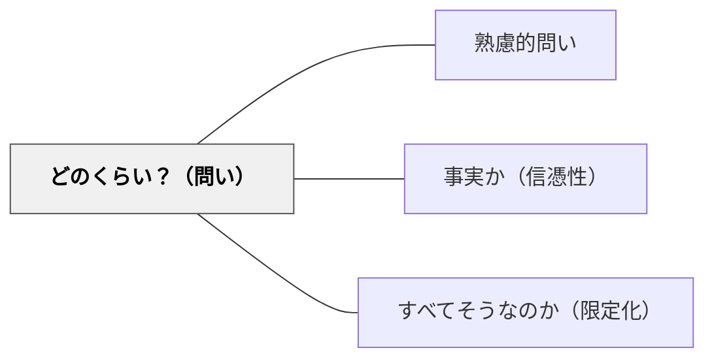

# どのくらい？（問い）

> 量・程度・割合・頻度を問うことで、曖昧な言葉に数値的根拠と具体性をもたらす。

## 背景（Context）
議論や説明の中で「多い」「少ない」「よく」「たまに」などの曖昧な量的表現が使われることが多い。話者によってその感覚は大きく異なり、共通理解が成立しないまま議論が進んでしまう。

## 問題（Problem）
量・程度・頻度が曖昧なまま語られると、聞き手が具体的なイメージを持てず、議論が地に足のつかないものになる。エビデンスや根拠の検討もできない。

## 力のかたち（Forces）
- 数値化は議論を明確にするが、測りにくいものを無理に数値化すると本質を歪める。
- 「どのくらい」を問うと、主張の根拠を問うことにもなり、批判的思考を促す。
- 頻度や程度への問いは、個人差・文化差を浮き彫りにする効果もある。

## 解決（Solution）
「どのくらい？」「何回？」「どのくらいの割合で？」「どの程度大きいのか？」と量的・程度的な具体化を求める問いを投げる。数値や比率だけでなく、比較対象を示させることも有効である。

## 結果（Consequences）
議論の根拠が明確になり、思い込みや過度な一般化を防ぐことができる。数値を求めることで学習者の調査・データ収集意欲が高まる一方、数字に頼りすぎて質的な側面を見失う危険もある。

## 関連パタン
- [[パタン/熟慮的問い]] — 親パタン
- [[パタン/事実か（信憑性）]] — 量的根拠の確認と連携する
- [[パタン/すべてそうなのか（限定化）]] — 一般化の誤りを問う問いと連携する

## クラスター図

## Actionable Insight

- 学習者が「多い」「少ない」「よく」と言ったとき、「どのくらい？」と問い返す——曖昧な量的表現に数値的根拠と具体性をもたらす
- 主張の根拠を問うとき「どのくらいの割合で？」「何回？」という形で数値化を促す——批判的思考と調査・データ収集の意欲が高まる
- 「どのくらい大きい？」という問いで比較対象を示させる——比率や比較が議論に具体性と地に足のついた根拠を生む

## 出典
- [[文献/熟慮的問いのパターンリスト（動画記録）]]
