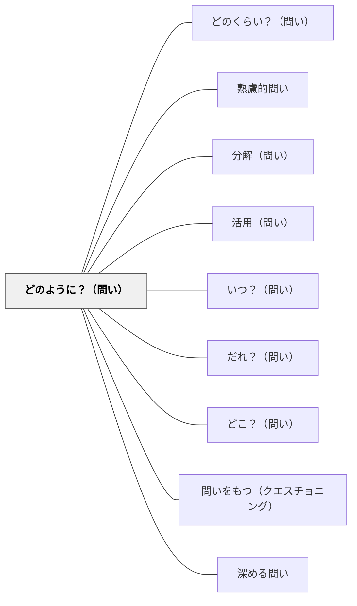

# どのように？（問い）

> 方法・プロセス・手順を問うことで、「何か」から「いかに」へと思考を深める。

## 背景（Context）
学習の場では、「何が起きたか」「何が正解か」という知識の確認にとどまりがちで、そのプロセスや方法論への問いが後回しになることが多い。「どのように」を問わないと、知識は孤立した事実のままとなる。

## 問題（Problem）
「何か」は分かっていても「どのように」が問われないため、応用・実践・再現の手がかりが学習者に渡らない。プロセスが不可視のまま終わる。

## 力のかたち（Forces）
- 「何」への問いは答えやすいが、「どのように」は複雑で複数の経路がある。
- プロセスへの問いは、暗黙知や経験知を言語化するよい機会となる。
- 手順を問いすぎると本質的な問いが失われる危険もある。

## 解決（Solution）
「どのようにして？」「どういう手順で？」「どのようなプロセスを経たのか？」と明示的に問いかける。方法や経路を複数想定させることで、多様なアプローチへの気づきを促す。

## 結果（Consequences）
学習者がプロセスや方法を言語化・可視化するようになり、メタ認知が促される。実践への橋渡しになる一方、手順の詳細に拘泥して本質を見失わないよう注意が必要。

## 関連パタン
- [[パタン/どのくらい？（問い）]]
- [[パタン/熟慮的問い]] — 親パタン
- [[パタン/分解（問い）]] — プロセスをステップに分解する問いと連携する
- [[パタン/活用（問い）]] — 「どのように使うか」へ発展する

- [[パタン/いつ？（問い）]] — 5W1H の「時」：プロセスの時系列を問う兄弟パタン
- [[パタン/だれ？（問い）]] — 5W1H の「誰」：誰がどのようにを問う兄弟パタン
- [[パタン/どこ？（問い）]] — 5W1H の「場所」：どこでどのようにを問う兄弟パタン
- [[パタン/問いをもつ（クエスチョニング）]] — 5W1H を使って問いを構造化する上位パタン
- [[パタン/深める問い]] — プロセスへの問いが表面的理解を深める探究へ転換する
## クラスター図

## Actionable Insight

- 「何が起きたか」に答えさせた後、「どのようにして？」「どういうプロセスを経たのか？」と続けて問う——プロセスが可視化されてメタ認知が促される
- 学習者の解法や思考を「どのように考えたの？」と問い返す——暗黙知が言語化される機会になる
- 「別のどのような方法があるか？」と問うことで複数の経路への気づきを促す——多様なアプローチへの柔軟性が育つ

## 出典
- [[文献/熟慮的問いのパターンリスト（動画記録）]]
