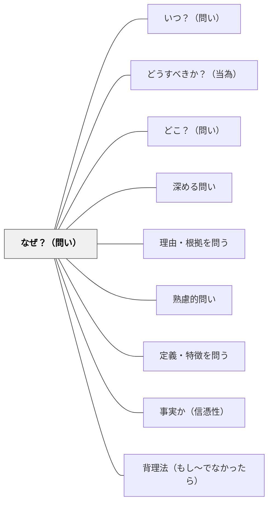

# なぜ？（問い）

> 理由・原因・動機・目的を問う最も深い疑問詞。「なぜ」の連鎖が本質的理解を生む。

## 背景（Context）
「何が」「いつ」「どこで」という問いが事実を明らかにするのに対し、「なぜ」という問いは原因・理由・意図・目的という次元に踏み込む。「なぜ」を繰り返すことで表面的な説明から根本的な原理へと到達できる（トヨタの「なぜなぜ分析」などもこの原理の応用である）。

## 問題（Problem）
学習者は「何が」という事実の習得に留まり、「なぜそうなのか」という問いを立てないことが多い。表面的な記述で満足してしまうと、現象の背後にある仕組みや原理が理解されない。また「なぜ」を問われることを「責められている」と感じる文化的・心理的障壁もある。

## 力のかたち（Forces）
- 「なぜ」は記述から説明へ、事実から原理へと思考を深める
- 「なぜ」の連鎖は根本原因・根本原理への到達手段になる
- 目的を問う「なぜ」は価値判断と倫理的思考を引き出す
- 「なぜ」への答えが出ないことが、理解の限界を示す診断になる

## 解決（Solution）
「なぜそうなのか？なぜそう言えるか？根拠は何か？もう一段深く考えると？」と問いかける。例えば「なぜ植物は緑色なのか」→「なぜクロロフィルは緑の光を反射するのか」→「なぜその分子構造になっているのか」と問いを深めていく。「なぜ」を少なくとも3〜5回繰り返すことで、表面的説明から本質的説明へ到達させる。

## 結果（Consequences）
- 事実の暗記を超えた原理的・概念的理解が生まれる
- 批判的思考と自律的な問い立ての習慣が育つ
- 根本原因への到達が、問題の本質的な解決に繋がる

## 関連パタン
- [[パタン/いつ？（問い）]]
- [[パタン/どうすべきか？（当為）]]
- [[パタン/どこ？（問い）]]
- [[パタン/深める問い]]
- [[パタン/理由・根拠を問う]]
- [[パタン/熟慮的問い]] — 親パタン
- [[パタン/定義・特徴を問う]] — 概念の本質を問う補完的パタン
- [[パタン/事実か（信憑性）]] — 「なぜそう言えるか」の証拠を問う
- [[パタン/背理法（もし〜でなかったら）]] — 否定から「なぜ」を深める

## クラスター図

## Actionable Insight

- 学習者が事実を答えた後「なぜそうなるの？」とひと掘り問いかける習慣をつける——一段深く問うことが暗記から原理的理解への転換を促す
- 「なぜなぜ分析」の形で「なぜ」を3回連続で問う活動を授業に取り入れる——問いの連鎖が表面的な説明から根本的な原理への到達を経験させる
- 「なぜそう言えるか」という問いを加えることで証拠・根拠を求める批判的思考を育てる——根拠を問う習慣が事実と推論の区別を学習者に意識させる

## 出典
- [[文献/熟慮的問いのパターンリスト（動画記録）]]
