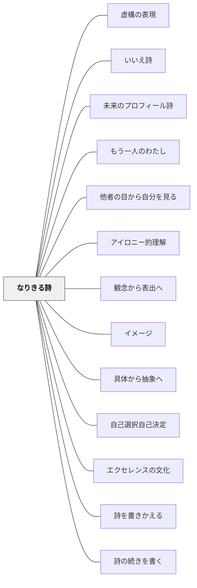

# なりきる詩

> 物や生き物になりきって詩を書くとき、子どもは自分の中の新しい自分を発見する。

## [Pattern Connection]

白谷明美『詩が生まれるとき書けるとき』第一章6節「なりきる詩」・第二章2節「わたしの中に」・第二章3節「わたしって何者」を統合。

- **[[パタン/いいえ詩]] との連続性**：「いいえ詩」で事実を否定してイメージを転換する体験の後、「では、自分がそのものになってみよう」へと進む。否定→変身という順序で比喩の深化が起きる。
- **[[パタン/アイロニー的理解]] との関連**：自分とは異なる存在の視点に立つことで、自分を外から見る認知的距離が生まれる。これは「自分の外に出て考える」という知的変容を引き出す。
- **新しく補強される点**：第二章の「特長図→なりきり比喩詩」アプローチは、視覚的思考ツール（特長図）を詩の創作と連結させる独自の手法。単なる「なりきり」を超えて、自己の特性・願いの発見に深化する。

**近藤真『中学生のことばの授業』統合（2026-05-16）：**

「なりきる詩」の中学版として「木になる」授業（谷川俊太郎「き」）を統合。

**PART-1「き」の授業（N中学校・中学2年生・1997年）の構造：**

N中学校はS岳という山の麓にある学校。校舎の裏に原生林が続く。理科室裏の側溝を飛び越えるとすぐ森に入れる環境。

1. 谷川俊太郎「き」を繰り返し読む——係助詞「は」の機能（一人称ハ文型の判断文：自分の意志・断定を語る構造）に気づくまで読み込む。詩「き」との出会いは「三省堂国語教育」第三十六号（1966年）。
2. 「きみは変身して何になりたいか」を問う——タダシ「雲」、ミエ「ドラえもん（ドラえもんになりたいから）」、ケンタとジロウ「雲になって下界をながめてみたい」、アキコ「鳥になりたい——いつでも世界中を見ていられるから」など、変身願望が多様に出てくる。
3. 二月の朝、冬の森に連れて行く——「木のそばに行って、幹に耳を当てて詩を読みなさい」「この詩の続きを書いてみなさい」。「第三の書く」（青木幹勇）の実践。
4. 各自が木のそばで「書きたし」（詩の続き）を書く → 百四十人分が集まる（1997年）。

**百四十の「書きたし」から（主な例）：**

- 「木はうごけない。だまっているけど何でも知っている。木はしゃべれない……木は人間よりえらい」——キミコ
- 「木は生きられる。動けないし何もできない。でも、木は生きている。静かな命を持って、ときどき吹く風に体がゆれて、生きていることを確かめる」——ジュンコ
- 「太陽の光が葉に当たり、あおあおとしげっている。そこに立っている、あおあおとしげっている」——フミ
- 「光さえも届かぬ、神さえも気づかぬこの空間で、一人空しく生きていく。だれも気づかない孤独」——ナオコ
- 「木は日の向かって伸びるために時間がかかる。落ちていく大事な場所だな」——コウイチ

「教室で一行ごと、一語ごとの訓詁注釈的な授業をしなかった。けれど、森に入り、木によりそうことで、虚構と変身の詩である『き』の学習ごこ、『和解』をそれぞれの仕方で果たした」（近藤真）。

**PART-2「自分の木」の授業（N中学校・中学2年生）の構造：**

同じN中学校の別の学年の実践。N中学校の敷地には六十四本の桜をはじめ、竹桃・蔓躑躅・梅・アカシア・五葉松・楓・棕櫚・ポプラなど多種の木々が植わっている。これらは昭和二十〜三十年代にかけて、教師と生徒が協働して戦後民主主義教育のシンボルとして植えてきた木々である。

1. 校庭の木々の歴史（昭和20〜30年代から植えられてきた歴史）を伝える——定年退職した同僚が昭和二十年代の後半に木造校舎のそばに桜の苗を植えた逸話を含む。
2. 「校庭のなかから、自分が変身して物事を語りたい木を探しなさい」——数日かけて「分身の木」を選ぶ。35人が校庭から中庭・体育館裏まで散らばって木を探す。
3. 選んだ木の写真を撮り、画用紙に貼る（イラストも添える）。
4. その木になりきって「つぶやき」を詩にする。

木を選ぶ生徒たちの様子：マサオは棕櫚の木に抱きつき、ミカは体育館裏の日陰の小さな無花果のそばにしゃがみ、ヒロアキは桜の木によじ登った。

カズオ（山遊びが好きで学校になじめない生徒）が「木とボールに寂しさを託した」詩を書いた例が象徴的。カズオは夏になると近くの山に入ってクワガタムシやカブトムシをポケットに入れて学校にやってくる子で、じっと耐えることが苦手だった。カズオが選んだのはバスケットボールコートの横の木。朝から仲間とバスケに来ていた彼は、近藤に「動くな！」と言われポーズを決めながら、はじめての詩を書いた：

```
木

ぼくはバスケットボールコートの上の木になった。
いつもみんなが楽しそうにしている。
ぼくの体に鳥がとんでくる。
夜になるとさまざまな虫たちがとんできて、
ぼくの体にかぶとむしたちがとんできたじゃないか。
```

「今度はぼくはバスケットボールになる」と言ってつづけて書いたカズオの詩を、近藤は大きな声でクラスに読んだ。

**同じ木から生徒それぞれの詩が紡ぎだされる：**
体育館前のN中でいちばん大きな桜の木を選んだ生徒だけで10人あまりいた。同じ木でも、生徒一人ひとりの内側が異なるため、詩はまったく違う声になった（サエコ「春への招待状」、ジュンコ「春と一緒に旅したい」など）。

**「子どもはだれでも自分の森をもっている」（近藤真）：**
生徒が木を選び、その詩を書いたとき、近藤は「一枚一枚の作品を読み解きながら、かれら一人ひとりがほんとうにいとおしく思えてきた」と記す。「木」の授業で発見したことは、「かれらが紡ぎだしたことばの背後に広がる深い森——他人がみだりに踏み込んではならない神秘の領域——を自分のなかにもっている」ということだった。

- **読む側への拡張**：白谷の「なりきって書く」に対し、近藤は「詩を読みながら木になりきる」——なりきり読みが先行し、書くことがその表出になる。

**白谷明美（年不詳）第2次統合（2026-05-21）：**

OCR全文精読により、第二章1節「生活の中で」の感情なりきりが補強された。

- **感情なりきり詩（即興型）**：第一章の「特長図→なりきり比喩詩」（物を観察してから書く準備型）に対し、第二章1節は「おこった時→はりねずみ（針で場所をつくる）」「つまらないとき→光（ピカッと光る）」「テストでわからない時→石（どんどん固くなる→ひらめく光）」という感情の瞬間に即興でなりきる形を示す。特長図なしで使える軽量版。日常の感情の瞬間（怒る・退屈・困惑）を詩の材料にするために授業外でも使える。
- **イメージの連鎖（しりとりイメージ）**：「からだをぬぎます→からだをぬいで→こころひとつになります」という連鎖イメージの構造。なりきり後に「そのなりきった存在が次にどうなるか」を連鎖させることでイメージが広がる。[[パタン/いいえ詩]] の詩りとりリレーと同じ連鎖原理。
- **自己探求の詩群との接続**：白谷明美の詩教育は「物になりきる（なりきる詩）→感情になりきる（感情なりきり）→自分の深層を探る（[[パタン/未来のプロフィール詩]]）→内なる葛藤を人格化する（[[パタン/もう一人のわたし]]）→他者の目から自分を見る（[[パタン/他者の目から自分を見る]]）」という探求の連鎖として読み解ける。
- **「自分の木・自分の森」**：木になって詩を読むとき、学校の特定の木（場所の記憶）を選ぶことで、生徒は「自分の森（内面の風景）」を発見する。
- **「第三の書く」**（青木幹勇）：訓詁注釈的な授業を超えて、身体的・空間的に詩に向き合い書く体験。→ [[パタン/詩の続きを書く]]
- **深化版「詩を書きかえる」へ**：物・自然になりきる（白谷）→ 詩の人物になりきる（近藤）という深化がある。→ [[パタン/詩を書きかえる]]

## [The Pattern]

> キャベツになったえみさんが、一枚一枚の葉の中に「こわい自分・やさしい自分・いろいろな自分」を見つけた。「詩が生まれた」ということは、「新しいイメージを発見した」ということだった。

### 背景（Context）

詩を書く時、子どもたちは「自分の視点から出ること」が難しい。「見たこと・感じたこと」を書こうとすると、どうしても観察者の視点になる。詩の持つ「自分を遠くから見る」「別の存在として世界を感じる」という力は、別の入口から引き出す必要がある。

### 問題（Problem）

「自分のことを詩に書こう」と言うと、子どもは表面的なプロフィールを書くか、説明文になる。どうすれば、自分の内側にある複数の側面・願い・不安・矛盾を、詩の言葉で引き出すことができるか。

### 力のかたち（Forces）

- 「なりたいもの」への憧れは強力な動機になる——「いいなあ」という感情から入ると書きやすい
- 物・動植物になりきることで「自分」への言及を回避できる——自己開示の心理的コストが下がる
- 物の特性と自分の特性を重ねる操作には、観察力・分析力・比喩力が同時に働く
- 特長図（ビジュアルマップ）を使うと、物の特性を整理してから詩へ移れる

### 解決（Solution）

**①「いいなあ変身」から入る**

「なりたいなあ」と思うものを一つ選び、そのものになりきって詩を書く。ポイントは「なぜなりたいか」という憧れの根拠が詩の核になること。

手順：
1. 「なりたいもの」を1つ選ぶ（風、川、ねこ、石、空…）
2. 「わたしは〇〇だ」から書き始める
3. そのものとして見えること・感じること・したいことを詩にする

---

**例 1（白谷明美の授業例：「キャベツ」小4 相浦えみ）**

```
キャベツ

朝おきると
ちがう自分になっている
自分の葉がふえている
いろいろな自分
やさしい自分
一日がおわると
葉の中でずっとねむりつづけるんだ
一まい一まいの葉の中には
いろいろな名前の葉がある
```

えみさんは「たまねぎで泣いた経験」をとらえ、「うらのおもての目」で「新しいイメージ」を発見した。「自分もたまねぎも泣いているんだという経験をもとに、うらの『おもての目』で新しいイメージを発見していますね」

---

**②「変身クイズ詩」——何になりきっているか当てさせる**

なりきっているものを明かさず、特徴だけを詩に書き、読んだ人が「これは○○だ」と当てる形式。読者への問いかけが詩の構造になる。

---

**③「特長図→自分の願いと重ねる比喩詩」**

第二章で展開される深化版。物の特性を「特長図」として視覚化してから、自分の特性・願いと重ねる。

手順：
1. 身近な物を1つ選ぶ（電球・じょうぎ・釘・なっとう・血まめ…）
2. 「特長図」：その物の特長を箇条書きにする
3. 特長の中から「自分の願いと重なるもの」を1つ選ぶ
4. 「〇〇のように、〜したい/なりたい」と詩にする

---

**例 2（特長図→なりきり比喩詩：「電球」小5 山田英明）**

```
特長図：電球 — つるっぱげ　光る　明るい　つるっぱげで仕事をいっしょうけんめいする
```

```
電球

ぼくは電球
ひからなくていいじゃないか
仕事になれなくて
つるっぱげでいいじゃないか
ぼくはいっしょうけんめいする
(中略)
自分一人でやってのけて
自分自身の証明を
見つけたい
```

---

**例 3（「紙風船」黒田三郎との重ね詩 — 願いの発見）**

黒田三郎「紙風船」（「落ちて来たら/今度はもっと高く/何度でも」）を読んで、子どもたちは「紙風船のように、美しい/願いことのように」と自分の願いを重ねて詩にする。プロの詩人の言葉の構造を借りながら、子どもが自分の本音にたどり着く。

### 結果（Consequences）

- 自分の内側の複数の側面（こわい自分・やさしい自分など）が詩の言葉で表れる
- 「特長図」を使うことで、観察力と比喩力が同時に育つ
- 書くことへの抵抗が下がる：物になりきることが心理的な安全を生む
- 「自分について正直に書く」よりも深い自己表現が生まれることがある
- 特長図→詩の移行には時間がかかる：授業時数を確保する必要がある

## 関連パタン

- [[パタン/虚構の表現]] — なりきりに共通する統一原理——変身・ペンネーム・他者の声を経由することで本音が出やすくなる逆説
- [[パタン/いいえ詩]] — 前段の技法。否定→変身という流れで接続
- [[パタン/未来のプロフィール詩]] — 物になりきる深化版。自分自身の特性（短所）となりきり対象を重ねる自己探求版
- [[パタン/もう一人のわたし]] — 内側の一部を人格化するなりきり。外の存在でなく「内なる自分の一部」になりきる
- [[パタン/他者の目から自分を見る]] — 方向が逆の補完パタン。なりきる詩は「自分が他者になる」、本パタンは「他者が自分を見る」
- [[パタン/アイロニー的理解]] — 自分とは異なる存在の視点に立つという認知操作
- [[パタン/観念から表出へ]] — なりきる前に物を観察し特長を見つける「内側の時間」
- [[パタン/イメージ]] — なりきる対象のイメージを持つことが詩の質を決める
- [[パタン/具体から抽象へ]] — 物の具体的な特長から自分の抽象的な願いへ
- [[パタン/自己選択自己決定]] — 何になりきるかを子どもが選ぶことが詩の個性を生む
- [[パタン/エクセレンスの文化]] — 子どもの詩を読み合い、発見を共有する文化
- [[パタン/詩を書きかえる]] — なりきりの深化版。「物・自然になりきる」から「詩の人物の視点で書きかえる」へ（近藤真）
- [[パタン/詩の続きを書く]] — なりきって読んだ後に「詩の続き（書きたし）」を書く「第三の書く」の実装（近藤真・青木幹勇）

## クラスター図



## Actionable Insight

- 「なりたいものを1つ選んで、5分でそのものの詩を書く」活動を詩の単元の入口にする——「いいなあ変身」という憧れのエネルギーが詩の動機になる
- 書いた詩を「変身クイズ」として読み上げ、クラスに「何になりきっているか」当てさせる——正解・不正解がなく全員が楽しめる詩の共有になる
- 特長図ワークシートを使い「この物の好きなところを3つ」→「自分の願いに似ているのはどれ？」という2段階で進める——比喩が「発見」になる瞬間が生まれる
- 黒田三郎「紙風船」や新川和江「木」など、繰り返しの構造を持つ詩を使った「重ね詩」を一単元に一回取り入れる——詩の構造を借りながら自分の思いを書く体験が詩への自信につながる

## 出典

白谷明美（年不詳）『詩が生まれるとき書けるとき　だれにでもできる楽しい詩のつくり方』教育出版センター（第一章6節「なりきる詩」、第二章2・3節）

> えみさんははじめから新しいイメージをとらえていますね。ちがう自分になっている／こわい自分／やさしい自分が葉の中にはいろいろな名前の葉がある　と、いう発見ですね。「詩が生まれた」ということは。

## 出典

白谷明美（年不詳）『詩が生まれるとき書けるとき　だれにでもできる楽しい詩のつくり方』教育出版センター

## 関連実践

- [[実践/詩を紹介する・詩を創作する]]
- [[実践/詩歌の授業（詩を書く・詩を読む）]]
