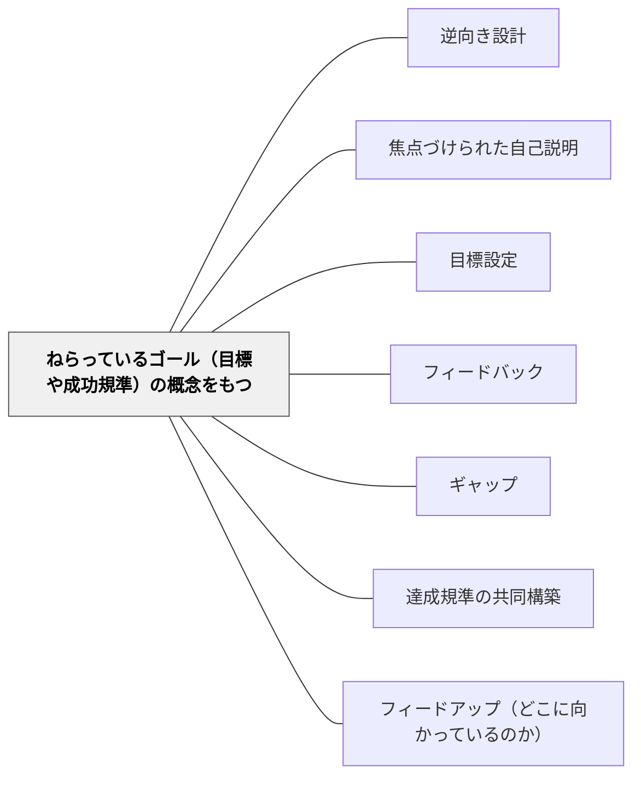

# ねらっているゴール（目標や成功規準）の概念をもつ

> どこへ向かっているのかを知ることが、学習の第一歩である。

## 背景（Context）

フィードバックが機能するためには、まず「何を目指しているのか」が明確でなければならない。目標・成功規準・達成基準のいずれかの形で、ゴールの概念を学習者が持つことが、効果的なフィードバックの前提条件である。

## 問題（Problem）

目標が曖昧なまま学習を進めると、何ができるようになればいいのかがわからず、フィードバックを受け取っても何を改善すべきかに繋がらない。

## 力のかたち（Forces）

- 教師が内心では持っているゴールを、学習者に共有しないまま進めることが多い
- ゴールを言語化する過程で、教師自身がゴールを明確にできることもある
- 外から与えられたゴールより、共同構築したゴールの方が学習者の動機と結びつきやすい

## 解決（Solution）

**学習のゴール（目標・成功規準・達成基準）を明確にし、学習者と共有する。できれば共同で構築する。**

ゴールの共有方法：
- 授業の冒頭でめあて・学習目標を確認する
- 達成基準を一緒に作る（→[[パタン/達成規準の共同構築]]）
- 実例を見て「どうなれば良いか」をイメージする（→[[パタン/実例を比べて分析する]]）

## 結果（Consequences）

- 学習者が「何のためにやっているか」を意識して取り組むようになる
- フィードバックの受け取り方が変わる（「批判」でなく「情報」として）
- 自己評価・自己調整が可能になる

## クラスター図

## Actionable Insight

- 授業の冒頭に「今日できるようになるゴールは○○です」と一文で示す——ゴールを持った状態で学習に入ることがフィードバックを「情報」として受け取る準備をつくる
- 達成基準を「できた例」と「まだの例」の実物を見せながら学習者と一緒に言語化する——共同構築したゴールが学習者の内発的な動機と結びつく
- 学習の終わりに「今日のゴールに対して自分はどこまで来たか」を一行書かせる——ゴールと現状の自己比較が自己評価と次の学習への動機をつくる

## 出典

- 一つの教育のパタン・ランゲージ（岩井輝久）

## 関連パタン
- [[パタン/逆向き設計]]
- [[パタン/焦点づけられた自己説明]]
- [[パタン/目標設定]]

- [[パタン/フィードバック]] — 親パタン
- [[パタン/ギャップ]] — ゴールがあってこそギャップが生まれる
- [[パタン/達成規準の共同構築]] — ゴールを共に作る
- [[パタン/フィードアップ（どこに向かっているのか）]] — フィードバックの方向としてのゴール確認
