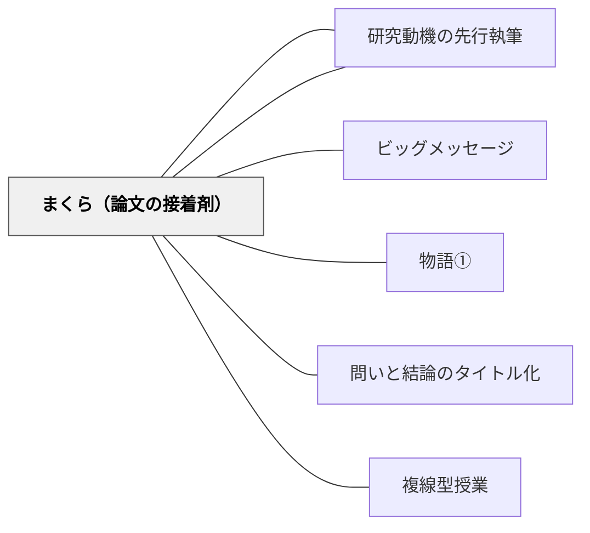

# まくら（論文の接着剤）

> ピースをレンガとすれば、まくらはモルタル（接着剤）だ。まくらが書けないのは、ピースの間にストーリー（分類・経過・理由）がないから。

---

## Pattern Connection

**卒業論文のデザイン（片岡則夫, 2025）統合（2026-05-27）：**

清教学園中学校の論文指導ガイドブック第5章「まくらが書けないのは論文にストーリーがないから」より統合する。

- **既存パタンとの関連**：[[パタン/ビッグメッセージ]] の「論文全体の主張を先に立てる」という原則が、まくらを書くための前提条件となる。全体のストーリーが見えていれば、ピース間のまくらも自然に書ける
- **補強された点**：[[パタン/物語①]] が語りの構造を扱うのに対し、本パタンは「研究論文の中の語り」——分類・経過・理由という三種のストーリー型を提供する
- **他のパタンへの波及**：[[パタン/研究ピース]] — ピースが増えることでまくらが書けるようになる。[[パタン/複線型授業]] — 章立ての設計（ストーリーの選択）は授業の複線設計に通じる

---

## 背景（Context）

研究ピース（引用＋まくら＋コメント）の構造を学んでも、「まくら（自分の言葉で入る導入文）」が書けない生徒が多い。「〜について調べるため、〜を引用する」という型通りの文しか書けず、ピースとピースがただ並んでいる状態になってしまう。

まくらが書けないのは、文章の技術の問題ではなく、ピース間の「なぜこの順番で並んでいるか」という論理（ストーリー）が見えていないからだ。

## 問題（Problem）

ピースを並べただけでは、「レンガを積み上げただけで崩れる壁」になる。ピースとピースの「関係」を読者に伝えるまくらがなければ、論文の論理が読者に届かない。

「まくら」を書こうとして「〜を研究するにあたり〜について」というパターンを繰り返すのは、まくらの本質（ピース間の関係を語る）を理解していないから。

## 力のかたち（Forces）

- まくらは「入るだけの理由・必然性」が必要——なぜこのピースが次に来るのかを読者に示す
- ストーリーがあれば、まくらに「まず」「次に」「さらに」「第一に」「第二に」などの言葉が自然に入る
- ストーリーには三種の基本型がある：①分類（AとBとC）②経過（開始→展開→現在）③理由（理由が3つある）
- ピースが少ない段階では単独ピースになり、まくらが書きにくい——「〜を研究するにあたり〜について」は一回だけ使えば十分

## 解決（Solution）

**まくらを書く前に、ピース群の「ストーリー（並べ方の論理）」を決める。分類・経過・理由の三型のどれかでピースを整理することで、まくらが「入るだけの理由」を持つようになる。**

---

### ストーリーの三型とまくらの書き方

#### ① 分類型

複数の項目に分けて紹介するストーリー。

```
例：ラーメン店の営業形態を「小型店舗」「大型店舗」「移動販売店舗」の3つに区別する。

まくらの流れ：
→「まず、〜の中で最も身近なのが小型店舗である。では『小型』の店舗とはなにか。」
→「次に、大型の店舗である。」
→「さらに、移動型店舗いわゆる『屋台』について。」
```

#### ② 経過型（時系列）

時間の流れをたどるストーリー。

```
例：ラーメンチェーン店の「開業時代」「チェーン店時代」「海外展開時代」

まくらの流れ：
→「はじめに、開業時代である。」（「〜から」）
→「次に、チェーン店時代についてである。」（「から」）
→「さらに、2000年に…。」（「さらに」）
```

#### ③ 理由型

「〜の理由（原因）は以下の3つである」と列挙するストーリー。

```
例：ラーメン店が海外展開できた理由を3つ挙げる。

まくらの流れ：
→「海外展開の第一の理由は、店舗の接客マニュアルの多言語化である。」
→「第二の理由は、現地に合わせたメニューの開発である。」
→「第三の理由は、積極的な投資である。」
```

---

### まくらで使う接続詞の整理

| ストーリー型 | 使う接続詞 |
|-------------|-----------|
| 分類型 | まず、次に、さらに、また |
| 経過型 | はじめに、〜から、次に、さらに |
| 理由型 | 第一に、第二に、第三に、最後に |
| 共通 | しかし（逆説）、つまり（言い換え）、したがって（まとめ） |

---

## 結果（Consequences）

- ストーリー型を決めることで、まくらが「次のピースへの必然性」を持った文章になる
- 論文全体の構成（何を、どの順序で、なぜその順序で論じるか）が明確になる
- 読者が「次は何が来るか」を予測しながら読めるようになり、論文の可読性が上がる
- 逆に、ストーリーが決まっていない段階では無理にまくらを書こうとしないことが重要——まずピースを増やし、ストーリーを見つけてからまくらを書く

## 関連パタン

- [[パタン/研究ピース]] — まくらはピースとピースをつなぐ。ピースが増えて初めてまくらが書ける
- [[パタン/研究動機の先行執筆]] — 全体の動機（ストーリーの根）がまくらの源泉になる
- [[パタン/ビッグメッセージ]] — 論文全体のメッセージが決まるとストーリーが見える
- [[パタン/物語①]] — 語りの構造（問題→経過→解決）との接続
- [[パタン/問いと結論のタイトル化]] — タイトルが決まると論文全体のストーリーが明確になる
- [[パタン/複線型授業]] — 章立て（ストーリー設計）と授業の複線設計の共通点

## クラスター図



## Actionable Insight

- 作文の段落構成を指導するとき「これはどんな順番で並んでいる？分類・経過・理由？」と問う——段落の並べ方に意識が向き、論文的な論理構成の入口になる
- 子どもの書いた文章を見て「まくらが弱い」と感じたとき「なんでこれが次に来るの？」と問う——子ども自身がストーリー（理由・順序の論理）を言語化するきっかけになる
- 授業の説明でも「分類して説明する型・時系列で説明する型・理由を3つ挙げる型」を意識すると、教師自身の話し方が構造化され、子どもの聴く力も育つ

---

## 出典

山崎勇気・片岡則夫・南百合絵（2025）『卒業論文のデザイン：「なんでやねん」2025』清教学園中学校, pp.123-124

[[文献/卒業論文のデザイン（片岡則夫）]]
