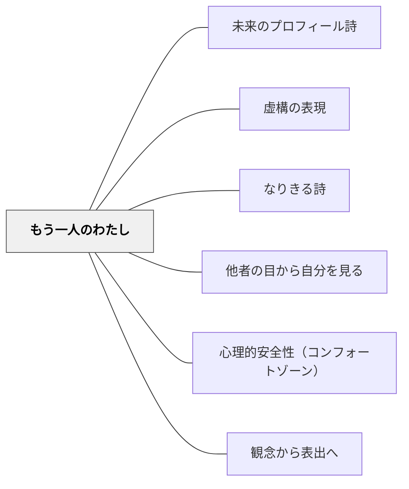

# もう一人のわたし

> 「なまけ忍者」に名前をつけたとき、子どもは自分の葛藤を笑って受け入れた。

---

## Pattern Connection

**白谷明美（年不詳）統合（2026-05-21）：**

荘司武「なまけ忍者」（「ぼくのおへやのすみっこに/なまけ忍者のひくい声/ちょっとテレビをつけてくれ」）を入口に、白谷明美は「内なる葛藤を別人格として詩に描く」授業を展開した。「やる気ないない虫」「お調子ねずみ」という子どもたちの創造が、この技法の豊かさを示している。

- **既存パタンとの関連**：[[パタン/虚構の表現]] の「虚構的装置が本音を引き出す」原理の応用——「なまけ忍者」という虚構の人格が、「さぼりたい自分」を直接書く心理的コストを下げる。[[パタン/未来のプロフィール詩]] と補完関係にある：本パタンは「短所を人格化して受け入れる」であり、[[パタン/未来のプロフィール詩]] は「短所を逆転させて願いを発見する」。
- **補強する点**：[[パタン/なりきる詩]] の「物になりきる」とは異なり、本パタンは「自分の内側の一部をなりきる」——外の存在へのなりきりでなく、内面の分裂を外在化する操作。[[パタン/心理的安全性（コンフォートゾーン）]] の文脈で：「悪い部分を認める」ために「それを別人格にする」という構造が心理的安全を生む。
- **他のパタンへの波及**：[[パタン/他者の目から自分を見る]] — 多視点で自己を見るという自己探求の連鎖に連なる。本パタンは「内側の別人格から自己を見る」という形でその連鎖に参加する。

---

## 背景（Context）

人の心の中には「努力する自分」と「さぼりたい自分」、「優しい自分」と「意地悪な自分」が常に共存している。この内なる矛盾・葛藤・二重性は、人間の最も豊かな詩的素材の一つだ。しかし学校の作文・詩の授業では「いいことを書く」文化が強く、「さぼりたい」「意地悪したい」という内側の声は隠される。

白谷明美は荘司武「なまけ忍者」という詩を入口に、「自分の中の困ったもう一人のわたし」を別の存在として詩に描くことで、子どもが自己受容と自己発見を同時に体験する実践を展開した。

## 問題（Problem）

「自分のいいところを書こう」「正直な気持ちを書こう」と言っても、子どもは「道徳的に正しい自分」しか書かない。内なる矛盾・怠惰・攻撃性・自己嫌悪——これらが詩の最も豊かな素材なのに、授業では語られない。どうすれば、子どもが自分の複雑さ・矛盾を詩のことばで表出できるか。

## 力のかたち（Forces）

- 「悪い自分・さぼりたい自分」を直接書くことへの道徳的な抵抗がある
- しかし「別人格として描く」（なまけ忍者・やる気ないない虫）という距離が表現を可能にする
- 葛藤を「外に出す」（名前をつける・姿を与える）ことで、子どもは自己観察と自己受容を同時に体験する
- 「困った存在」に名前をつけ、その行動を具体的に描くことで、詩に物語性と生き生きとした感覚が生まれる
- 二つの声の対話形式（「なまけもの」vs「がんばりや」）が詩の構造として完結する

## 解決（Solution）

**自分の中にいる「困ったもう一人の自分」に名前と姿を与え、その存在が何をしてくるかを詩として書く。発展として、「立ち向かう自分」との対話形式に展開する。**

---

### Step 1：「もう一人のわたし」を発見する

荘司武「なまけ忍者」を読む（または教師が読み聞かせる）。

> ぼくのおへやのすみっこに  
> なまけ忍者のひくい声  
> 「ちょっとテレビをつけてくれ」  
> 「ちょっとテレビをつけてくれ」

「あなたの心の中にも、こんな声が聞こえてくることはありますか？その声は何という名前ですか？どんな姿をしていますか？」

---

### Step 2：名前と姿を与える

子どもが自分の「困った内なる存在」に名前をつける：

- 「やる気ないない虫」（やる気を吸い取る虫が心の中に巣を作っている）
- 「お調子ねずみ」（心のふくろに穴を開けて調子を盗む）
- 「あきらめ天使」（「もういいんじゃない？」とつぶやいてくる）
- 「いいわけ妖精」（言い訳をどんどん思いつかせてくれる）

---

### Step 3：詩に書く

その存在が何をしてくるか・自分がどう感じるかを詩に書く：

**子どもの実作例：**

```
やる気ないない虫

ぼくの心のなかに
やる気ないない虫が
すを作っている

ぼくが宿題をしようとすると
ぴゅーっとやってきて
やる気をすいとっていく

でも
宿題が終わったとき
やる気ないない虫は
きえてしまう
```

---

### 発展：対話形式「なまけものとがんばりや」

野口雄大「なまけものとがんばりや」（なまけもの：「テレビを見た方が楽しいぞ」/ がんばりや：「宿題を終わらせろよ」）を読んで、自分の内なる対話を詩にする。

二つの声を交互に書くことで、葛藤が詩の構造そのものになる。

---

### 小学校・低学年への展開

- 低学年では「なまけものの声」という概念より「もういいよという小さな声」という表現が伝わりやすい
- 「あなたの心の中の声を絵に描いてみよう（どんな形？色？）」という視覚化から入ると書きやすい

## 結果（Consequences）

- 「悪い部分を認める」という自己受容が、詩を書く前より後の方で自然に起きる
- 「困った内なる声」に名前をつけることで、子どもは葛藤を笑って語れるようになる
- 詩が「道徳的に正しい自分」を書くものでなく「本当の自分の複雑さ」を書くものとして変わる
- 二つの声の対話形式が詩の構造として機能し、詩を書くことへの抵抗が下がる
- 「立ち上がる自分」を加えると、自己変容・成長の詩として完結する

## クラスター図



## Actionable Insight

- 荘司武「なまけ忍者」か教師自作の詩を読んで「あなたの中にもいる？」と問う——驚くほど多くの子が「いる！」と反応する
- 「その存在に名前をつけて、どんな姿か絵に描いてみよう（3分）」——可視化してから詩にする
- 「ちゃんとしていない自分を詩に書いていいんだよ、それが本物の詩になる」と一言伝える——この許可が詩の質を変える

## 関連パタン

- [[パタン/未来のプロフィール詩]] — 短所を逆転させて願いを発見する補完的手法
- [[パタン/虚構の表現]] — 虚構的人格（なまけ忍者）が本音を引き出す
- [[パタン/なりきる詩]] — 外の存在になりきるのに対し、本パタンは内側の一部を人格化する
- [[パタン/他者の目から自分を見る]] — 多視点で自己を見る自己探求の連鎖
- [[パタン/心理的安全性（コンフォートゾーン）]] — 「別人格」という距離が自己開示の安全を生む
- [[パタン/観念から表出へ]] — 内なる葛藤を観念として育て、詩として表出する
- [[文献/詩が生まれるとき書けるとき（白谷明美）]] — 一次資料（第二章4節）

## 出典

白谷明美（年不詳）『詩が生まれるとき書けるとき　だれにでもできる楽しい詩のつくり方』教育出版センター（第二章4節「もう一人の『わたし』」）

> 「ぼくのおへやのすみっこに／なまけ忍者のひくい声」——荘司武「なまけ忍者」（本書引用）
