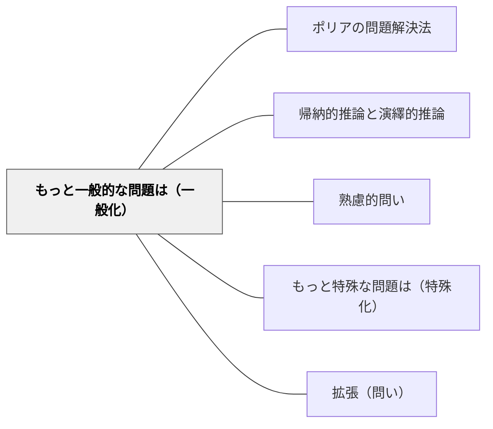

# もっと一般的な問題は（一般化）

> 抽象化・一般化を問うことで、個別事例を超えた本質的理解へと導く。

## Pattern Connection

**Blitzer（2014）統合（2026-05-24）——帰納的推論の実践としての一般化：**

*Thinking Mathematically* Ch.1 Section 1 は「帰納的推論（Inductive Reasoning）」を「具体的な例の観察から一般的な結論に到達するプロセス」と定義し、その結論を「予想（conjecture）」と呼ぶ。一般化という問いの行為が帰納的推論そのものである。

- **補強された点**：一般化は「まとめること」ではなく、**暫定的な予想（conjecture）を立てること**として位置づけられる。帰納的推論による一般化は反例が見つかれば覆る——この「暫定性」を子どもに伝えることが、「正解を確定する」から「仮説を立てる」への思考転換をもたらす
- **拡張された点**：Blitzer は帰納的推論→予想→反例探索→演繹的証明という**数学的探究のサイクル**を示す。「もっと一般的に言うと？」という問いはこのサイクルの「予想を立てる」ステップを引き出す問いである
- **他のパタンへの波及**：[[パタン/帰納的推論と演繹的推論]] — 一般化の背後にある推論の2種類を区別する。[[パタン/ポリアの問題解決法]] — Step 4「振り返り」で「どこまで一般化できるか」を問う

---

## 背景（Context）
一つの問題を解けたとしても、それがより広いパターンや原理の一例だと気づかなければ、学習の転移は起こりにくい。一般化する問いは、個別事例から抽象的な法則を抽出する思考を促し、知識の適用範囲を広げる。

## 問題（Problem）
学習者は個々の問題を「一回限りのもの」として処理しがちで、その背後にある一般的なパターンや構造を見出そうとしない。これでは問題ごとに解法を一から考えることになり、学習効率が上がらない。一般化の力は明示的に引き出さないと育ちにくい。

## 力のかたち（Forces）
- 一般化は個別知識を体系的知識へと変換する
- 「このケースだけでなく」という視点が抽象的思考力を鍛える
- 一般的な解法は特殊解よりも強力で応用が広い
- 一般化を問うことで、学習者は自分の理解の深さを自覚できる

## 解決（Solution）
「この問題だけでなく、もっと一般的に言うとどうなる？nを任意の数にしたら？条件をどこまで緩めても成り立つか？」と問いかける。例えば「3つの場合に成り立ったが、これはn個の場合にも言えるか？どう証明する？」と一般化の方向を示す。一般的な命題として表現させることが重要である。

## 結果（Consequences）
- 知識の転移が容易になり、新しい問題に自力で取り組めるようになる
- 抽象的思考力・数学的思考力が養われる
- 一般化された知識はより少ない記憶で広い範囲をカバーする

## 関連パタン
- [[パタン/ポリアの問題解決法]]
- [[パタン/帰納的推論と演繹的推論]]
- [[パタン/熟慮的問い]] — 親パタン
- [[パタン/もっと特殊な問題は（特殊化）]] — 一般化の逆方向で理解を深める
- [[パタン/拡張（問い）]] — 一般化を別ドメインへと広げる

## クラスター図

## Actionable Insight

- 具体的な問題を解いた後「これ、もっと一般的に言うとどうなる？」と必ず一問追加する——特殊解から一般的な法則への抽象化が知識の転移を促す
- 「3つの場合に成り立ったが、n個の場合にも言えるか？」と問い、式や言葉で一般化させる——一般化の言語化が抽象的思考力と数学的思考力を育てる
- 単元の終わりに「この単元で学んだことを一つの一般原理として表現すると？」と問う——学んだ内容を一般化してまとめる経験が次の学習への転移の基盤になる

## 出典
- [[文献/熟慮的問いのパターンリスト（動画記録）]]
- ジョージ・ポリア（1954）『いかにして問題をとくか』丸善出版
